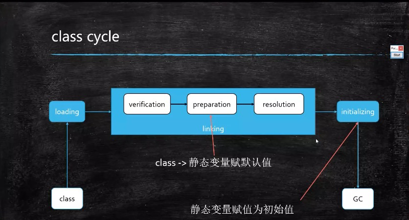
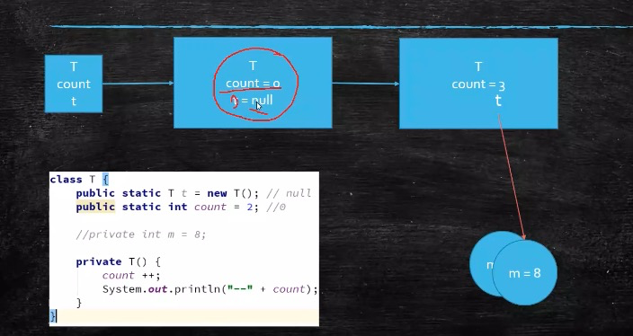
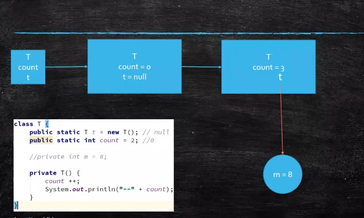
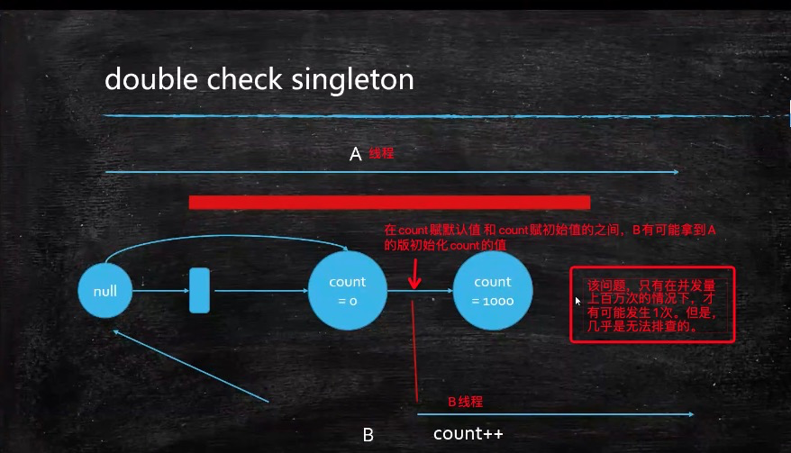
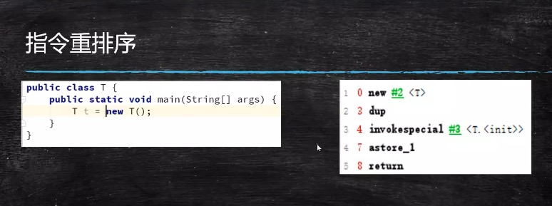

# 01.Class初始化过程和G1垃圾收集入门

## [目录]
* [01.Class初始化过程和G1垃圾收集入门](JVM_01.md)
* [02.GC垃圾回收预习课程-GC入门](JVM_02.md)
* [03.GC基础知识](JVM_03.md)
* [04.GC算法](JVM_04.md)
* [05.JVM的垃圾回收器](JVM_05.md)
* [06.简历上如何敢写"有过JVM调优经验"](JVM_06.md)
* [07.系统上线前预估系统的内存占用情况](JVM_07.md)
* [08.系统上线前预估系统的并发访问情况](JVM_08.md)
* [09.根据预估值设定JVM初始参数](JVM_09.md)
* [10.根据日志解决实战问题](JVM_10.md)
* [11.为什么一个百万级TPC系统会频繁GC](JVM_11.md)
* [12.用TOP命令观察系统运行情况](JVM_12.md)
* [13.用jps定位虚拟机进程](JVM_13.md)
* [14.用jstack定位问题线程](JVM_14.md)
* [15.集中答疑，解决同学们学习中的问题](JVM_15.md)
* [16.面向未来，学习路线指引与职业规划](JVM_16.md)
* [17.用JMAP导出内存存储文件](JVM_17.md)
* [18.用jhat分析转储文件](JVM_18.md)
* [19.用top命令观察系统运行情况](JVM_19.md)
* [20.其他给力的工具 visual VM MAT Arthas介绍](JVM_20.md)
* [21.JVM动手实战调优](JVM_21.md)
* [22.20年清华架构师，职业把脉，直击痛点](JVM_22.md)

## 课程内容简介
* JVM Introduction
* Class File format
* loading linking initializing
* Java Memory Model
 * thread specific
 * thread share
* JVM Instruction Set
* GC turning (比例60%的篇幅)

## Class Loader

### Case01 静态变量引发的问题

程序题01
```java
// 以下程序的结果是什么
package com.jvm.classloader;
public class ClassLoadingProcedure{
    public static void main(String[] args){
        System.out.println(T.count);
    }
}
class T{
    public static T t = new T();
    public static int count = 2;
    
    private T(){
        count++;
    }
}
/**
 * A. 2
 * B. 3
 * C. 0
 * D. 1
 */
```


程序题02
```java
// 以下程序的结果是什么
package com.jvm.classloader;
public class ClassLoadingProcedure{
    public static void main(String[] args){
        System.out.println(T.count);
    }
}
class T{
    public static int count = 2;
    public static T t = new T();
    
    private T(){
        count++;
    }
}
/**
 * A. 2
 * B. 3
 * C. 0
 * D. 1
 */
```

答案
> 程序题01 答案：2
> 程序题02 答案：3


* 1 class文件放在硬盘上
* 2 classLoader 开始 loading
* 3 开始linking
  * verification: 对格式进行校验，是否符合虚拟机的要求
  * perparation: class的静态变量赋值为默认值
  * resolution: 有一些特定的方法，根据符号 转换为直接引用。方法名 直接转成地址 可以执行的方法块
* 4 类的初始化：initializing
  * 静态变量赋值为初始值
* 5 交给GC 回收

看一下程序题01的解答过程


看一下程序题02的解答过程



### Case02  单例模式相关的问题
```java

public class Mgr01{
    private static final Mgr01 INSTANCE = new Mgr01();
    
    private Mgr01() {};

    public static Mgr01 getInstance() { return INSTANCE;}
    
    public void m() { System.out.println("m");}
    
    public static void main(String[] args){
    
        Mgr01 m1 = Mgr01.getInstance();
        Mgr02 m2 = Mgr01.getInstance();
        System.out.println(m1 == m2);
    }   
}
```

```java
/**
 * dubbo check singleton
 */
public class Mgr06{
    // private static volatile Mgr06 INSTANCE; // 务必要加
    private static Mgr06 INSTANCE; // 错误的写法
    
    private Mgr06{
    }
    
    public static Mgr06 getInstance(){
        if(INSTANCE == null){
            synchronized (Mgr06.class){
                if(INSTANCE == null){
                    try{
                        Thread.sleep(1);
                    }catch(InterruptedException e){
                        e.printStackTrace();
                    }
                    INSTANCE = new Mgr06();
                }
            }
        }
        return INSTANCE;
    }
    public static void main(String[] args){
        for(int i=0; i < 100; i++){
            new Thread(()->{
                System.out.println(Mgr06.getInstance().hashCode());
            }).start();
        }
    }   
}
```

但是 dubbo check singleton是有问题的，在并发量超级高的情况下，偶尔会出现一次


* 指令重排序

如果在不影响最后结果的情况下， 4，和 7 步骤可以互换，这时候才会出现版初始化的问题。

* 那么如何解决？
> 务必要加上 volatile关键字

* volatile的作用
> 是线程间可见，禁止指令重排序


## G1 : GC tuning
Java 只负责 创建对象，而回收对象是有GC来管理。