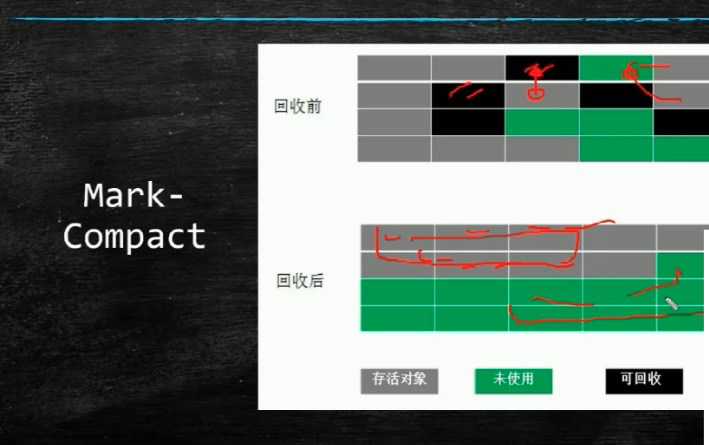
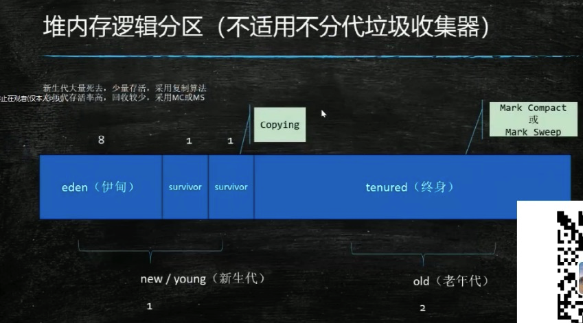
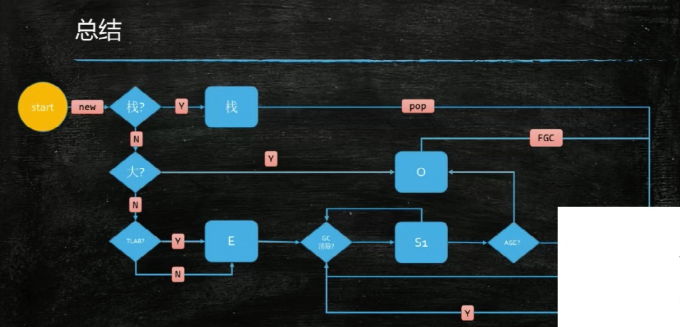
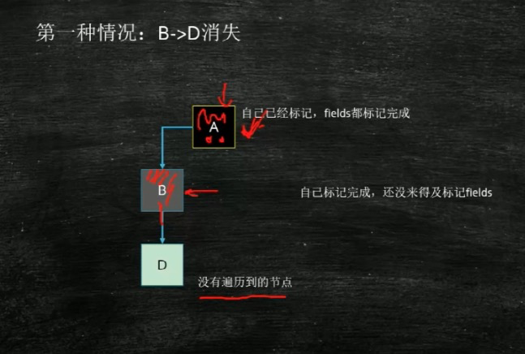
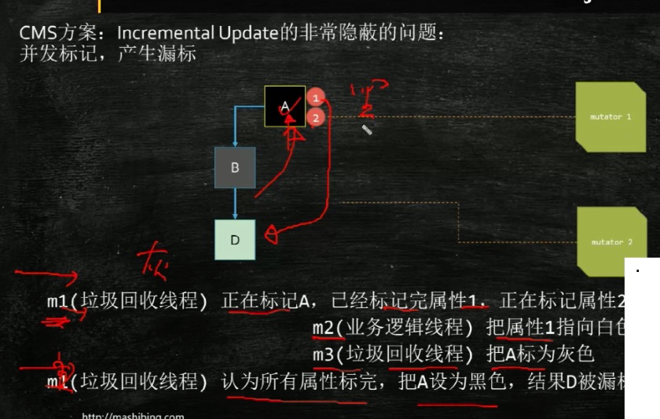

# JVM 概述
注：本文有大量配图，想正常浏览，请下载到本地观看

## 参考资料
https://www.bilibili.com/video/BV1ZK411p7cr?p=1
https://www.bilibili.com/video/BV1mC4y1H7QC?p=1
## 常见的面试题
* 1 CMS和G1的异同
* 2 G1什么时候引发FullGC
* 3 说一个最熟悉的垃圾回收算法
* 4 吞吐量优先和响应时间优先的回收有哪些
* 5 怎么判断内存泄露
* 6 讲一下CMS的流程
* 7 为什么压缩指针超过32G失效
* 8 什么是内存泄露？ GC调优有经验吗？ 一般出现GC问题你怎么解决？
* 9 ThreadLocal有没有内存泄露问题
* 10 G1两个Region是不是连续的，而且之间还有可达的引用，我们现在要回收一个，另一个怎么处理？
* 11 讲一下JVM堆内存管理（对象分配过程）
* 13 到底多大的对象会被直接扔到老年代
* 14 用一句话说明你的JVM水平很牛

## 目录
* 1 what is garbage
* 2 how to find it
* 3 GC algorithms
* 4 Available collectors
* 5 tuning

## 第一部分 什么是垃圾

再引用不到的对象就是垃圾

## 第二部分 如何找打垃圾
### 1 引用计数
* 如果有一个对象，有3个引用 在对象上计数，没少一个引用，计数减1，知道为0


* 但是 无法解决 循环引用的问题。


### 2 根可达算法
 而 hotspot里面用的是: 根可达查询/ Root Searching

> 那么 哪些对象是根？
> 总而言之最开始生成的对象就是根对象。

* 推荐用书 << The Java Virtual Machine Specification>>

## 第三部分 GC算法/ GC Algorithms
* 1 Mark-Sweep/标记清楚
* 2 Copying/拷贝
* 3 Mark-Compact/标记压缩
所有的算法都是以上3中算法的组合，归根到底就这3个

### 1. Mark-Sweep/标记清楚


哪些是垃圾，那些就标记出来，然后直接清楚，但是会造成碎片。
* 缺点：碎片

### 2. Copying/拷贝


收先将内存一分为二，那些是不是垃圾，就copy到下面，有用的连接在一起，没用的连接在一起。
但是问题就在于 空间浪费。
* 缺点：空间浪费

### 3. Mark-Compact/标记压缩



有用的压缩在一起，没用的压缩在一起，边清理，边压缩。
* 缺点：效率低

## 第四部分 垃圾回收器


* 分代模型
  * ParNew
  * CMS
  * Serial
  * Serial Old
  * Parallel Scavenge
  * Parallel Old

* 不分带模型
  * G1: 逻辑分代，物理不分代
  * ZGC: 逻辑不分代，物理也不分代
  * Shenandah: 逻辑不分代，物理也不分代
  * Epsilon: JDK11以后出的

* 如何查看当前系统使用的垃圾回收器
```shell
$ java -XX:+PrintCommandLineFlags -version
-XX:G1ConcRefinementThreads=4 
-XX:GCDrainStackTargetSize=64 
-XX:InitialHeapSize=268435456 
-XX:MaxHeapSize=4294967296 
-XX:+PrintCommandLineFlags 
-XX:ReservedCodeCacheSize=251658240 
-XX:+SegmentedCodeCache 
-XX:+UseCompressedClassPointers 
-XX:+UseCompressedOops 
-XX:+UseG1GC
```
### 常见垃圾回收器组合参数设定（1.8）
* -XX:+UseSerialGC = Serial New(DefNew) + Serial Old
  * 小型程序。
* -XX:+UseParNewGC = ParNew + SerialOld
  * 这个组合已经废弃，很少用了
* -XX:+UseConcurrentMarkSweepGC = ParNew + CMS + Serial Old
* -XX:+UseParallelGC = Parallel Scavenge + Parallel Old(1.8默认)
* -XX:+UseParallelOldGC = Parallel Scavenge + Parallel Old
* -XX:+UseG1GC = G1
* 打印UseParallelGC 
```shell
java +XXPrintCommandLineFlags -version
```
* Linux下，1.8版本默认的垃圾回收器是什么
  * copy MarkCompact
  
### 分代模型

新生代，老年代的结构， 对内存逻辑分区如下：

每经过一次垃圾回收，年龄+1，
过于顽固时，放到老年代，当老年代快满的时候，老年代执行fullGC




* 新生代中：使用 copying算法
  * 大多数新生的，放在伊甸园/eden，执行的是copying算法，
  * 从eden 到 survivor1 ， survior2
* 老年代中：使用 Mark Compact 或者 Mark Sweep算法
* 一般的进入老年代的年龄15， 而CMS是6

以下表示 一个对象的回收过程


总结

eden里面有TLAB，

* 随着内存的增大，诞生了不同的垃圾回收器。

### Serial
* a stop-the-world, copying collector which uses a single GC thread
* 当内存快满的时候，GC停止所有其他任务，开始回收, 使用copying算法，回收结束，其他任务继续
* 使用copying算法


### Serial Old
* a stop-the-word, mark-sweep-compact collector that uses a single GC thread.
* GC执行时，停止其他任务，结束之后，继续之前其他任务
* 使用mark-sweep-compact算法

### Parallel Scavenge
* a stop-the-world, copying collector which uses multiple GC threads
* 和 Serial的区别就是，GC是几个


### Parallel Old
* a compacting collector that uses multiple GC threads.
* 和 Serial Old的区别是， GC是几个


* 总结
内存小： serial + serial old
内存大： Parallel Scavenge + Parallel Old

### CMS
CMS
* concurrent mark sweep
* a mostly concurrent, low-pause collector
* 4 phases
  * 1 initial mark
  * 2 concurrent mark
  * 3 remark
  * 4 concurrent sweep

* 问题
  * 因为边运行 边清理，会出现错误标记的问题。
  * 解决 错误标记 问题，使用 重新标记。
  * CMS/G1 的从新标记方法： 三色标记算法
 


### 三色标记算法

出现错标的场景




CMS方案: Incremental Update
把A标记为灰色


CMS方案: Incremental Update的非常隐蔽的问题
并发标记，产生漏标


所以CMS重新标记，必须重头到位扫描一遍

G1方案：SATB Snapshot At the Beggining


## 第五部分 Tuning
1 根据需求进行JVM规划和调优
2 优化运行JVM运行环境（慢，卡段）
3 解决JVM运行过程中的各种问题（OOM）

java -XX:+PrintFlagsFinal -version

### G1常用的参数
* -XX:+UseG1GC
* -XX:MaxGCPauseMillis
建议值，G1会阐释他调整Yong去的快熟达到这个值
* -XX:GCPauseIntervalMillis
GC的间隔时间
* -XX:+G1HeapRegionSize
区分大小，建议组件增大 ， 1 2 4 8 16 32。
随着size增加 垃圾存活时间更长， GC间隔更长，每次GC时间也会更长
* G1NewSizePercent
新生代最小比例，默认为5%
* G1MaxNewSizePercent
新生代最大比例，默认为60%
* GCTimeRatio
GC时间建议比例
* ConGCThreads
线程数量
* InitiatingHeapOccupancyRecent
启动G1堆空间比例


* 推荐用书 << The Java Virtual Machine Specification>>
