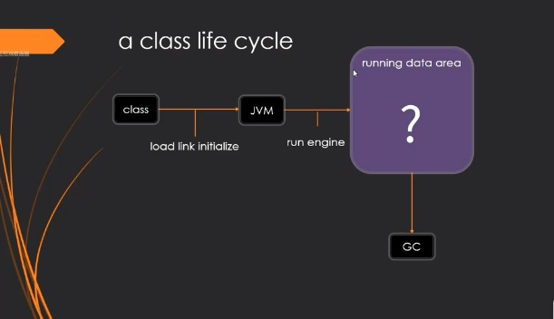
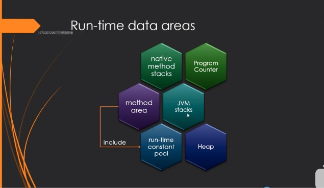
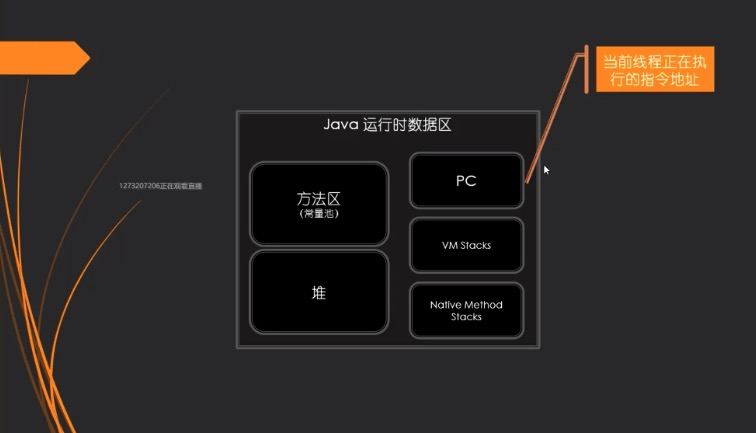
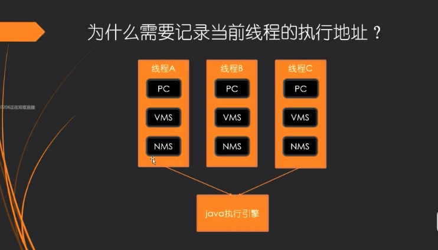
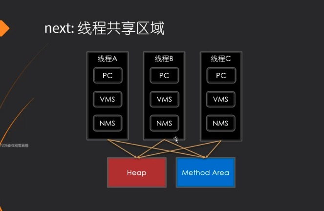

# JVM 概述2

### 一个class的生命周期

### 运行数据区

* Program Counter: 程序计数器，程序运行到哪里了，该运行什么程序了
* JVM stacks: 装的是栈帧，记录的是frames
* Heap: 堆，用来保存new出来的对象(shared)
* native method stacks: 本地方法栈
* method area: 方法区(shared)
* run-time constant pool: (逻辑区) 常量池

#### 为什么需要记录当前线程的执行地址

* 注：每个线程都有 PC VMS NMS
* PC: Program Counter
* VMS: JVM stacks
* NMS: native method stacks
* 线程内部使用的内存结构

#### 线程共享区域

## JVM抽丝剥茧
## JVM知识体系推广
https://www.bilibili.com/video/BV1ZK411p7cr?p=2