# JVM 概述2

### 一个class的生命周期
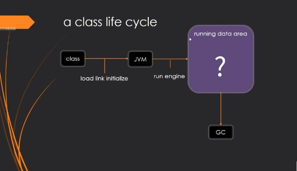

### 运行数据区
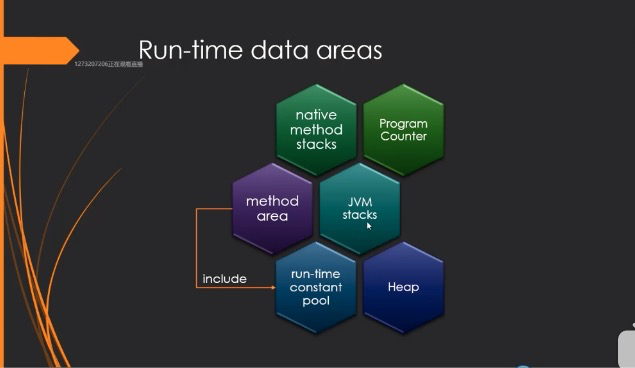
* Program Counter: 程序计数器，程序运行到哪里了，该运行什么程序了
* JVM stacks: 装的是栈帧，记录的是frames
* Heap: 堆，用来保存new出来的对象(shared)
* native method stacks: 本地方法栈
* method area: 方法区(shared)
* run-time constant pool: (逻辑区) 常量池

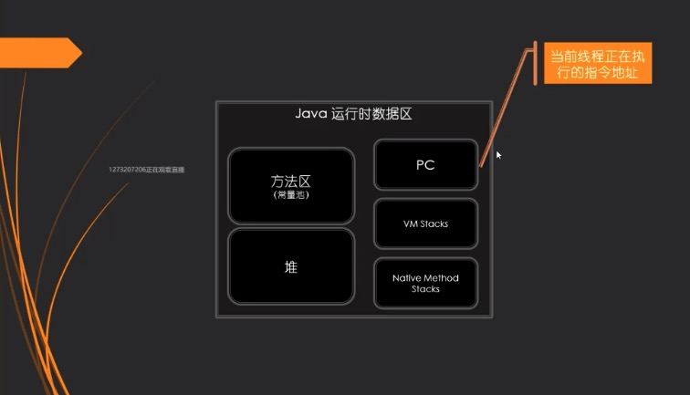

#### 为什么需要记录当前线程的执行地址
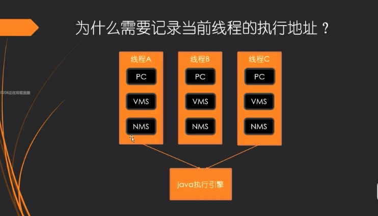
* 注：每个线程都有 PC VMS NMS
* PC: Program Counter
* VMS: JVM stacks
* NMS: native method stacks
* 线程内部使用的内存结构

#### 线程共享区域
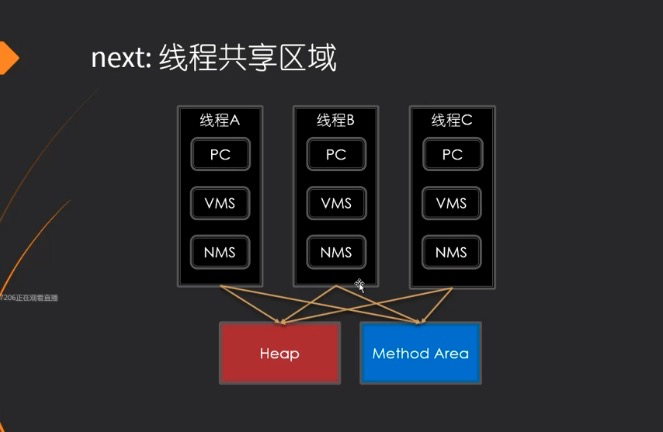

### 栈帧 Frame
* 任何一个方法都会产生一个栈帧

### Heap 堆的管理
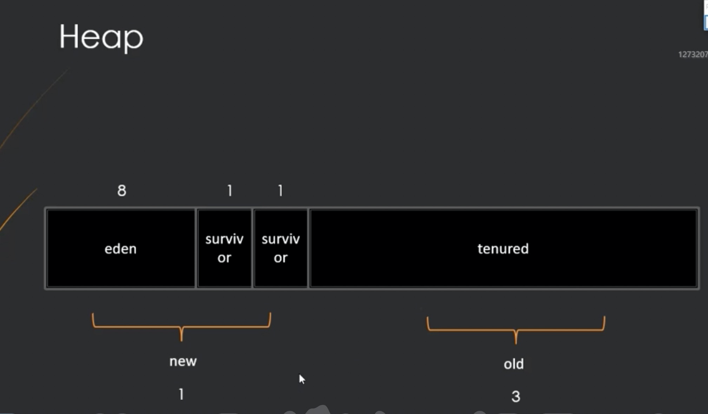
* eden
* survivor：s0
* survivor：s1
* tenured：老年代
eden经历过一次gc后，90%的垃圾会被回收，
剩下的 copying到 s0，再经历一次gc，s0 copying到 s1
直到基数到15，认为是old对象，进入tenured

### Garbage Collector
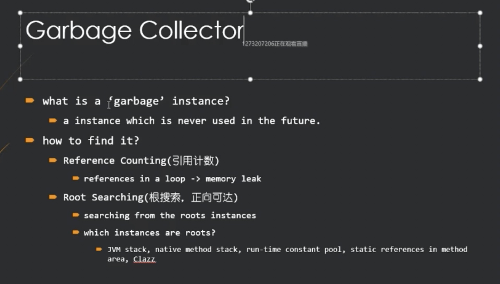
* 1 什么是垃圾：new一个对象，后面不用了，就是垃圾
* 2 如何找到
  * reference count：引用计数（现在用的比较少）
    * 缺点：循环引用时，无法判断
  * root searching：根可达
    * searching from the roots instances
    * JVM stack, native method stack, run-time constant pool,static reference in method area, Clazz

### GC Algorithms：GC算法

* Mark-Sweep:标记清除
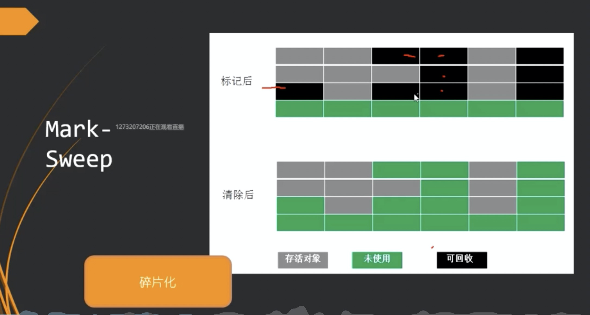
缺点：碎片多

* Copying：复制
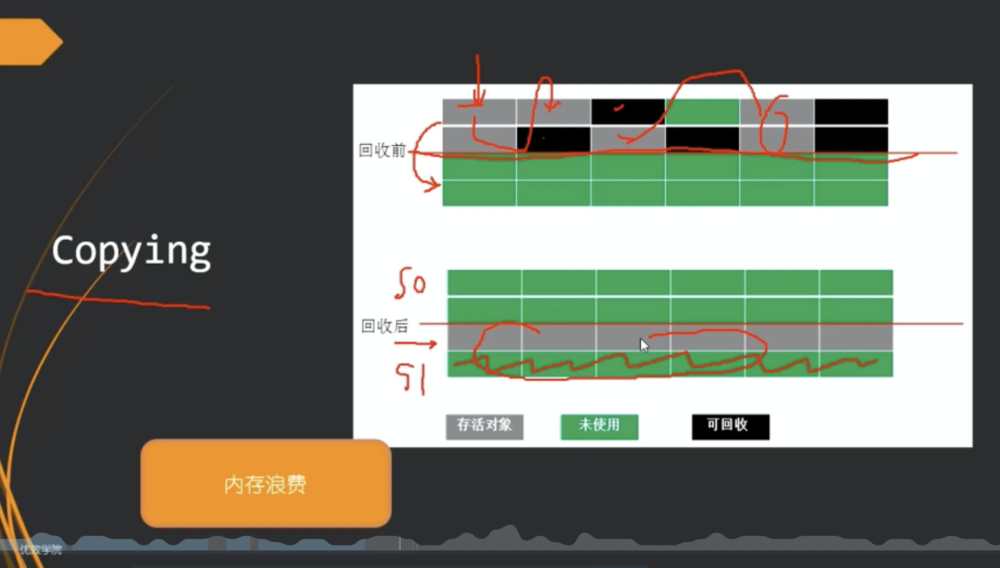
缺点：内存浪费
优点：效率很高
实际上就是s0和s1之间互相copy

* Mark-Compact:标记压缩
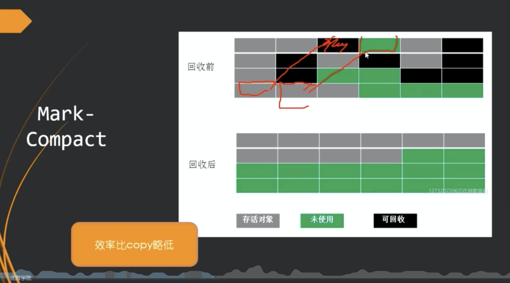
缺点：效率低一点
可以避免碎片化

### YGC和FullGC
一般YGC就够了，但是只有当tenured到了75%的时候，才会触发FullGC

### Hotspot的垃圾收集器
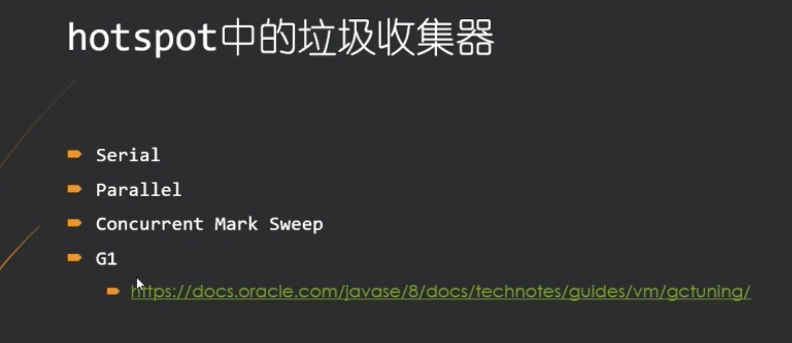

## 各种垃圾回收器
* Serial 几十兆
* Parallel 几个G
* CMS 几十个G、
  * 承上启下
  * 开始并发回收
  * 三色标记-错标，Remark + 写屏障
* G1支持上百G内存：
  * 逻辑分代、物理不分代
  * 三色标记 + SATB + 写屏障
* ZGC - Shenandoah 支持 4T内存
  * 物理逻辑都不分代
  * ColoredPointers（颜色指针 着色指针） + 读屏障
* Epsilon 啥也不干

## G1：Garbage First
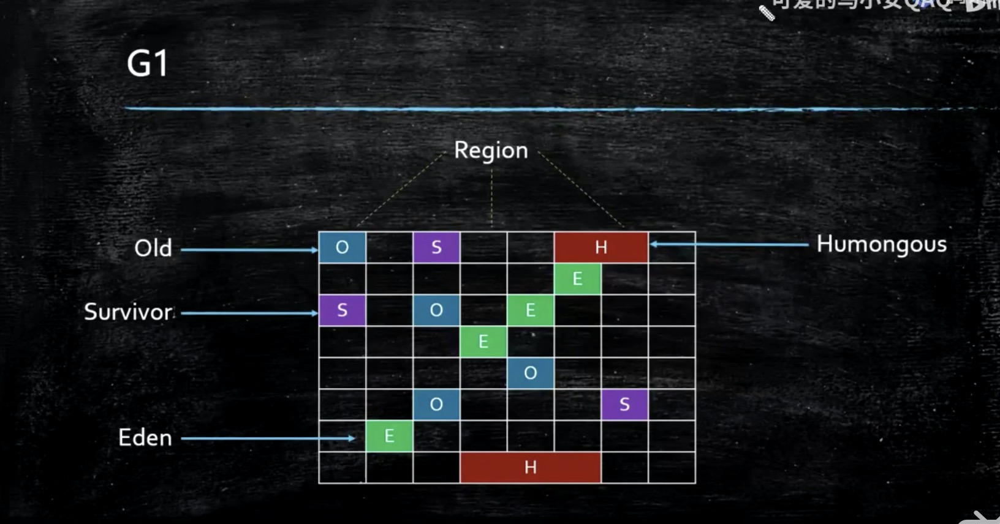
* G1有没有stw，有
* G1有没有fullgc，有
* 参考地址
https://www.bilibili.com/video/BV1mC4y1H7QC?p=4
19:40 开始讲G1
* G1 比 ParNew+CMS 的吞吐量 只低了10%~15左右
* 但是G1的相应速度提高了好多倍
https://www.bilibili.com/video/BV1pJ411V7mi?from=search&seid=2687067393647809352

### G1:MixedGC过程
* 初始标记STW
* 并发标记
* 最终标记 STW(重新标记)
* 筛选回收 STW(并行)

#### 初始标记
找到根对象
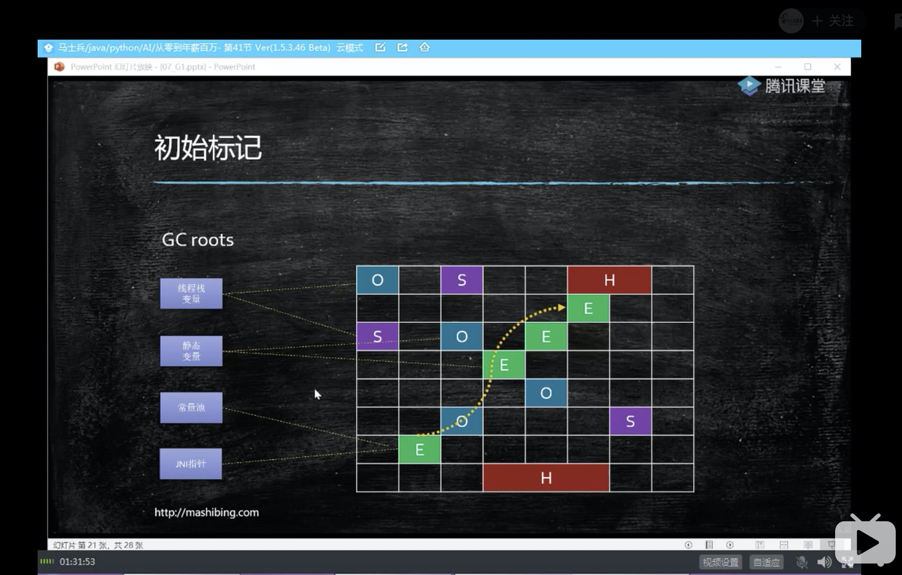

#### 并发标记
通过根对象到处找找找,找到那些和他相连的对象
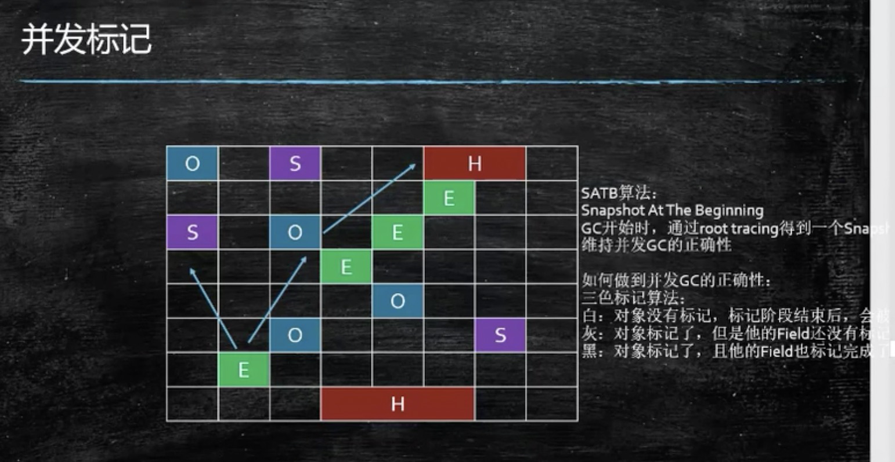

#### 最终标记
非常重要
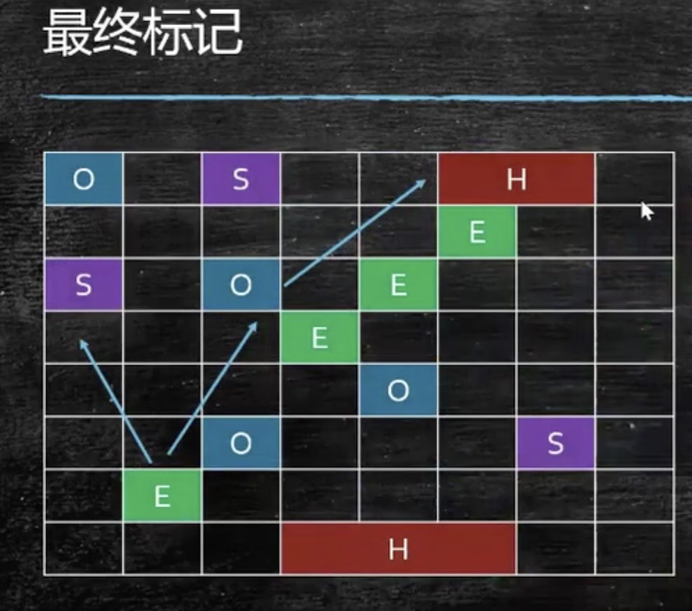

#### 筛选回收
调一个块里面全是垃圾的，整体回收
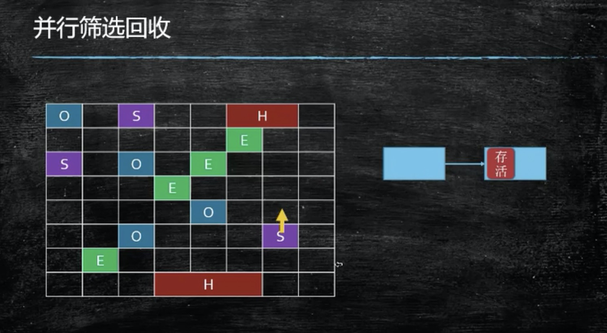

#### 并发标记算法

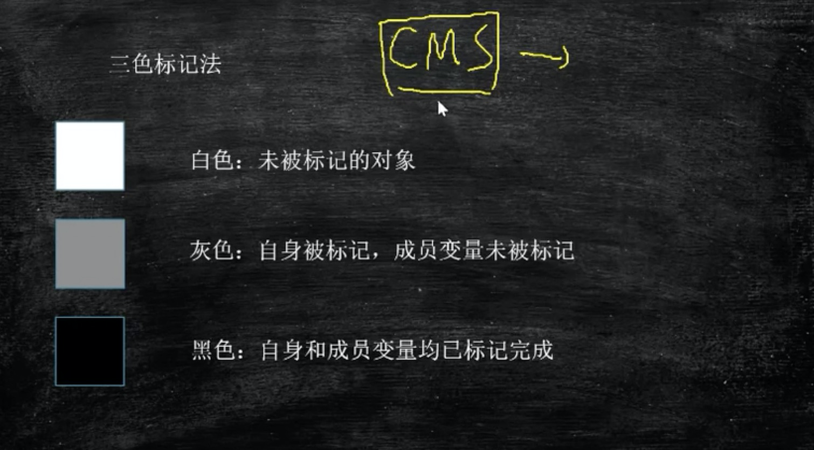

* 什么情况会产生漏标

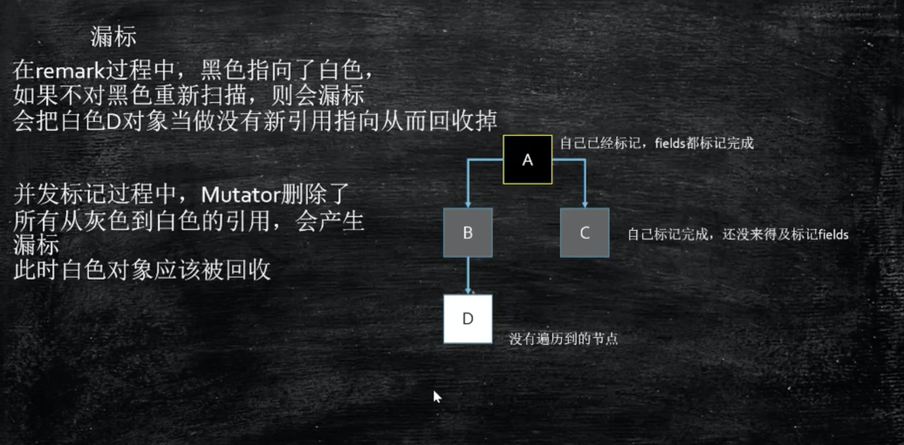
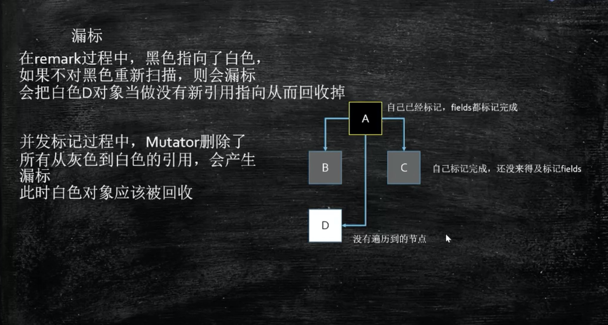
  * 黑色指向白色的
  * 灰色指向白的消失了
  * 以上2个条件 缺一不可，会出现白色漏标

那么如何解决呢？
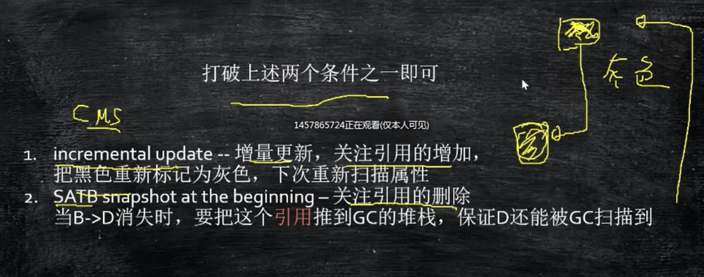

