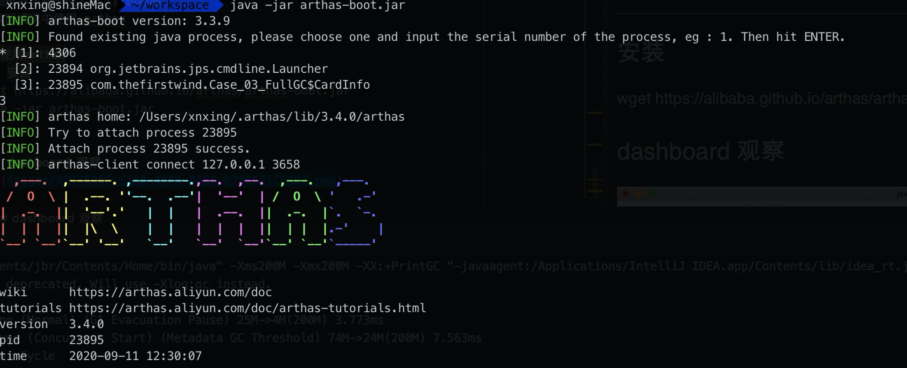
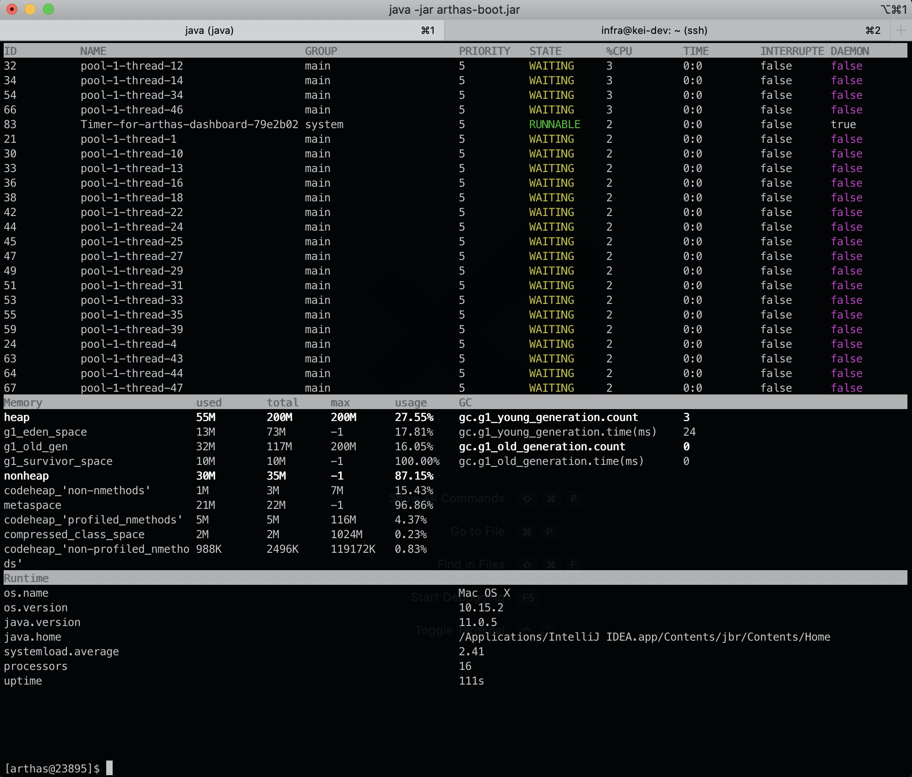
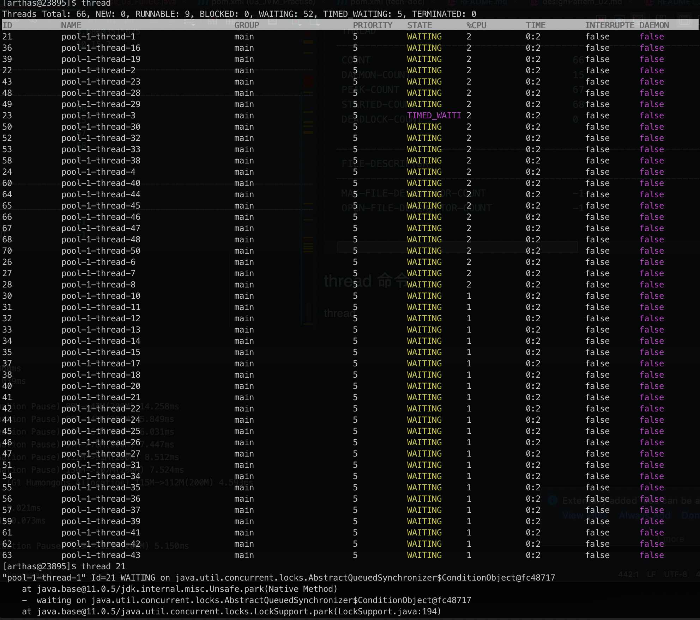

# JVM Tuning：JVM调优 case by case

## tuning入门- Java对象分配

### 概述
* 栈上分配
  * 线程私有小对象
  * 无逃逸
  * 支持标量替换
  * 无需调整
* 线程本地分配TLAB(Thread Local Allacation Buffer)
  * 占用eden，默认1%
  * 多线程的时候不用竞争eden就可以申请空间，提高效率
  * 小对象
  * 无需调整
* 老年代
  * 大对象
* eden

### new 一个对象的过程如何进内存
1 栈上分配
1.1 首先栈上分配，每一个线程都有一个JVM stack，很小的话就进线程
1.2 逃逸分析：一个方法里面，new的对象，方法以外没有用，就在栈上分配
1.3 标量替换：简单的 基础类型，综合在一起放
* 栈上分配的好处：栈帧弹出来，自动的就回收了，和GC没有关系。
2 不是私有小对象，有逃逸的话，代表分配不了。去线程本地分配TLAB（eden的1%）
3 分配不了，去老年代
4 如果不需要，去eden


```java
public class Case_02_TLAB {
    class User {
        int id;
        String name;

        public User(int id, String name) {
            this.id = id;
            this.name = name;
        }
    }

    void alloc(int i){
        new User(i, "name" + i);
    }

    public static void main(String[] args){
        Case_02_TLAB t = new Case_02_TLAB();
        long start = System.currentTimeMillis();
        for( int i = 0; i < 1000_0000; i++) t.alloc(i);
        long end = System.currentTimeMillis();
        System.out.println(end - start);
    }
}

运行时添加以下JVM相关测参数

-XX:-DoEscapeAnalysis -XX:-EliminateAllocations -XX:-UseTLAB -XX:+PrintGC
-XX:+DoEscapeAnalysis -XX:+EliminateAllocations -XX:+UseTLAB -XX:+PrintGC
逃逸分析，标量替换，使用TLAB

输出1
[0.002s][warning][gc] -XX:+PrintGC is deprecated. Will use -Xlog:gc instead.
[0.010s][info   ][gc] Using G1
[0.228s][info   ][gc] GC(0) Pause Young (Normal) (G1 Evacuation Pause) 23M->0M(512M) 1.506ms
[1.306s][info   ][gc] GC(1) Pause Young (Normal) (G1 Evacuation Pause) 304M->1M(512M) 1.699ms
[2.219s][info   ][gc] GC(2) Pause Young (Normal) (G1 Evacuation Pause) 305M->1M(512M) 1.306ms
2487

输出2
[0.002s][warning][gc] -XX:+PrintGC is deprecated. Will use -Xlog:gc instead.
[0.010s][info   ][gc] Using G1
[0.157s][info   ][gc] GC(0) Pause Young (Normal) (G1 Evacuation Pause) 24M->0M(512M) 1.771ms
[0.393s][info   ][gc] GC(1) Pause Young (Normal) (G1 Evacuation Pause) 304M->0M(512M) 1.191ms
357
```

* 参考地址：https://www.bilibili.com/video/BV1mC4y1H7QC?p=5


## JVM调优第一步，了解JVM常用命令
* JVM命令参数参考：https://docs.oracle.com/javase/8/docs/technotes/tools/unix/java.html
* HotSpot参数分类
  * 标准： - 开头，所有hotspot都支持
  * 非标准：-X 开头， 特定版本HotSpot支持特定命令
  * 不稳定：-XX 开头，下一版本可能取消

> java -version

> java -X

* 打印所有参数

> java -XX:+PrintFlagsWithComments // 只有debug版本能用

> java -XX:+PringFlagsFinal // 打印所有参数  七百多个

### 设置GC的日志
```
-Xloggc:/opt/xxx/logs/xxx-xxx-gc-%t.log #自动生成
-XX:+UseGCLogFileRotation #滚动生成
-XX:NumberOfGCLogFiles=5 #产生5个日志文件
-XX:GCLogFileSzie=20M #最大20M
-XX:+PrintGCDetails
-XX:+PrintGCDateStamps
-XX:+PrintGCCause
```
### case_03 fullGC
```java
import java.math.BigDecimal;
import java.util.ArrayList;
import java.util.Date;
import java.util.List;
import java.util.concurrent.ScheduledThreadPoolExecutor;
import java.util.concurrent.ThreadPoolExecutor;
import java.util.concurrent.TimeUnit;

public class Case_03_FullGC {

    private static class CardInfo{
        BigDecimal price = new BigDecimal(0.0);
        String name = "bob";
        int age = 5;
        Date birthdate = new Date();

        public void m(){

        }

        private static ScheduledThreadPoolExecutor executor = new ScheduledThreadPoolExecutor(50,
                new ThreadPoolExecutor.DiscardOldestPolicy());

        /**
         *  执行的时候添加 jvm参数
         *  java -Xms100M -Xmx100M -XX:+PrintGC com.thefirstwind.Case_03_FullGC
         * @param args
         * @throws Exception
         */
        public static void main(String[] args) throws Exception{
            executor.setMaximumPoolSize(50);

            for(;;){
                modelFit();
                Thread.sleep(100);
            }
        }

        private static void modelFit(){

            List<CardInfo> taskList = getAllCardInfo();
            taskList.forEach(info->{
                executor.scheduleWithFixedDelay(()->{
                    info.m();
                }, 2, 3, TimeUnit.SECONDS);
            });

        }

        private static List<CardInfo> getAllCardInfo(){
            List<CardInfo> taskList = new ArrayList<>();

            for(int i=0; i< 100; i++){
                CardInfo ci = new CardInfo();
                taskList.add(ci);
            }
            return taskList;
        }
    }
}
```
打印的结果如下
```
"/Applications/IntelliJ IDEA.app/Contents/jbr/Contents/Home/bin/java" -Xms200M -Xmx200M -XX:+PrintGC "-javaagent:/Applications/IntelliJ IDEA.app/Contents/lib/idea_rt.jar=62139:/Applications/IntelliJ IDEA.app/Contents/bin" -Dfile.encoding=UTF-8 -classpath /Users/xnxing/projects.tech-doc/tech-doc/03_JVM_Practise/target/classes com.thefirstwind.Case_03_FullGC$CardInfo
[0.002s][warning][gc] -XX:+PrintGC is deprecated. Will use -Xlog:gc instead.
[0.009s][info   ][gc] Using G1

Exception: java.lang.OutOfMemoryError thrown from the UncaughtExceptionHandler in thread "pool-1-thread-6"
[1033.609s][info   ][gc] GC(415) Pause Full (G1 Evacuation Pause) 199M->199M(200M) 96.120ms
[1033.725s][info   ][gc] GC(416) Pause Full (G1 Evacuation Pause) 199M->199M(200M) 116.186ms
[1033.725s][info   ][gc] GC(412) Concurrent Cycle 423.800ms
[1033.726s][info   ][gc] GC(417) Pause Young (Normal) (G1 Evacuation Pause) 199M->199M(200M) 0.660ms
[1033.820s][info   ][gc] GC(418) Pause Full (G1 Evacuation Pause) 199M->199M(200M) 93.545ms
[1033.935s][info   ][gc] GC(419) Pause Full (G1 Evacuation Pause) 199M->199M(200M) 114.890ms
[1033.936s][info   ][gc] GC(420) Pause Young (Concurrent Start) (G1 Evacuation Pause) 199M->199M(200M) 0.359ms
[1033.936s][info   ][gc] GC(422) Concurrent Cycle

Exception: java.lang.OutOfMemoryError thrown from the UncaughtExceptionHandler in thread "pool-1-thread-34"
[1034.032s][info   ][gc] GC(421) Pause Full (G1 Evacuation Pause) 199M->199M(200M) 96.655ms
[1034.148s][info   ][gc] GC(423) Pause Full (G1 Evacuation Pause) 199M->199M(200M) 114.744ms
[1034.148s][info   ][gc] GC(424) Pause Young (Normal) (G1 Evacuation Pause) 199M->199M(200M) 0.231ms
[1034.247s][info   ][gc] GC(425) Pause Full (G1 Evacuation Pause) 199M->199M(200M) 98.712ms
[1034.362s][info   ][gc] GC(426) Pause Full (G1 Evacuation Pause) 199M->199M(200M) 114.390ms
[1034.362s][info   ][gc] GC(422) Concurrent Cycle 426.232ms
[1034.363s][info   ][gc] GC(427) Pause Young (Normal) (G1 Evacuation Pause) 199M->199M(200M) 0.474ms
[1034.455s][info   ][gc] GC(428) Pause Full (G1 Evacuation Pause) 199M->199M(200M) 92.654ms
[1034.570s][info   ][gc] GC(429) Pause Full (G1 Evacuation Pause) 199M->199M(200M) 114.158ms
[1034.571s][info   ][gc] GC(430) Pause Young (Concurrent Start) (G1 Evacuation Pause) 199M->199M(200M) 0.754ms
[1034.571s][info   ][gc] GC(432) Concurrent Cycle
[1034.673s][info   ][gc] GC(431) Pause Full (G1 Evacuation Pause) 199M->199M(200M) 102.164ms
[1034.787s][info   ][gc] GC(433) Pause Full (G1 Evacuation Pause) 199M->199M(200M) 113.527ms
[1034.788s][info   ][gc] GC(432) Concurrent Cycle 216.601ms
[1034.788s][info   ][gc] GC(434) Pause Young (Normal) (G1 Evacuation Pause) 199M->199M(200M) 0.375ms
[1034.903s][info   ][gc] GC(435) Pause Full (G1 Evacuation Pause) 199M->199M(200M) 115.112ms
[1035.016s][info   ][gc] GC(436) Pause Full (G1 Evacuation Pause) 199M->199M(200M) 112.303ms
[1035.017s][info   ][gc] GC(437) Pause Young (Concurrent Start) (G1 Evacuation Pause) 199M->199M(200M) 0.472ms
[1035.017s][info   ][gc] GC(439) Concurrent Cycle
[1035.112s][info   ][gc] GC(438) Pause Full (G1 Evacuation Pause) 199M->199M(200M) 94.704ms
[1035.227s][info   ][gc] GC(440) Pause Full (G1 Evacuation Pause) 199M->199M(200M) 115.026ms
[1035.228s][info   ][gc] GC(441) Pause Young (Normal) (G1 Evacuation Pause) 199M->199M(200M) 0.260ms
[1035.320s][info   ][gc] GC(442) Pause Full (G1 Evacuation Pause) 199M->199M(200M) 91.777ms
[1035.434s][info   ][gc] GC(443) Pause Full (G1 Evacuation Pause) 199M->199M(200M) 113.638ms
[1035.434s][info   ][gc] GC(439) Concurrent Cycle 417.249ms
[1035.434s][info   ][gc] GC(444) Pause Young (Normal) (G1 Evacuation Pause) 199M->199M(200M) 0.225ms
[1035.526s][info   ][gc] GC(445) Pause Full (G1 Evacuation Pause) 199M->199M(200M) 91.501ms
[1035.641s][info   ][gc] GC(446) Pause Full (G1 Evacuation Pause) 199M->199M(200M) 114.934ms
[1035.642s][info   ][gc] GC(447) Pause Young (Concurrent Start) (G1 Evacuation Pause) 199M->199M(200M) 0.528ms
[1035.642s][info   ][gc] GC(449) Concurrent Cycle
[1035.735s][info   ][gc] GC(448) Pause Full (G1 Evacuation Pause) 199M->199M(200M) 92.796ms
[1035.851s][info   ][gc] GC(450) Pause Full (G1 Evacuation Pause) 199M->199M(200M) 115.448ms
[1035.851s][info   ][gc] GC(451) Pause Young (Normal) (G1 Evacuation Pause) 199M->199M(200M) 0.252ms
[1035.945s][info   ][gc] GC(452) Pause Full (G1 Evacuation Pause) 199M->199M(200M) 93.625ms
[1036.060s][info   ][gc] GC(453) Pause Full (G1 Evacuation Pause) 199M->199M(200M) 114.302ms
[1036.060s][info   ][gc] GC(449) Concurrent Cycle 417.779ms
[1036.060s][info   ][gc] GC(454) Pause Young (Normal) (G1 Evacuation Pause) 199M->199M(200M) 0.257ms
[1036.158s][info   ][gc] GC(455) Pause Full (G1 Evacuation Pause) 199M->199M(200M) 97.224ms
[1036.272s][info   ][gc] GC(456) Pause Full (G1 Evacuation Pause) 199M->199M(200M) 114.212ms
[1036.274s][info   ][gc] GC(457) Pause Young (Concurrent Start) (G1 Evacuation Pause) 199M->199M(200M) 0.784ms
[1036.274s][info   ][gc] GC(459) Concurrent Cycle
[1036.369s][info   ][gc] GC(458) Pause Full (G1 Evacuation Pause) 199M->199M(200M) 95.790ms
[1036.484s][info   ][gc] GC(460) Pause Full (G1 Evacuation Pause) 199M->199M(200M) 113.849ms
[1036.485s][info   ][gc] GC(461) Pause Young (Normal) (G1 Evacuation Pause) 199M->199M(200M) 0.328ms
[1036.579s][info   ][gc] GC(462) Pause Full (G1 Evacuation Pause) 199M->199M(200M) 94.199ms
[1036.693s][info   ][gc] GC(463) Pause Full (G1 Evacuation Pause) 199M->199M(200M) 113.926ms
[1036.694s][info   ][gc] GC(459) Concurrent Cycle 419.803ms
[1036.694s][info   ][gc] GC(464) Pause Young (Normal) (G1 Evacuation Pause) 199M->199M(200M) 0.249ms
[1036.785s][info   ][gc] GC(465) Pause Full (G1 Evacuation Pause) 199M->199M(200M) 91.191ms
[1036.906s][info   ][gc] GC(466) Pause Full (G1 Evacuation Pause) 199M->199M(200M) 120.982ms
[1036.907s][info   ][gc] GC(467) Pause Young (Concurrent Start) (G1 Evacuation Pause) 199M->199M(200M) 0.275ms
[1036.907s][info   ][gc] GC(469) Concurrent Cycle
[1037.002s][info   ][gc] GC(468) Pause Full (G1 Evacuation Pause) 199M->199M(200M) 95.150ms
[1037.117s][info   ][gc] GC(470) Pause Full (G1 Evacuation Pause) 199M->199M(200M) 113.663ms
[1037.117s][info   ][gc] GC(471) Pause Young (Normal) (G1 Evacuation Pause) 199M->199M(200M) 0.237ms
[1037.209s][info   ][gc] GC(472) Pause Full (G1 Evacuation Pause) 199M->199M(200M) 92.195ms
[1037.330s][info   ][gc] GC(473) Pause Full (G1 Evacuation Pause) 199M->199M(200M) 119.905ms
[1037.330s][info   ][gc] GC(469) Concurrent Cycle 422.634ms
[1037.330s][info   ][gc] GC(474) Pause Young (Normal) (G1 Evacuation Pause) 199M->199M(200M) 0.229ms
[1037.424s][info   ][gc] GC(475) Pause Full (G1 Evacuation Pause) 199M->199M(200M) 94.104ms
[1037.542s][info   ][gc] GC(476) Pause Full (G1 Evacuation Pause) 199M->199M(200M) 117.140ms
[1037.543s][info   ][gc] GC(477) Pause Young (Concurrent Start) (G1 Evacuation Pause) 199M->199M(200M) 0.460ms
[1037.543s][info   ][gc] GC(479) Concurrent Cycle
[1037.639s][info   ][gc] GC(478) Pause Full (G1 Evacuation Pause) 199M->199M(200M) 96.248ms
[1037.754s][info   ][gc] GC(480) Pause Full (G1 Evacuation Pause) 199M->199M(200M) 115.008ms
[1037.755s][info   ][gc] GC(481) Pause Young (Normal) (G1 Evacuation Pause) 199M->199M(200M) 0.228ms
[1037.849s][info   ][gc] GC(482) Pause Full (G1 Evacuation Pause) 199M->199M(200M) 93.282ms
[1037.964s][info   ][gc] GC(483) Pause Full (G1 Evacuation Pause) 199M->199M(200M) 115.220ms
[1037.964s][info   ][gc] GC(479) Concurrent Cycle 421.529ms
[1037.965s][info   ][gc] GC(484) Pause Young (Normal) (G1 Evacuation Pause) 199M->199M(200M) 0.223ms
Process finished with exit code 1

```

### 介绍 java -XX:+PrintCommandLineFlags -version
```shell
java -XX:+PrintCommandLineFlags -version
-XX:InitialHeapSize=31324288  
-XX:MaxHeapSize=501188608  
-XX:+PrintCommandLineFlags  
-XX:ReservedCodeCacheSize=251658240  
-XX:+SegmentedCodeCache  
-XX:+UseCompressedClassPointers  
-XX:+UseCompressedOops  
-XX:+UseSerialGC
```

UseCompressedClassPointers
* markWord: 锁的信息 GC的信息 以及 HashCode
* classPointers：会指向所属的类，是被压缩的
* 64位系统，指针必须是 8个字节的
* padding
* JVM的数据要默认被8字节整除，效率高

UseCompressedOops
* 在成员变量里面有一个引用，这个指针占多少，开启压缩是占4，不开压缩站8
* 32G以上的内存，失效


## JVM调优：arthas在线排查工具
* 为什么需要在线排查
```
 在生产上经常有一些不好排查的问题，例如线程安全问题，用最简单的threaddump或者
 heapdump不好查到问题原因,为了排查这些问题，我们有时会临时加一些日志，比如在一些
 关键的函数里打印出出入参，然后重新打包发布，如果打了日志还没有找到问题，继续加日志，
 重新打包发布，对于上线流程复杂而且审核比较严格的公司，从改代码到伤心要层层的流转，
 会大大影响问题排查的进度。
```
* jvm观察jvm信息
* thread定位线程问题
* dashboard观察系统情况
* heapdump + jhat分析
* jad反编译
```
 动态大力生成类的问题丁文
 第三方的类（观察代码）
 版本问题（去顶自己最新提交的版本是不是被使用）
```
* redefine热替换
```
 目前有些限制条件，只能改方法实现（方法已经运行完成），不能改方法名，不能改属性
```
* sc - search class
* watch - watch method
* 没有包含的功能：jmap


### 常用的JVM相关的命令
* jps
* jstack
* jinfo
* jstat -gc [pid] 1000
* jmap：当前服务器是要暂停的
* 图形界面都是在上线之前的内测
* 实际情况中使用 arthas

## 使用arthas
### 安装
wget https://alibaba.github.io/arthas/arthas-boot.jar
java -jar arthas-boot.jar

### 启动 arthas


### dashboard 观察



### JVM命令
```
[arthas@23895]$ jvm
 RUNTIME
---------------------------------------------------------------------------------------------------------------------------------------------
 MACHINE-NAME                            23895@shineMac.local
 JVM-START-TIME                          2020-09-11 12:29:59
 MANAGEMENT-SPEC-VERSION                 2.0
 SPEC-NAME                               Java Virtual Machine Specification
 SPEC-VENDOR                             Oracle Corporation
 SPEC-VERSION                            11
 VM-NAME                                 OpenJDK 64-Bit Server VM
 VM-VENDOR                               JetBrains s.r.o
 VM-VERSION                              11.0.5+10-b520.38
 INPUT-ARGUMENTS                         -Xms200M
                                         -Xmx200M
                                         -XX:+PrintGC
                                         -javaagent:/Applications/IntelliJ IDEA.app/Contents/lib/idea_rt.jar=54453:/Applications/IntelliJ ID
                                         EA.app/Contents/bin
                                         -Dfile.encoding=UTF-8

 CLASS-PATH                              /Users/xnxing/projects.tech-doc/tech-doc/03_JVM_Practise/target/classes
 BOOT-CLASS-PATH
 LIBRARY-PATH                            /Users/xnxing/Library/Java/Extensions:/Library/Java/Extensions:/Network/Library/Java/Extensions:/Sy
                                         stem/Library/Java/Extensions:/usr/lib/java:.

---------------------------------------------------------------------------------------------------------------------------------------------
 CLASS-LOADING
---------------------------------------------------------------------------------------------------------------------------------------------
 LOADED-CLASS-COUNT                      3340
 TOTAL-LOADED-CLASS-COUNT                3340
 UNLOADED-CLASS-COUNT                    0
 IS-VERBOSE                              false

---------------------------------------------------------------------------------------------------------------------------------------------
 COMPILATION
---------------------------------------------------------------------------------------------------------------------------------------------
 NAME                                    HotSpot 64-Bit Tiered Compilers
 TOTAL-COMPILE-TIME                      2301
 [time (ms)]

---------------------------------------------------------------------------------------------------------------------------------------------
 GARBAGE-COLLECTORS
---------------------------------------------------------------------------------------------------------------------------------------------
 G1 Young Generation                     name : G1 Young Generation
 [count/time (ms)]                       collectionCount : 7
                                         collectionTime : 52

 G1 Old Generation                       name : G1 Old Generation
 [count/time (ms)]                       collectionCount : 0
                                         collectionTime : 0


---------------------------------------------------------------------------------------------------------------------------------------------
 MEMORY-MANAGERS
---------------------------------------------------------------------------------------------------------------------------------------------
 CodeCacheManager                        CodeHeap 'non-nmethods'
                                         CodeHeap 'profiled nmethods'
                                         CodeHeap 'non-profiled nmethods'

 Metaspace Manager                       Metaspace
                                         Compressed Class Space

 G1 Young Generation                     G1 Eden Space
                                         G1 Survivor Space
                                         G1 Old Gen

 G1 Old Generation                       G1 Eden Space
                                         G1 Survivor Space
                                         G1 Old Gen


---------------------------------------------------------------------------------------------------------------------------------------------
 MEMORY
---------------------------------------------------------------------------------------------------------------------------------------------
 HEAP-MEMORY-USAGE                       init : 209715200(200.0 MiB)
 [memory in bytes]                       used : 117387264(111.9 MiB)
                                         committed : 209715200(200.0 MiB)
                                         max : 209715200(200.0 MiB)

 NO-HEAP-MEMORY-USAGE                    init : 7667712(7.3 MiB)
 [memory in bytes]                       used : 32726432(31.2 MiB)
                                         committed : 37404672(35.7 MiB)
                                         max : -1(-1 B)

 PENDING-FINALIZE-COUNT                  0

---------------------------------------------------------------------------------------------------------------------------------------------
 OPERATING-SYSTEM
---------------------------------------------------------------------------------------------------------------------------------------------
 OS                                      Mac OS X
 ARCH                                    x86_64
 PROCESSORS-COUNT                        16
 LOAD-AVERAGE                            3.68603515625
 VERSION                                 10.15.2

---------------------------------------------------------------------------------------------------------------------------------------------
 THREAD
---------------------------------------------------------------------------------------------------------------------------------------------
 COUNT                                   66
 DAEMON-COUNT                            15
 PEAK-COUNT                              67
 STARTED-COUNT                           68
 DEADLOCK-COUNT                          0

---------------------------------------------------------------------------------------------------------------------------------------------
 FILE-DESCRIPTOR
---------------------------------------------------------------------------------------------------------------------------------------------
 MAX-FILE-DESCRIPTOR-COUNT               -1
 OPEN-FILE-DESCRIPTOR-COUNT              -1

```

### thread 命令
* thread

* 查询出现死锁的线程： thread -b
* thread -help
```
 USAGE:
   thread [-h] [-b] [--lockedMonitors] [--lockedSynchronizers] [-i <value>] [--state <value>] [-n <value>] [id]

 SUMMARY:
   Display thread info, thread stack

 EXAMPLES:
   thread
   thread 51
   thread -n -1
   thread -n 5
   thread -b
   thread -i 2000
   thread --state BLOCKED

 WIKI:
   https://arthas.aliyun.com/doc/thread

 OPTIONS:
 -h, --help                                     this help
 -b, --include-blocking-thread                  Find the thread who is holding a lock that blocks the most number of threads.
     --lockedMonitors                           Find the thread info with lockedMonitors flag, default value is false.
     --lockedSynchronizers                      Find the thread info with lockedSynchronizers flag, default value is false.
 -i, --sample-interval <value>                  Specify the sampling interval (in ms) when calculating cpu usage.
     --state <value>                            Display the thead filter by the state. NEW, RUNNABLE, TIMED_WAITING, WAITING, BLOCKED, TERMI
                                                NATED is optional.
 -n, --top-n-threads <value>                    The number of thread(s) to show, ordered by cpu utilization, -1 to show all.
 <id>                                           Show thread stack
```

* sc 命令
```
[arthas@23895]$ sc *com.thefirstwind*
com.thefirstwind.Case_03_FullGC
com.thefirstwind.Case_03_FullGC$CardInfo
com.thefirstwind.Case_03_FullGC$CardInfo$$Lambda$15/0x0000000800066c40
com.thefirstwind.Case_03_FullGC$CardInfo$$Lambda$16/0x0000000800066040
Affect(row-cnt:4) cost in 11 ms.
[arthas@23895]$ sc com.thefirstwind.Case_03_FullGC
com.thefirstwind.Case_03_FullGC
Affect(row-cnt:1) cost in 3 ms.
```

* sm 命令
```
[arthas@23895]$ sm *com.thefirstwind*
com.thefirstwind.Case_03_FullGC$CardInfo$$Lambda$16/0x0000000800066040 <init>(Lcom/thefirstwind/Case_03_FullGC$CardInfo;)V
com.thefirstwind.Case_03_FullGC$CardInfo$$Lambda$16/0x0000000800066040 get$Lambda(Lcom/thefirstwind/Case_03_FullGC$CardInfo;)Ljava/lang/Runnable;
com.thefirstwind.Case_03_FullGC$CardInfo$$Lambda$16/0x0000000800066040 run()V
com.thefirstwind.Case_03_FullGC$CardInfo <init>()V
com.thefirstwind.Case_03_FullGC$CardInfo main([Ljava/lang/String;)V
com.thefirstwind.Case_03_FullGC$CardInfo m()V
com.thefirstwind.Case_03_FullGC$CardInfo modelFit()V
com.thefirstwind.Case_03_FullGC$CardInfo getAllCardInfo()Ljava/util/List;
com.thefirstwind.Case_03_FullGC$CardInfo lambda$modelFit$1(Lcom/thefirstwind/Case_03_FullGC$CardInfo;)V
com.thefirstwind.Case_03_FullGC$CardInfo lambda$modelFit$0(Lcom/thefirstwind/Case_03_FullGC$CardInfo;)V
com.thefirstwind.Case_03_FullGC <init>()V
com.thefirstwind.Case_03_FullGC$CardInfo$$Lambda$15/0x0000000800066c40 <init>()V
com.thefirstwind.Case_03_FullGC$CardInfo$$Lambda$15/0x0000000800066c40 accept(Ljava/lang/Object;)V
Affect(row-cnt:13) cost in 7 ms.
```

* trace 命令

* monitor 命令


https://www.bilibili.com/video/BV1mC4y1H7QC?p=7