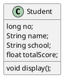
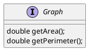
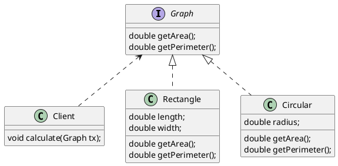
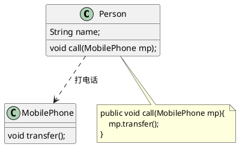
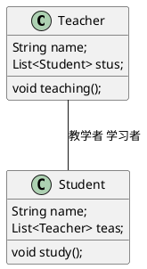
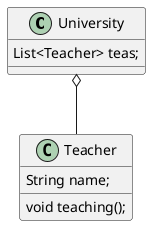
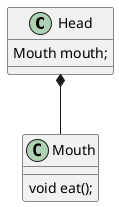
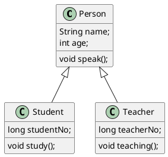
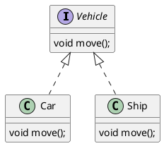

# UML中的类图及类图之间的关系
```
本文需安装插件才能正常浏览 plantuml图
https://chrome.google.com/webstore/detail/pegmatite/jegkfbnfbfnohncpcfcimepibmhlkldo

Idea 中如果要正常浏览，需要使用 Markdown navigator插件替换原有的Markdown插件
```
## 类之间的关系


## 类图


## 接口


## 有关系的类图



## 类之间的关系
* 依赖关系
* 关联关系
* 聚合关系
* 组合关系
* 泛化关系
* 实现关系
### 1 依赖关系

### 2 关联关系

### 3 聚合关系

### 4 组合关系

### 5 泛化关系

### 6 实现关系
