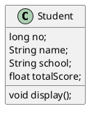
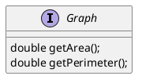
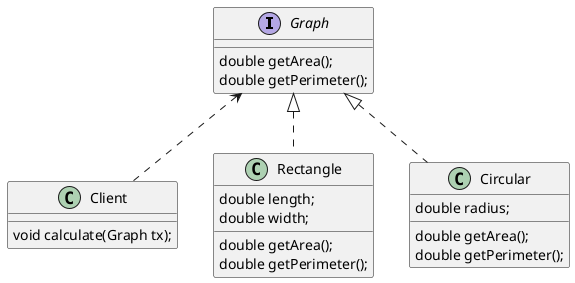

# UML中的类图及类图之间的关系
```
本文需安装插件才能正常浏览 plantuml图
https://chrome.google.com/webstore/detail/pegmatite/jegkfbnfbfnohncpcfcimepibmhlkldo
```
## 类之间的关系


## 类图


## 接口


## 有关系的类图



## 类之间的关系
* 依赖关系
* 关联关系
* 关联关系
* 聚合关系
* 组合关系
* 泛化关系
* 实现关系
### 1 依赖关系
### 2 依赖关系
### 3 关联关系
### 4 关联关系
### 5 聚合关系
### 6 组合关系
### 7 泛化关系
### 8 实现关系


