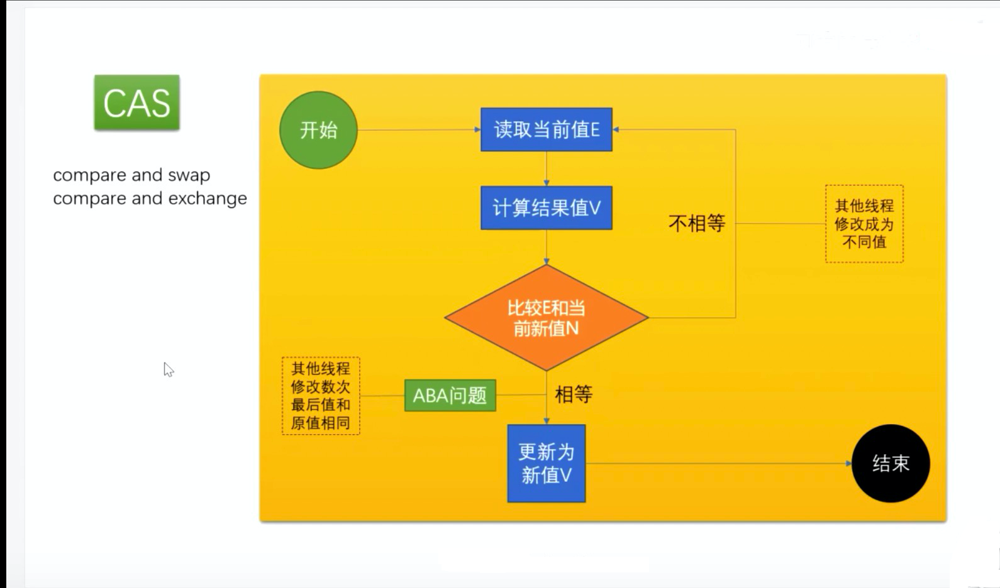
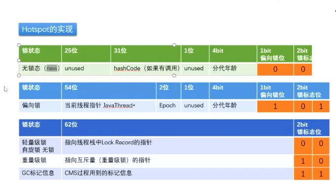
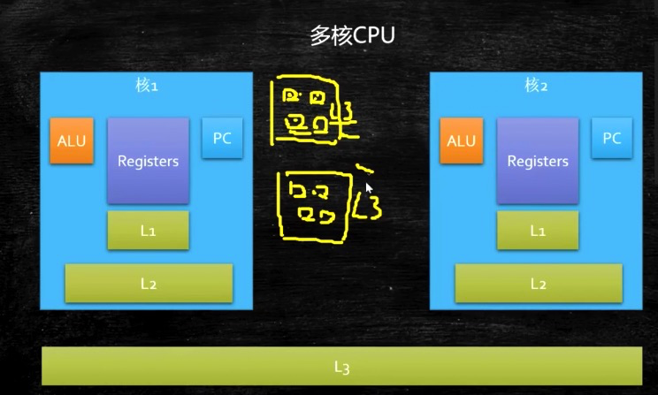
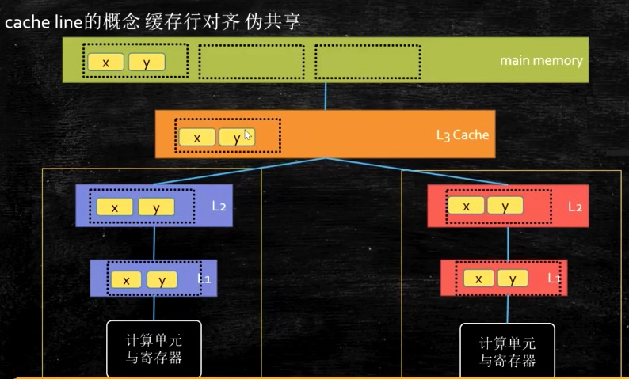
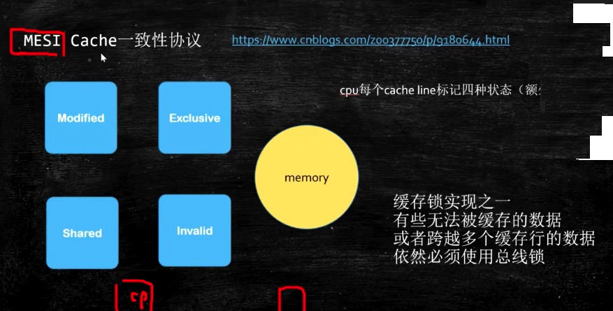
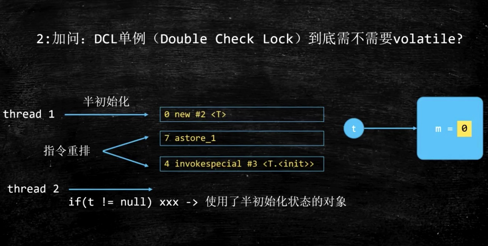

# Java多线程高并发讲解

## 1 大厂真题
* 请描述synchronized 和 reentrantlock的底层实现及重入的底层原理 （百度 阿里）
* 请描述锁四种状态和升级过程 （百度 阿里）
* CAS的ABA问题如何解决 （百度）
* 请谈一下AQS，为什么AQS的底层是CAS + volatile（百度）
* 请谈一下你对volatile的理解 （美团 阿里）
* volatile的可见性 和 禁止指令重排序是如何实现的 （美团）
* CAS是什么 （美团）
* 请描述一下对象的创建过程 （美团 顺丰）
* 对象在内存中的内存布局 （美团 顺丰）
* DCL单例为什么要加volatile（美团）
* 解释一下所得四种状态（顺丰）
* Object o = new Object() 在内存中占了多少字节？ （顺丰）
* 请描述synchronized和 ReentrantLock的异同
* 聊聊你对 as-if-serial和 happens-before语句的理解（京东）
* 你了解ThreadLocal吗？ 你知道ThreadLocal中如何解决内存泄漏问题？（京东 阿里）
* 请描述一下锁的分类以及JDK中的应用（阿里）


77C9CAF7-869F-4B08-B3ED-F4A8478F958F
## 2 CAS
### 2.1 CAS介绍

Compare And Swap (Compare And Exchange) / 自旋 / 自旋锁 / 无锁

因为经常配合循环操作，直到完成为止，所以泛指一类操作

cas(v, a, b) ，变量v，期待值a, 修改值b

ABA问题，你的女朋友在离开你的这段儿时间经历了别的人，自旋就是你空转等待，一直等到她接纳你为止

解决办法（版本号 AtomicStampedReference），基础类型简单值不需要版本号

举个例子
```java
AtomicInteger i = new AtomicInteger();

// JDK中的实现
public final int incrementAndGet() {
    return unsafe.getAndAddInt( this, valueOffset, i) + 1;
}
public final int getAndAddInt(Object var1, long var2, int var4){
    int var5;
    // 在这里一直做添加处理
    do{
        var5 = this.getIntVolatile(var1, var2);
    }while(!this.compareAndSwapInt(var1,var2,var5, var5 + var4))
    return var5;
}
// compareAndSwapInt 就是一个CAS操作
```
* CAS: compare and swap
在没有所得情况下，能保证多个线程对一个值的更新。
* 先读取，在写的时候，比较当前值是不是读取的值，是就直接更新
* 如果不是，继续之前的操作，直到满足条件
### 2.2 CAS 的 ABA问题，其他线程修改次数最后值原值相同
那么如何ABA问题，就要对当前值加上一个版本号，写的时候不仅对比值而且比较版本号。
* 使用 AtomicStampedReference

### 2.3 CAS的底层实现

jdk8u: unsafe.cpp:

cmpxchg = compare and exchange

```c++
UNSAFE_ENTRY(jboolean, Unsafe_CompareAndSwapInt(JNIEnv *env, jobject unsafe, jobject obj, jlong offset, jint e, jint x))
  UnsafeWrapper("Unsafe_CompareAndSwapInt");
  oop p = JNIHandles::resolve(obj);
  jint* addr = (jint *) index_oop_from_field_offset_long(p, offset);
  return (jint)(Atomic::cmpxchg(x, addr, e)) == e;
UNSAFE_END
```

jdk8u: atomic_linux_x86.inline.hpp

is_MP = Multi Processor

```c++
inline jint     Atomic::cmpxchg    (jint     exchange_value, volatile jint*     dest, jint     compare_value) {
  int mp = os::is_MP();
  __asm__ volatile (LOCK_IF_MP(%4) "cmpxchgl %1,(%3)"
                    : "=a" (exchange_value)
                    : "r" (exchange_value), "a" (compare_value), "r" (dest), "r" (mp)
                    : "cc", "memory");
  return exchange_value;
}
```

jdk8u: os.hpp is_MP()

```c++
  static inline bool is_MP() {
    // During bootstrap if _processor_count is not yet initialized
    // we claim to be MP as that is safest. If any platform has a
    // stub generator that might be triggered in this phase and for
    // which being declared MP when in fact not, is a problem - then
    // the bootstrap routine for the stub generator needs to check
    // the processor count directly and leave the bootstrap routine
    // in place until called after initialization has ocurred.
    return (_processor_count != 1) || AssumeMP;
  }
```

jdk8u: atomic_linux_x86.inline.hpp

```c++
#define LOCK_IF_MP(mp) "cmp $0, " #mp "; je 1f; lock; 1: "
```
最终实现：

cmpxchg = cas修改变量值

```assembly
lock cmpxchg 指令
```
lock指定在执行后面指令的时候，锁定了一个北桥指令

## 3 工具查看对象在内存里的布局
### 3.1 面试题： Object o = new Object() 在内存中占了多少个字节（顺丰)
### 3.2 工具：JOL = Java Object Layout
```xml
<dependencies>
    <dependency>
        <groupId>org.openjdk.jol</groupId>
        <artifactId>jol-core</artifactId>
        <version>0.9</version>
    </dependency>
</dependencies>
```
```java
public class Case001_New_Object {

    public static void main(String[] args){
        Object o = new Object();
        System.out.println(ClassLayout.parseInstance(o).toPrintable());

        synchronized (o){
            System.out.println(ClassLayout.parseInstance(o).toPrintable());
        }
    }
}
```

输出结果如下
```
java.lang.Object object internals:
 OFFSET  SIZE   TYPE DESCRIPTION                               VALUE
      0     4        (object header)                           05 00 00 00 (00000101 00000000 00000000 00000000) (5)
      4     4        (object header)                           00 00 00 00 (00000000 00000000 00000000 00000000) (0)
      8     4        (object header)                           00 10 00 00 (00000000 00010000 00000000 00000000) (4096)
     12     4        (loss due to the next object alignment)
Instance size: 16 bytes
Space losses: 0 bytes internal + 4 bytes external = 4 bytes total

java.lang.Object object internals:
 OFFSET  SIZE   TYPE DESCRIPTION                               VALUE
      0     4        (object header)                           05 90 80 ea (00000101 10010000 10000000 11101010) (-360673275)
      4     4        (object header)                           bd 7f 00 00 (10111101 01111111 00000000 00000000) (32701)
      8     4        (object header)                           00 10 00 00 (00000000 00010000 00000000 00000000) (4096)
     12     4        (loss due to the next object alignment)
Instance size: 16 bytes
Space losses: 0 bytes internal + 4 bytes external = 4 bytes total

```

解释一下


一个对象有4个部分
* markword: 关于锁的信息，关于synchronized所有信息
* class pointer: 类型指针，指向属于什么类
* instance data: 实例数据
* padding: 对齐(补位)
>
* markword 8个字节
* class pointer 4个字节
* instance data 0个字节
* padding 补位 补了4个字节凑够16个字节（凑够8字节的倍数）

### 3.3 锁升级过程
> new - 偏向锁 - 轻量级锁（无锁、自旋锁、自适应自锁） - 重量级锁




> 以上所有信息记录在markword里面
>
> markword一共有 64位 4个字节
>
> markword里面记录了：锁，GC，分代，和 hashcode的信息

Synchronized优化的过程和markword息息相关

用markword中最低的三维代表锁的状态 其中1位是偏向锁 2位是普通锁

* step1 new:无锁
* step2 ：Thread 开始偏向锁
* step3 ：有别的线程来竞争资源， 原对象释放偏向锁，2者同时开始进入轻量级锁（自旋锁）
* step4 ：未竞争到锁资源的，时间过长（10次自旋） 升级为 重量级锁/互斥锁（内核态）
* step5 ：每一个重量级锁下面都有一个队列，不消耗CPU，不执行自旋

### 3.4 锁降级
知识发生在GC的过程中，所以简单的因为不存在即可。

### 3.5 所消除
```java
public void add(String str1, String str2){
    StringBuffer sb = new StringBuffer();
    sb.append(str1).append(str2);
}
```
> StringBuffer: 线程安全

> StringBuilder: 单线程效率高

> StringBuffer在 append的过程中，一直在加锁 解锁 加锁 解锁的过程中，
> 所以 StringBuffer 如果判断 这个 string仅在方法中使用，那么就不会再
> 标记Synchronized，自动消除 StringBuffer对象的内部锁

### 3.6 锁粗化 lock coarsening
```
public String test(String str){
    int i = 0;
    StringBuffer rsb = new StringBuffer();
    while( i < 100){
        sb.append(str);
        i++;
    }
    return sb.toString();
}
```

> 在以上代码中，对于原有的StringBuffer中是要加Synchronized
> 的，而jvm会把 Synchronized直接加在 while上

### 3.7 synchronized最底层实现
```
public class T{
    static volatile int i = 0;
    public static void n() { i++;}
    public static synchronized void m(){}
    public static void main(String[] args){
        for(int j=0; j< 1000_000; j++){
            m();
            n();
        }
    }
}
```
> java -XX:+UnlockDiagnosticVMOptions -XX:+PrintAssembly

> C1 Compile Level 1 / 一级优化
> C2 Compile Level 2 / 二级优化
> 找到 m() m()方法的汇编码，会看到 lock comxchg ... 命令

JVM中有JIT：Just In Time，讲热点代码，直接编译成机器语言，提高执行效率

使用一个插件 hsdis 将汇编语言 反编译成解释语言
### 3.8 synchronized的实现过程
* 1 Java代码的层级： synchronzied
* 2 编译的时候：monitorenter monitorexit
* 3 执行过程中自动升级： new -> 自旋锁/偏向锁 -> 轻量级锁 -> 重量级锁/互斥锁
* 4 CPU汇编 lock comxchg

## 4 volatile的可见性
特性
* 1 线程可见性
* 2 指令重排序
### 4.1 volatile的可见性
#### 4.1.1 Case003_Volatile
```java
public class Case003_Volatile {
    boolean running = true;
    void m(){
        System.out.println("m " + Thread.currentThread().getName() + " start");
        while(running){
        }
        System.out.println("m " + Thread.currentThread().getName() + " end");
    }

    public static void main(String[] args){
        Case003_Volatile t = new Case003_Volatile();
        new Thread(t::m, "t1").start();
        new Thread(t::m, "t2").start();
        new Thread(t::m, "t3").start();

        try{
            TimeUnit.SECONDS.sleep(1);
        }catch(InterruptedException e){
            e.printStackTrace();
        }
        t.running = false;
    }
}
```

执行结果
```
m t1 start
m t2 start
m t3 start
```
#### 4.1.2 Case004_Volatile

而加了 volatile之后
```java
public class Case004_Volatile {
    volatile Boolean running = true;
    void m(){
        System.out.println("m " + Thread.currentThread().getName() + " start");
        while(running){
        }
        System.out.println("m " + Thread.currentThread().getName() + " end");
    }

    public static void main(String[] args){
        Case004_Volatile t = new Case004_Volatile();
        new Thread(t::m, "t1").start();
        new Thread(t::m, "t2").start();
        new Thread(t::m, "t3").start();
        try{
            Thread.sleep(100);
        }catch(InterruptedException e){
            e.printStackTrace();
        }
        t.running = false;

    }
}
```
执行结果如下
```
m t1 start
m t2 start
m t3 start
m t1 end
m t3 end
m t2 end
```
#### 4.1.3 改造后的 Case003_Volatile ？？？有问题 TODO
但是一下代码，在while里面添加了一句话，又可见了，为什么？
```java
public class Case003_Volatile {
    boolean running = true;
    void m(){
        System.out.println("m " + Thread.currentThread().getName() + " start");
        while(running){
            System.out.println("m " + Thread.currentThread().getName() + " running");
        }
        System.out.println("m " + Thread.currentThread().getName() + " end");
    }

    public static void main(String[] args){
        Case003_Volatile t = new Case003_Volatile();
        new Thread(t::m, "t1").start();
        new Thread(t::m, "t2").start();
        new Thread(t::m, "t3").start();

        try{
            TimeUnit.SECONDS.sleep(1);
        }catch(InterruptedException e){
            e.printStackTrace();
        }
        t.running = false;
    }
}
```
### 4.2 计算机的组成
* 文件从磁盘加载到内存中
* 在内存里保存的是 一条一条的指令
* CPU 读取内存里面的指令
  * ProgramCounter(指令寄存器)：一条一条的指令的地址
  * Registers(寄存器)：存储数据
  * ALU(逻辑运算单元): 对Registers进行操作
  * cache(缓存)

### 4.3 CPU 内部缓存：L1、L2、L3
https://www.bilibili.com/video/BV1xK4y1C7aT?p=4 34分-37分 重点理解
* 速度对比


* 每层缓存之间的速度

  * CUP的速度是硬盘的100w倍
* 多核CPU共享一个L3缓存

* 什么叫做超线程
  * 线程叫做CPU执行的基本单位
  * 进程叫做CPU分配的基本单位
  * 线程切换 context swtich： 线程1 先放在PC，执行中，线程2来了，把线程1 保存一个地方，腾出来空间给线程2执行。
  * 超线程：是一个ALU对应多个PC|Register。就是所谓的四核八线程

### 4.4 cache line的概念： 缓存行对齐 伪共享
#### 4.4.1 概要

* 找数据 L0 -> L1 -> L2 -> L3 -> 主内存
* 读数据 主内存 -> L3 -> L2 -> L1 -> L0
* 读数据的时候 按块 来读
* cache line：一行数据 8字节 共8行 一共64个字节
* 64字节是CPU的同步的基本单位
#### 4.4.2 缓存行预备实例
分布在不同的PC里的L1里面
volatile 要互相通知
```java
public class Case005_CacheLine {
    private static class T {
        public volatile long x = 0L;
    }
    public static T[] arr = new T[2];

    static {
        arr[0] = new T();
        arr[1] = new T();
    }

    public static void main(String[] args) throws InterruptedException {
        Thread t1 = new Thread(()->{
           for(long i = 0 ; i < 1000_0000L; i++){
               arr[0].x = i;
           }
        });
        Thread t2 = new Thread(()->{
            for(long i = 0 ; i < 1000_0000L; i++){
                arr[1].x = i;
            }
        });
        final long start = System.nanoTime();
        t1.start();
        t2.start();
        t1.join();
        t2.join();
        System.out.println((System.nanoTime() - start)/100_0000);
    }
}
```
#### 4.4.3 缓存行对齐
参考 Case006_CacheLine
* 缓存行对齐，速度比上面程序快1倍以上
```java
public class Case006_CacheLine {
    // 以下做了什么事情：缓存行对齐
    private static class Padding{
        public volatile long p1, p2, p3, p4, p5 ,p6, p7;
    }
    // T 占 64个字节
    private static class T extends Padding{
        public volatile long x = 0L;
    }
    public static T[] arr = new T[2];

    static {
        arr[0] = new T();
        arr[1] = new T();
    }

    public static void main(String[] args) throws InterruptedException {
        Thread t1 = new Thread(()->{
           for(long i = 0 ; i < 1000_0000L; i++){
               arr[0].x = i;
           }
        });
        Thread t2 = new Thread(()->{
            for(long i = 0 ; i < 1000_0000L; i++){
                arr[1].x = i;
            }
        });
        final long start = System.nanoTime();
        t1.start();
        t2.start();
        t1.join();
        t2.join();
        System.out.println((System.nanoTime() - start)/100_0000);
    }
}
```
* 例子: disruptor 并发框架
> Disruptor是英国外汇交易公司LMAX开发的一个高性能队列，研发的初衷是解决内存队列的延迟问题（在性能测试中发现竟然与I/O操作处于同样的数量级）。基于Disruptor开发的系统单线程能支撑每秒600万订单，2010年在QCon演讲后，获得了业界关注。2011年，企业应用软件专家Martin Fowler专门撰写长文介绍。同年它还获得了Oracle官方的Duke大奖。
基于Disruptor开发的系统单线程能支撑每秒600万订单，2010年在QCon演讲后，获得了业界关注。2011年，企业应用软件专家Martin Fowler专门撰写长文介绍。同年它还获得了Oracle官方的Duke大奖。


### 4.5 MESI Cache一致性
> CPU核之间的缓存一致性协议



## 5 volatile的乱序性
特性
* 1 线程可见性
* 2 指令重排序
### 5.1 CPU的乱序执行

* 举个例子
```java
/**
 * 常理来说绝对不可能出现 x=0；y=0；的情况
 */
public class Case007_CPU_Disorder {

    private static int x = 0, y = 0;
    private static int a = 0, b = 0;

    public static void main(String[] args) throws InterruptedException {
        int i = 0;
        for(;;){
            i++;
            x = 0; y =0;
            a = 0; b = 0;
            Thread one = new Thread( new Runnable(){
                public void run(){
                    a = 1;
                    x = b;
                }
            });
            Thread other = new Thread(new Runnable(){
                public void run(){
                    b = 1;
                    y = a;
                }
            });
            one.start(); other.start();
            one.join(); other.join();

            String result = "第" + i + "次 (" + x + "," + y + ")";
            if( x == 0 && y == 0){
                System.err.println(result);
                break;
            }else{
//                System.out.println(result);
            }
        }
    }
}
```
结果
```
（JDK8)：第155523次 (0,0)
而(JDK11): 执行了半小时没出来
```
### 5.2 如何避免指令重排序/乱序执行
* valatile i: 源码
* ACC_VOLATILE: 字节码
* JVM的内存屏障: JVM
* hotspot实现:

#### 5.2.1 DCL单例 为什么要加volatile

```java
public class Case008_DCL_Singleton {

    private static volatile Case008_DCL_Singleton INSTANCE;

    private Case008_DCL_Singleton(){

    }

    public static Case008_DCL_Singleton getInstance(){
        if(INSTANCE == null){
            synchronized (Case008_DCL_Singleton.class){
                if(INSTANCE == null){
                    try{
                        Thread.sleep(1);
                    } catch (InterruptedException e) {
                        e.printStackTrace();
                    }
                    INSTANCE = new Case008_DCL_Singleton();
                }
            }
        }
        return INSTANCE;
    }

    public static void main(String[] args) throws InterruptedException {

        String hashcode = "";
        for(long i = 0 ; i < 100_00L; i++){
            new Thread(()->{
                System.out.println(Case008_DCL_Singleton.getInstance().hashCode());
            }).start;
        }
    }
}
```

#### 5.2.2 new 对象的时候到底有哪些操作
Object o = new Object(); 翻译成字节码之后


* 1 new 一个对象：按照这个对象的大小分配内存
* 2 对象的值 默认为 0 或者 null
* 3 invokespecial 调用构造方法
* 4 设置默认值
* 5 return回去

总而言之 new 一个对象 有一个中间态，叫半初始化状态


* thread2 拿到了半初始化状态的对象的话，直接返回了。
* 所以对于INSTANCE必须要加上volatile，禁止指令重排序
* 再回答 5.2.1

#### 5.2.3 内存屏障
* JVM内存屏障，两边的指令不可以重排！保证有序性。
* 内存屏障 sfence mfence lfence等系统源语
* 锁总线

Java规范中


#### 5.2.4 volatile的实现细节
JVM层面
* 写的时候
  * 1 StoreStoreBarrier(前)
  * 2 volatile写操作
  * 3 StoreLoadBarrier(后)
* 读的时候
  * 1 LoadLoadBarrier(前)
  * 2 volatile读操作
  * 3 LoadStoreBarrier(后)
如下图


#### 5.2.5 hotspot实现


## 6 强软弱虚 - Java中的引用类型

### 6.1 强引用
```
public class Case009_NormalReference {

    public static void main(String[] args) throws IOException {
        M o = new M();
        o = null;
        System.gc();
        System.in.read();
    }
}
class M{
    @Override
    protected  void finalize(){
        // 打印出finalize 表示被GC回收
        System.out.println("finalize");
    }
}
```
### 6.2 软引用
* 内存不够用的时候，直接把软引用拿走
* 主要用途是缓存
* 执行的时候 添加 -Xms20M
* SoftReference
```
import java.lang.ref.SoftReference;

public class Case010_SoftReference {

    public static void main(String[] args){
        SoftReference<byte[]> m = new SoftReference<>(new byte[1024*1024*10]);
        System.out.println(m.get());
        System.gc();
        try{
            Thread.sleep(500);
        }catch (InterruptedException e){
            e.printStackTrace();
        }
        System.out.println(m.get());

        byte[] b = new byte[1024*1024*15];
        System.out.println(m.get());
    }
}

```
### 6.3 弱引用
#### 6.3.1 弱引用的介绍
* 弱引用 没有人用到时，经历一次GC就被回收
```
import java.lang.ref.WeakReference;

public class Case011_WeakReference {
    public static void main(String[] args){
        WeakReference<M> m = new WeakReference<>(new M());

        System.out.println(m.get());
        System.gc();
        System.out.println(m.get());

        ThreadLocal<M> tl = new ThreadLocal<>();
        tl.set(new M());
        tl.remove();
    }
}

```

#### 6.3.2 先了解什么是 ThreadLocal
ThreadLocal叫线程本地变量
```java
import java.util.concurrent.TimeUnit;

public class Case013_ThreadLocal {
    static ThreadLocal<Person> t1 = new ThreadLocal<>();

    public static void main(String[] args){
        new Thread(()->{
            try{
                TimeUnit.SECONDS.sleep(2);
            }catch(InterruptedException e){
                e.printStackTrace();
            }
            System.out.println(t1.get());
        }).start();

        new Thread(()->{
            try{
                TimeUnit.SECONDS.sleep(1);
            }catch(InterruptedException e){
                e.printStackTrace();
            }
            t1.set(new Person());
        });
    }

    static class Person{
        String name = "zhangsan";

        public String toString(){
            String str = "name = " + name;
            return str;
        }
    }
}
```
输出结果
```
null
```
#### 6.3.3 ThreadLocal源码
```java
    // ThreadLocal源码跟踪
    ThreadLocal<M> tl = new ThreadLocal<>();
    tl.set(new M());
    tl.remove();

    
    
```
```java
public void set(T value) {
    Thread t = Thread.currentThread();
    ThreadLocalMap map = getMap(t);
    if (map != null) {
        map.set(this, value);
    } else {
        createMap(t, value);
    }
}
```
```java
ThreadLocalMap getMap(Thread t) {
    return t.threadLocals;
}

```
```java
ThreadLocal.ThreadLocalMap threadLocals = null;
```
```java
static class ThreadLocalMap {
    static class Entry extends WeakReference<ThreadLocal<?>> {
        /** The value associated with this ThreadLocal. */
        Object value;

        Entry(ThreadLocal<?> k, Object v) {
            super(k);
            value = v;
        }
    }
}
```
```java
static class Entry extends WeakReference<ThreadLocal<?>> {
    /** The value associated with this ThreadLocal. */
    Object value;

    Entry(ThreadLocal<?> k, Object v) {
        super(k);
        value = v;
    }
}
```
结论 ThreadLocal是用WeakReference实现的
#### 6.3.3 弱引用的实现

* Step1 tl 设置了一个强引用 指向 ThreadLocal
* Step2 之后key 设置了一个弱引用 指向 ThreadLocal

这个做法是为了防止内存泄露

* 在使用threadLocal的时候，一旦某些元素不适用了，必须使用 remove

#### 6.3.4 弱引用的应用
* JVM 里面的NIO
* Spring 里面的 @Transactional

### 6.4 虚引用

* 虚引用的作用： 管理堆外内存
* 在JVM中 GC是管理堆内内存的，专门的一个垃圾线程 专门管理 堆外内存
```java
import java.lang.ref.PhantomReference;
import java.lang.ref.Reference;
import java.lang.ref.ReferenceQueue;
import java.util.LinkedList;
import java.util.List;
import java.util.Queue;

public class Case012_PhantomReference {

    private static final List<Object> LIST = new LinkedList<>();
    private static final ReferenceQueue<M> QUEUE = new ReferenceQueue<>();
    public static void main(String[] args){
        PhantomReference<M> phantomReference = new PhantomReference<>(new M(), QUEUE);

        new Thread(()->{
           while(true){
               LIST.add( new byte[1024 * 1024]);
               try{
                   Thread.sleep(1);
               }catch(InterruptedException e){
                   e.printStackTrace();
                   Thread.currentThread().interrupt();
               }
               System.out.println(phantomReference.get());
           }
        }).start();

        new Thread(()->{
            while(true){
                Reference<? extends M> poll = QUEUE.poll();
                if(poll != null){
                    System.out.println("------- 被回收了 ------ " + poll);
                }
            }
        }).start();
    }
}
```
> JVM内有一个对象，关联着一个堆外内存，如果没人回收的话，会造成内存泄露
> 所以需要对以上的对象 进行管理。
> 那么将以上的对象 挂上一个虚引用即可。
