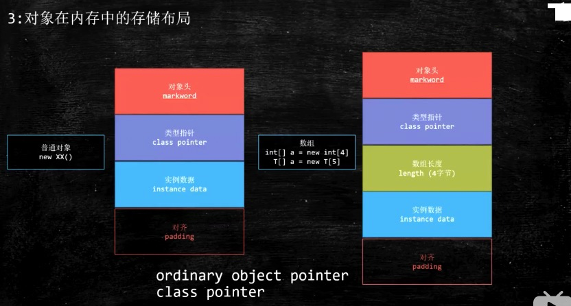

# Java多线程高并发讲解

## 1 大厂真题
* 请描述synchronized 和 reentrantlock的底层实现及重入的底层原理 （百度 阿里）
* 请描述所得四种状态和升级过程 （百度 阿里）
* CAS的ABA问题如何解决 （百度）
* 请谈一下AQS，为什么AQS的底层是CAS + volatile（百度）
* 请谈一下你对volatile的理解 （美团 阿里）
* volatile的可见性 和 禁止名利重排序是如何实现的 （美团）
* CAS是什么 （美团）
* 请描述一下对象的创建过程 （美团 顺丰）
* 对象在内存中的内存布局 （美团 顺丰）
* DCL单例为什么要加volatile（美团）
* 解释一下所得四种状态（顺丰）
* Object o = new Object() 在内存中占了多少字节？ （顺丰）
* 请描述synchronized和 ReentrantLock的异同
* 聊聊你对 as-if-serial和 happens-before语句的理解（京东）
* 你了解ThreadLocal吗？ 你知道ThreadLocal中如何解决内存泄漏问题？（京东 阿里）
* 请描述一下锁的分类以及JDK中的应用（阿里）


77C9CAF7-869F-4B08-B3ED-F4A8478F958F
## 2 CAS
### 2.1 CAS介绍

Compare And Swap (Compare And Exchange) / 自旋 / 自旋锁 / 无锁

因为经常配合循环操作，直到完成为止，所以泛指一类操作

cas(v, a, b) ，变量v，期待值a, 修改值b

ABA问题，你的女朋友在离开你的这段儿时间经历了别的人，自旋就是你空转等待，一直等到她接纳你为止

解决办法（版本号 AtomicStampedReference），基础类型简单值不需要版本号

举个例子
```java
AtomicInteger i = new AtomicInteger();

// JDK中的实现
public final int incrementAndGet() {
    return unsafe.getAndAddInt( this, valueOffset, i) + 1;
}
public final int getAndAddInt(Object var1, long var2, int var4){
    int var5;
    // 在这里一直做添加处理
    do{
        var5 = this.getIntVolatile(var1, var2);
    }while(!this.compareAndSwapInt(var1,var2,var5, var5 + var4))
    return var5;
}
// compareAndSwapInt 就是一个CAS操作
```
* CAS: compare and swap
在没有所得情况下，能保证多个线程对一个值的更新。
* 先读取，在写的时候，比较当前值是不是读取的值，是就直接更新
* 如果不是，继续之前的操作，直到满足条件
### 2.2 CAS 的 ABA问题，其他线程修改次数最后值原值相同
那么如何ABA问题，就要对当前值加上一个版本号，写的时候不仅对比值而且比较版本号。
* 使用 AtomicStampedReference

### 2.3 CAS的底层实现

jdk8u: unsafe.cpp:

cmpxchg = compare and exchange

```c++
UNSAFE_ENTRY(jboolean, Unsafe_CompareAndSwapInt(JNIEnv *env, jobject unsafe, jobject obj, jlong offset, jint e, jint x))
  UnsafeWrapper("Unsafe_CompareAndSwapInt");
  oop p = JNIHandles::resolve(obj);
  jint* addr = (jint *) index_oop_from_field_offset_long(p, offset);
  return (jint)(Atomic::cmpxchg(x, addr, e)) == e;
UNSAFE_END
```

jdk8u: atomic_linux_x86.inline.hpp

is_MP = Multi Processor

```c++
inline jint     Atomic::cmpxchg    (jint     exchange_value, volatile jint*     dest, jint     compare_value) {
  int mp = os::is_MP();
  __asm__ volatile (LOCK_IF_MP(%4) "cmpxchgl %1,(%3)"
                    : "=a" (exchange_value)
                    : "r" (exchange_value), "a" (compare_value), "r" (dest), "r" (mp)
                    : "cc", "memory");
  return exchange_value;
}
```

jdk8u: os.hpp is_MP()

```c++
  static inline bool is_MP() {
    // During bootstrap if _processor_count is not yet initialized
    // we claim to be MP as that is safest. If any platform has a
    // stub generator that might be triggered in this phase and for
    // which being declared MP when in fact not, is a problem - then
    // the bootstrap routine for the stub generator needs to check
    // the processor count directly and leave the bootstrap routine
    // in place until called after initialization has ocurred.
    return (_processor_count != 1) || AssumeMP;
  }
```

jdk8u: atomic_linux_x86.inline.hpp

```c++
#define LOCK_IF_MP(mp) "cmp $0, " #mp "; je 1f; lock; 1: "
```
最终实现：

cmpxchg = cas修改变量值

```assembly
lock cmpxchg 指令
```
lock指定在执行后面指令的时候，锁定了一个北桥指令

## 3 工具查看对象在内存里的布局
### 3.1 面试题： Object o = new Object() 在内存中占了多少个字节（顺丰)
### 3.2 工具：JOL = Java Object Layout
```xml
<dependencies>
    <dependency>
        <groupId>org.openjdk.jol</groupId>
        <artifactId>jol-core</artifactId>
        <version>0.9</version>
    </dependency>
</dependencies>
```
```java
public class Case001_New_Object {

    public static void main(String[] args){
        Object o = new Object();
        System.out.println(ClassLayout.parseInstance(o).toPrintable());

        synchronized (o){
            System.out.println(ClassLayout.parseInstance(o).toPrintable());
        }
    }
}
```

输出结果如下
```
java.lang.Object object internals:
 OFFSET  SIZE   TYPE DESCRIPTION                               VALUE
      0     4        (object header)                           05 00 00 00 (00000101 00000000 00000000 00000000) (5)
      4     4        (object header)                           00 00 00 00 (00000000 00000000 00000000 00000000) (0)
      8     4        (object header)                           00 10 00 00 (00000000 00010000 00000000 00000000) (4096)
     12     4        (loss due to the next object alignment)
Instance size: 16 bytes
Space losses: 0 bytes internal + 4 bytes external = 4 bytes total

java.lang.Object object internals:
 OFFSET  SIZE   TYPE DESCRIPTION                               VALUE
      0     4        (object header)                           05 90 80 ea (00000101 10010000 10000000 11101010) (-360673275)
      4     4        (object header)                           bd 7f 00 00 (10111101 01111111 00000000 00000000) (32701)
      8     4        (object header)                           00 10 00 00 (00000000 00010000 00000000 00000000) (4096)
     12     4        (loss due to the next object alignment)
Instance size: 16 bytes
Space losses: 0 bytes internal + 4 bytes external = 4 bytes total

```

解释一下



一个对象有4个部分
* markword: 关于锁的信息，关于synchronized所有信息
* class pointer: 类型指针，指向属于什么类
* instance data: 实例数据
* padding: 对齐(补位)
>
* markword 8个字节
* class pointer 4个字节
* instance data 0个字节
* padding 补位 补了4个字节凑够16个字节（凑够8字节的倍数）

### 3.3 锁升级过程
> new - 偏向锁 - 轻量级锁（无锁、自旋锁、自适应自锁） - 重量级锁


> 以上所有信息记录在markword里面
>
> markword一共有 64位 4个字节
>
> markword里面记录了：锁，GC，分代，和 hashcode的信息

Synchronized优化的过程和markword息息相关

用markword中最低的三维代表锁的状态 其中1位是偏向锁 2位是普通锁

* step1 new:无锁
* step2 ：Thread 开始偏向锁
* step3 ：有别的线程来竞争资源， 原对象释放偏向锁，2者同时开始进入轻量级锁（自旋锁）
* step4 ：未竞争到锁资源的，时间过长（10次自旋） 升级为 重量级锁/互斥锁（内核态）
* step5 ：每一个重量级锁下面都有一个队列，不消耗CPU，不执行自旋

### 3.4 锁降级
知识发生在GC的过程中，所以简单的因为不存在即可。

### 3.5 所消除
```java
public void add(String str1, String str2){
    StringBuffer sb = new StringBuffer();
    sb.append(str1).append(str2);
}
```
> StringBuffer: 线程安全

> StringBuilder: 单线程效率高

> StringBuffer在 append的过程中，一直在加锁 解锁 加锁 解锁的过程中，
> 所以 StringBuffer 如果判断 这个 string仅在方法中使用，那么就不会再
> 标记Synchronized，自动消除 StringBuffer对象的内部锁

### 3.6 锁粗化 lock coarsening
```
public String test(String str){
    int i = 0;
    StringBuffer rsb = new StringBuffer();
    while( i < 100){
        sb.append(str);
        i++;
    }
    return sb.toString();
}
```

> 在以上代码中，对于原有的StringBuffer中是要加Synchronized
> 的，而jvm会把 Synchronized直接加在 while上

### 3.7 synchronized最底层实现
```
public class T{
    static volatile int i = 0;
    public static void n() { i++;}
    public static synchronized void m(){}
    public static void main(String[] args){
        for(int j=0; j< 1000_000; j++){
            m();
            n();
        }
    }
}
```
> java -XX:+UnlockDiagnosticVMOptions -XX:+PrintAssembly

> C1 Compile Level 1 / 一级优化
> C2 Compile Level 2 / 二级优化
> 找到 m() m()方法的汇编码，会看到 lock comxchg ... 命令

JVM中有JIT：Just In Time，讲热点代码，直接编译成机器语言，提高执行效率

使用一个插件 hsdis 将汇编语言 反编译成解释语言
### 3.8 synchronized的实现过程
* 1 Java代码的层级： synchronzied
* 2 编译的时候：monitorenter monitorexit
* 3 执行过程中自动升级： new -> 自旋锁/偏向锁 -> 轻量级锁 -> 重量级锁/互斥锁
* 4 CPU汇编 lock comxchg

## 4 volatile
特性
* 1 线程可见性
* 2 指令重排序
