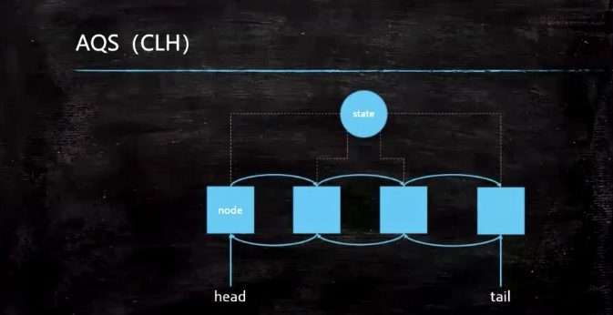
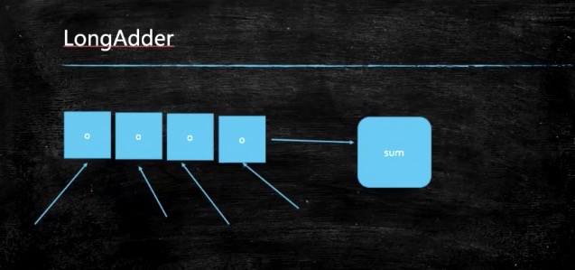
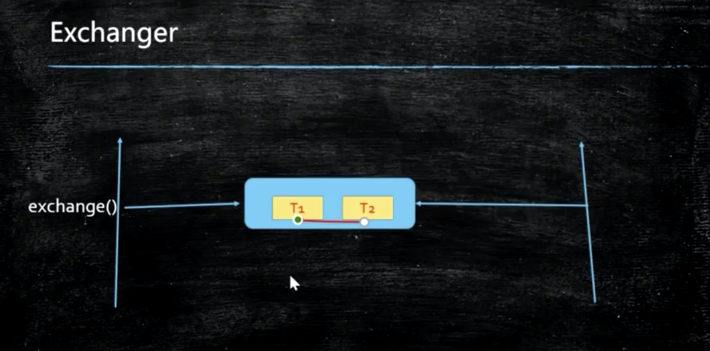

# Java多线程高并发详解2
## 1 AQS(CLH)

> 是一个用于构建锁和同步容器的框架。事实上concurrent包内许多类都是基于AQS构建，  
> 例如ReentrantLock，Semaphore，CountDownLatch，ReentrantReadWriteLock，  
> FutureTask等。AQS解决了在实现同步容器时设计的大量细节问题。


### 1.1 AstomicInteger 的原子操作
没有使用 atomicInteger的时候
```java
import java.util.ArrayList;
import java.util.List;

public class Case102_NoAtomicInteger {
    // 可见性、禁止命令乱序执行
    volatile int count = 0;

    // 加锁：慢
    synchronized void m(){
        for(int i = 0; i < 10000; i++){
            count++;
        }
    }

    public static void main(String[] args){
        Case102_NoAtomicInteger t = new Case102_NoAtomicInteger();

        List<Thread> threads = new ArrayList<Thread>();

        for( int i = 0; i < 10; i++){
            threads.add(new Thread(t::m, "thread-" + i));
        }
        threads.forEach((o) -> o.start());

        System.out.println(t.count);
    }
}

```

改用 AtomicInteger方法改写
```java
import java.util.ArrayList;
import java.util.List;
import java.util.concurrent.atomic.AtomicInteger;

public class Case101_AtomicInteger {
    AtomicInteger count = new AtomicInteger(0);

    void m(){
        for(int i = 0; i < 10000; i++){
            count.incrementAndGet(); // count++
        }
    }

    public static void main(String[] args){
        Case101_AtomicInteger t = new Case101_AtomicInteger();

        List<Thread> threads = new ArrayList<Thread>();

        for( int i = 0; i < 10; i++){
            threads.add(new Thread(t::m, "thread-" + i));
        }
        threads.forEach((o) -> o.start());

        System.out.println(t.count.get());
    }
}
```
输出结果
```
98247
```

### 1.2 对比 Atomic 和 Synchronized 对比 LongAdder之间的效率
```
import java.util.concurrent.atomic.AtomicLong;
import java.util.concurrent.atomic.LongAdder;

public class Case103_AtomicVsSyncVsLongAdder {

    static long count2 = 0L;
    static AtomicLong count1 = new AtomicLong(0);
    static LongAdder count3 = new LongAdder();

    public static void main(String[] args) throws InterruptedException {
        Thread[] threads = new Thread[1000];

        for(int i = 0; i< threads.length; i ++){
            threads[i] = new Thread(()->{
                for(int k=0; k<100_000; k++) count1.getAndIncrement();
            });
        }
        long start = System.currentTimeMillis();

        // 启动线程
        for(Thread t : threads) t.start();
        // 结束线程
        for(Thread t : threads) t.join();
        long end = System.currentTimeMillis();
        System.out.println("AtomicLong: " + count1.get() + " time " + (end-start));


        //-----------------------------

        Object lock = new Object();
        for(int i = 0; i< threads.length; i ++){
            threads[i] = new Thread(new Runnable(){
                @Override
                public void run(){
                    for( int k =0; k < 100_000; k++){
                        synchronized ((lock)){
                            count2++;
                        }
                    }
                }
            });
        }

        // 启动线程
        for(Thread t : threads) t.start();
        // 结束线程
        for(Thread t : threads) t.join();
        System.out.println("synchronized: " + count2 + " time " + (end-start));

        //-----------------------------

        for(int i = 0; i< threads.length; i ++){
            threads[i] = new Thread(()->{
                for(int k=0; k<100_000; k++) count3.increment();
            });
        }

        start = System.currentTimeMillis();
        // 启动线程
        for(Thread t : threads) t.start();
        // 结束线程
        for(Thread t : threads) t.join();
        end = System.currentTimeMillis();

        System.out.println("LongAdder: " + count3.longValue() + " time " + (end-start));


    }
}

```
输出结果
```
AtomicLong: 100000000 time 1806
synchronized: 100000000 time 1806
LongAdder: 100000000 time 495
```
为什么 LongAdder会非常快: 分段锁概念


## 2 ReentrantLock
### 2.1 synchronzied 本身就是可重入锁
```java
public class Case104_ReeentrantLock1 {

    /**
     * 加锁之后代码段m，同一时间只能被一个线程使用
     */
    synchronized void m1(){
        for(int i = 0 ; i < 10; i++){
            try{
                TimeUnit.SECONDS.sleep(1);
            }catch(InterruptedException e){
                e.printStackTrace();
            }

            System.out.println(i);

            if(i % 2 == 0) m2();
        }
    }
    synchronized void m2(){
        System.out.println("m2....");
    }

    public static void main(String[] args){

        // 生命一个可重入锁
        Case104_ReeentrantLock1 r1 = new Case104_ReeentrantLock1();
        new Thread(r1::m1).start();
        try{
            TimeUnit.SECONDS.sleep(1);
        }catch(InterruptedException e){
            e.printStackTrace();
        }
        new Thread(r1::m2).start();
    }
}
```
### 2.2 ReentranLock
> ReentrantLock主要利用CAS+AQS队列来实现。它支持公平锁和非公平锁，两者的实现类似
#### 2.2.1 可以替代 synchronzied, 但是 lock是需要 lock 和 finally{ unlock}
> 参考  Case105_ReentrantLock2
```java
import java.util.concurrent.TimeUnit;
import java.util.concurrent.locks.Lock;
import java.util.concurrent.locks.ReentrantLock;

public class Case105_ReentrantLock2 {

    Lock lock = new ReentrantLock();

    /**
     * 加锁之后代码段m，同一时间只能被一个线程使用
     */
    void m1(){
        try{
            lock.lock();
            for(int i = 0 ; i < 3; i++){
                TimeUnit.SECONDS.sleep(1);
                System.out.println(i);
//                if(i % 2 == 0 ) lock.t();
            }
        }catch(InterruptedException e){
            e.printStackTrace();
        }finally {
            lock.unlock();
        }
    }
    synchronized void m2(){
        try{
            lock.lock();
            System.out.println("m2....");

        } finally {
            lock.unlock();
        }
    }

    public static void main(String[] args){

        // 生命一个可重入锁
        Case105_ReentrantLock2 r1 = new Case105_ReentrantLock2();
        new Thread(r1::m1).start();
        try{
            TimeUnit.SECONDS.sleep(1);
        }catch(InterruptedException e){
            e.printStackTrace();
        }
        new Thread(r1::m2).start();
    }
}
```
#### 2.2.2 使用 tryLock
#### 2.2.3 使用 lockInterruptibly()试图唤醒原有sleep的线程
> 参考 Case106_ReentrantLock3
```
import java.util.concurrent.TimeUnit;
import java.util.concurrent.locks.Lock;
import java.util.concurrent.locks.ReentrantLock;


/**
 * 本段代码是有问题的
 */
public class Case106_ReentrantLock3 {

    public static void main(String[] args){
        Lock lock = new ReentrantLock();

        Thread t1 = new Thread(()->{
            try{
                lock.lock();
                System.out.println("t1 start");
                TimeUnit.SECONDS.sleep(Integer.MAX_VALUE);
                System.out.println("t1 end");
            }catch(InterruptedException e){
                System.out.println("interrupted!");
            }finally{
                lock.unlock();
                System.out.println("unlock 1!");
            }
        });
        t1.start();

        Thread t2 = new Thread(()->{
            try{
//                lock.tryLock();
                lock.lockInterruptibly(); // 可以对interrupte方法做出相应
                System.out.println("t2 start");
                TimeUnit.SECONDS.sleep(5);
                System.out.println("t2 end");
            }catch(InterruptedException e){
                System.out.println("interrupted! 2");
            }finally {
                lock.unlock();
                System.out.println("unlock 2!");
            }
        });
        t2.start();

        try{
            TimeUnit.SECONDS.sleep(1);
        }catch(InterruptedException e){
            e.printStackTrace();
        }
        t2.interrupt(); // 打断线程2的等待
    }
}

```
#### 2.2.4 ReentranLock也可以指定一个公平锁
* Lock lock = new ReentrantLock(true); // 表示为公平锁
> 使用队列等待，而不是自旋锁的抢

* Lock lock = new ReentrantLock(); // 表示为非公平锁
> 以下例子，打印出来锁释放的状态，2个线程抢占资源是公平的
```
import java.util.concurrent.locks.ReentrantLock;

public class Case108_ReentrantLock5  extends Thread{
    private static ReentrantLock lock = new ReentrantLock(true);
    public void run(){
        for(int i =0; i < 100; i ++){
            lock.lock();
            try{
                Thread.sleep(1);
                System.out.println(Thread.currentThread().getName() + "获得锁");
            } catch (InterruptedException e) {
                e.printStackTrace();
            } finally {
                lock.unlock();
            }
        }
    }
    public static void main(String[] args){
        Case108_ReentrantLock5 rl = new Case108_ReentrantLock5();
        Thread th1 = new Thread(rl);
        Thread th2 = new Thread(rl);
        th1.start();
        th2.start();
    }
}
```
* 面试题：用两个线程分别打印出 1 2 3 4，当线程1 打印完1 通知线程2 打印1，线程1 再开始打印2 ，以此类推。
> 注：该问题在高并发情况下，是需要使用线程之前通信的方法来实现，或者使用栅栏
```
import java.util.concurrent.TimeUnit;
import java.util.concurrent.locks.ReentrantLock;

public class Case109_ReentrantLock6 extends Thread{
    private static ReentrantLock lock = new ReentrantLock(true);
    public void run(){
        for(int i =1; i < 5; i ++){
            lock.lock();
            try{
                Thread.sleep(1);
                System.out.println(Thread.currentThread().getName() + "-" + i);
            } catch (InterruptedException e) {
                e.printStackTrace();
            } finally {
                lock.unlock();
            }
        }
    }
    public static void main(String[] args){
        Case109_ReentrantLock6 rl = new Case109_ReentrantLock6();
        Thread th1 = new Thread(rl::run, "th1");
        Thread th2 = new Thread(rl::run, "th2");
        th1.start();
        th2.start();
    }
}
```

## 3 CountDownLatch
> CountDownLatch 是原子的，没有线程安全的问题
> 倒数的门栓，5 4 3 2 1 门栓就开了
> 某种意义上 countDownLatch可以和 join的作用相同
> 但是 join只有在线程结束的时候才能继续，而 countDownLatch.countDown()更自由

```java
import java.util.concurrent.CountDownLatch;

public class Case110_CountDownLatch {
    
    public static void main(String[] args){
        usingJoin();
        usingCountDownLatch();
    }

    private static void usingCountDownLatch() {
        Thread[] threads = new Thread[100];
        CountDownLatch latch = new CountDownLatch(threads.length);

        for( int i = 0; i < threads.length ; i++){
            threads[i] = new Thread(()->{
                int result = 0;
                for( int j =0; j < 10000; j++) result +=j;
                latch.countDown();
                // 100 -> 99 -> 98 -> ....
            });
        }
        // 所有线程开始
        for(int i = 0; i < threads.length; i++){
            threads[i].start();
        }

        try{
            // 所有线程的门栓开始锁
            latch.await();
        }catch(InterruptedException e){
            e.printStackTrace();
        }

        System.out.println("end latch");

    }

    private static void usingJoin() {
        Thread[] threads = new Thread[100];
        for( int i = 0; i < threads.length ; i++){
            threads[i] = new Thread(()->{
                int result = 0;
                for( int j =0; j < 10000; j++) result +=j;
            });
        }
        // 所有线程开始
        for(int i = 0; i < threads.length; i++){
            threads[i].start();
        }

        for(int i = 0; i < threads.length; i++) {
            try{
                // 线程结束、每一个线程都等着 合并在当前线程上
                threads[i].join();
            }catch(InterruptedException e){
                e.printStackTrace();
            }

        }

        System.out.println("end latch");
    }
}
```

参考模式： https://www.bilibili.com/video/BV1xK4y1C7aT?p=14


## 4 CyclicBarrier
### 4.1 CyclicBarrier的概念
> 栅栏，类似一个发令枪的概念
> n多个人一起等待，人数够了，栅栏推到，跑。
> 然后栅栏再起来，再等人，推到，跑

### 4.2 CyclicBarrier的应用
* 场景1
> 另外：google有一个Guava RateLimiter用在实际生产上比较多

* 使用场景2
  * 复杂操作
    * 数据库
    * 网络
    * 文件
  * 并发执行后，等待其他几个，再执行其他操作
    * 线程1 - 操作1
    * 线程2 - 操作2
    * 线程3 - 操作3

## 5 Phaser
写遗传算法，phaser是实用的，这里暂时跳过
参考 https://www.bilibili.com/video/BV1xK4y1C7aT?p=14 98分钟

## 6 ReadWriteLock
### 6.1 ReadWriteLock的理解
* 共享锁： ReadLock
* 排他锁： WriteLock
参考 https://www.bilibili.com/video/BV1xK4y1C7aT?p=14  116分钟

> 读的时候，大家一起读，
> 写的时候，大家等会儿读，等我写完了再读

### 6.2 ReadWriteLock的应用

分析以下代码
```java
package com.thefirstwind;

import java.util.Random;
import java.util.concurrent.locks.Lock;
import java.util.concurrent.locks.ReadWriteLock;
import java.util.concurrent.locks.ReentrantLock;
import java.util.concurrent.locks.ReentrantReadWriteLock;

/**
 * 读锁 + 写锁
 * 读锁：共享锁
 * 写锁：排他锁
 */
public class Case112_ReadWriteLock {
    // 当前这个锁，一旦加锁，其他人是无法拿到的（资源独占)
    static Lock lock = new ReentrantLock();

    private static int value;

    static ReadWriteLock readWriteLock = new ReentrantReadWriteLock();
    static Lock readLock = readWriteLock.readLock();
    static Lock writeLock = readWriteLock.writeLock();

    public static void read(Lock lock){
        try{
            // 读的时候上锁
            lock.lock();
            Thread.sleep(1000);
            System.out.println("read over");
        }catch(InterruptedException e){
            e.printStackTrace();
        }finally{
            lock.unlock();
        }
    }

    public static void write(Lock lock, int v){
        try{
            lock.lock();
            Thread.sleep(1000);
            value = v;
            System.out.println("write over!");
        } catch (InterruptedException e) {
            e.printStackTrace();
        } finally {
            lock.unlock();
        }
    }

    public static void main(String[] args){
//        Runnable readR = ()-> read(lock);
//        Runnable writeR = ()->write(lock, new Random().nextInt());
        Runnable readR = ()->read(readLock);
        Runnable writeR = ()->write(writeLock, new Random().nextInt());

        for(int i =0; i< 18; i++) new Thread(readR).start();
        for(int i =0; i< 2; i++) new Thread(writeR).start();
    }
}
```
* 1 reenTrantLock 是互斥锁，也叫排他锁。可以是 公平锁，和非公平锁。 基本上和 synchronized的用法一致。
* 2 讲reenTrantLock换成 读写锁，效率很快。如果不用的话，可能会出现脏读。
* 3 但是实践中 首选synchronized来考虑

### 6.3 秒杀的实现
* 用 atomicInteger 比较合适
* 用乐观锁和消息队列FIFO 都可以


## 7 Semaphore: 信号量、信号灯

* 允许线程池有几个线程：限流

* 车道和收费站：公平限流，FIFO

* permits 允许的并行数量

Semaphore s = new Semaphore(1);

```java
import java.util.concurrent.Semaphore;

public class Case113_Semaphore {

    public static void main (String[] args){
        // 有几盏信号灯
        Semaphore s = new Semaphore(1, true);

        new Thread(()->{
            try{
                s.acquire();

                System.out.println("T running...");
                Thread.sleep(200);
                System.out.println("T running...");
                s.release();
            } catch (InterruptedException e) {
                e.printStackTrace();
            }
        }).start();
        
         new Thread(()->{
            try{
                s.acquire();

                System.out.println("T2 running...");
                Thread.sleep(200);
                System.out.println("T2 running...");
                s.release();
            } catch (InterruptedException e) {
                e.printStackTrace();
            }
        }).start();


    }
}
```

## 8 exchanger
线程中交换数据用的
* exchanger.exchange() 方法是阻塞的
```java
import java.util.concurrent.Exchanger;

public class Case114_Exchange {

    static Exchanger<String> exchanger = new Exchanger<>();

    public static void main(String[] args){
        new Thread(()->{
            String str = "T1";
            try {
                str = exchanger.exchange(str);
            } catch (InterruptedException e) {
                e.printStackTrace();
            }
            System.out.println(Thread.currentThread().getName() + " " + str);
        }, "t1").start();

        new Thread(()->{
            String str = "T2";
            try {
                str = exchanger.exchange(str);
            } catch (InterruptedException e) {
                e.printStackTrace();
            }
            System.out.println(Thread.currentThread().getName() + " " + str);
        }, "t2").start();

    }
}
```


## 9 锁的分类总结
### 锁的分类： 乐观锁、悲观锁、自旋锁、读写锁（排他锁、共享锁）分段锁等等各自特点，以及Java中的具体实现方式
* 乐观锁：凡是CAS都是乐观锁
* 悲观锁：synchronized
* 自旋锁：CAS
* 读写锁：ReadWriteLock
* 分段锁：LongAdder ConcurrentHashMap

