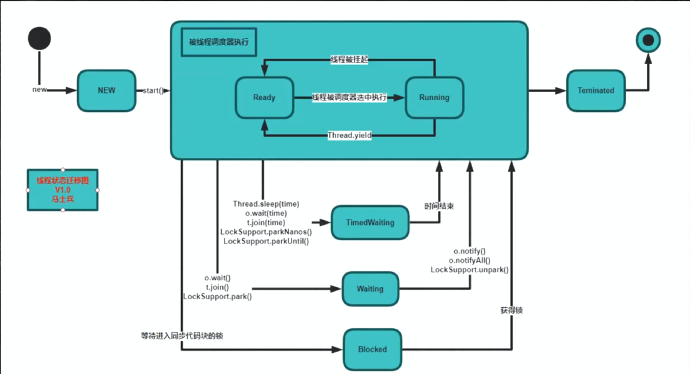

https://www.bilibili.com/video/BV12A411E7zo/

## 考核thread理解的套路
* 上天
  * 锻炼解决问题技能
  * 高并发 缓存 大流量 大数据量
* 入地
  *  面试
  *  JVM OS 算法 线程 IO

## 基本概念
* 进程 线程 协程
* program app
* QQ runing -> 进程
* 线程 -> 一个进程里面的不同执行路径
* 协程 -> CPU - Ring0 - 12 - Ring3
  * Ring 0 -> 内核态 Ring3 -> 用户态
  * 内核调用/系统调用 - 线程的操作
  * 用户态启动线程
    * 进入到内核态 - 保存用户态的线程
    * 用户态 不经过内核态的线程 - 协程 Golang里的go程
* 用户态 - 内核态
  * int 0x80 - 128
  * sysenter cpu支持
  * 保存

### 什么是线程：
* 一个程序里不同的执行路径
> 参考 Case001_WhatIsThread.java

### 如何创建线程
* 1 extends Thread
* 2 implement Runable
* 3 new Thread(()->{}).start();
* 4 通过线程池  Executors.newCachedThread
> 参考 Case002_HowToCreateThread

### 线程的几个方法
* Thread.sleep()：睡一会儿，制定时间
* Thread.Yeild()：让出一下cpu，去等待队列里
* t1.join()：去另外一个线程去运行，经常用来等待另外一个线程的结束
> 参考 Case003_Sleep_Yield_Join

### 线程的几个状态

* 1 new
* 2 Runnable: Ready、Running
* 3 TimedWaiting
* 4 Waiting
* 5 Blocked
* 6 Terminated
> 参考 Case004_ThreadState

### 线程的Interrupte方法 和 stop方法
* stop不建议使用
* interrupte的作用不是打断线程的处理
* 在工程中 不能用以上2个方法，来控制程序业务逻辑的运行。
* 如果非要使用interrupte，在一个程序执行非常长的时间，sleep很久，那么就用interrupte打断，并且在sleep后异常抛出


## synchronized 关键字

* synchronized 锁定是，锁一个对象
> 参考 Case011_Synchronized

* synchronized(this) 和 public synchronized void m(){} 是等价的
> 注 Case012_Synchronized 和 Case013_Synchronized 是等价的
```
public class Case012_Synchronized {

    private int count = 10;

    public void m(){
        synchronized (this){
            count--;
            System.out.println(Thread.currentThread().getName() + "count = " + count);
        }
    }
}
```
```
public class Case013_Synchronized {
    private int count = 10;

    public synchronized void m(){
        count--;
        System.out.println(Thread.currentThread().getName() + "count = " + count);
    }
}

```

* synchronized 加载静态方法上，相当于 加载 Class上
```
public class Case014_Synchronized {

    public static int count = 10;

    public synchronized  static void m(){ // 这里等同于 synchronized(Case014_Synchronized.class)
        count--;
        System.out.println(Thread.currentThread().getName() + " count = " + count);
    }

    public static void mm(){
        synchronized (Case014_Synchronized.class){
            count--;
        }
    }
}
```


