# Mysql讲解

<!--https://www.bilibili.com/video/BV1bD4y1m7RU?from=search&seid=2211861062542380942-->

## 1 Mysql的相关知识点需要了解哪些
* 调优
* 索引
* MVCC
* 存储索引
* 事务
* 主从复制
* 读写分离
* 分库分表
* 锁
* 日志系统

## 2 Mysql的整体架构
* 连接器：管理连接，验证权限
* 分析器：词法分析，语法分析
  * sharding-sphere: 数据库中间件，重点关注
* 优化器：一共134个优化器自动选择
  * CBO：基于 成本 的优化
  * RBO：基于 规则 的优化
```
select * from A join B join C
并不是，先查A再查B再查C
```
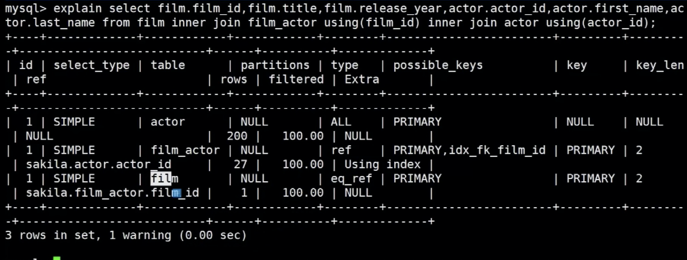

如图 顺序不是严格按照 ABC的顺序执行的

如果一定要按照ABC的顺序的话，使用 straight_join 方法，一般来说不建议使用

* 执行器：用来跟存储引擎直接做交互
* 存储引擎：innodb，myisam，memory
  * innodb支持事务，myisam不支持
  * innodb支持外检，myisam不支持
  * innodb支持表锁和行锁，但是myisam只支持标锁
  * innodb在5.6之后 支持全文索引，myisam一直支持
  * innodb是索引的叶子节点，直接存放数据，myisam存的是地址

mysql的架构图
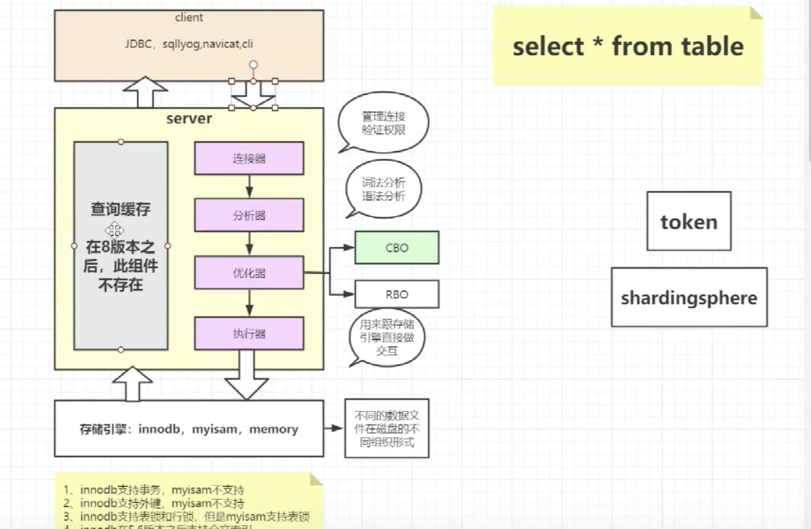

* sql解析的工具：calcite、antlr
> sql解析工具

* 索引能加快数据，索引要不要保存到磁盘？ 要的
  * 局部性原理：数据和程序都有聚集成群的倾向，空间局部性，时间局部性
  * 磁盘预读：按照块区来读取。这个逻辑单位叫做页，datapage，一般是4K或者8K，在读取的时候都是4K的整数呗，innodb每次读取16K的数据

* mysql索引的数据结构
  * hash：memory索引存储使用hash索引，innodb支持自适应hash
  * 树：B+树
    * 多叉树
    * 节点有序
    * 每一个节点可以存储多个数据
    * 是一颗平衡树

## 3 B+树的介绍
### 3.1 B+树在B树的基础上做了以下的优化
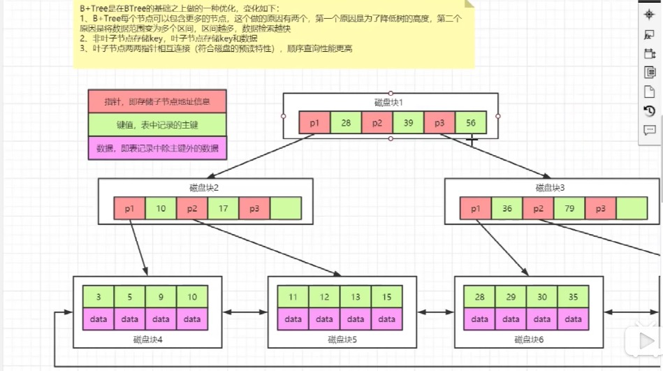;

### 3.1 B+树的层级
B+树 里面一个节点所能保证的是 degree-1条记录mysql的索引，一般有几层？

一般情况下，3、4层足以支撑千万级表的查询

### 3.2 创建索引的字段 是长了好还是短了好？
短了好。 原因在层数不变的时候，可以存出更多的数据量

* 我们在创建表的时候是在代理主键还是自然主键

### 3.4 mysql的innodb是否支持hash索引：
答案是： innodb存储索引支持的哈希索引是自适应的，会根据表的使用情况，自动为表生成哈希索引，不能人为干预。
但是，hash索引 在任何时候都不能避免表的扫描。所以Hash索引无法用来避免数据的排序操作。


## 4 B树
计算机有一个局部性原理，就是说，当一个数据被用到时，其附近的数据也通常会马上被使用
使用红黑树的话，一次只能得到一个健值的信息，而用B树的话，可以得到最多M-1个健值信息。
红黑树阶数更大，B树更短，这样查找的时候B树就更有优势，效率更高。

### 4.1 B树的概念
* 首先B树是二叉查找树的改进
* B树的设计思想：将相关数据尽量集中在一起，以便一次读取多个数据
* 根节点至少有2个子节点
* 每个节点有M-1个KEY，而且升序排列
* 位于M-1和 M key的子节点的值位于M-1和M key对应的value之间
* 其他节点至少有M/2个子节点
* 所有叶子节点都在同一层
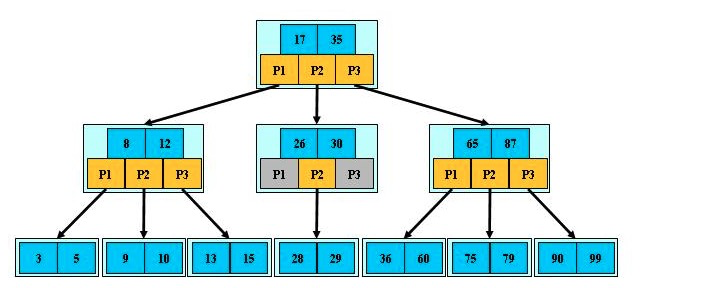
### 4.3 B树的插入
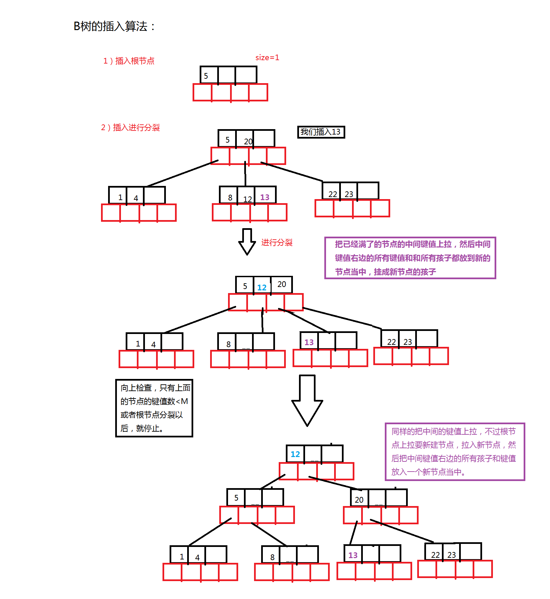
* 把已满的中间值上拉，然后中间健值右边的所有健值和所有孩子都放到新节点中，挂成新节点的孩子

## 5 B+树
<!--https://zhuanlan.zhihu.com/p/149287061-->
### 5.1 B+树的概念
* 定义和B树基本相同，除了：
* 非叶子节点的子树指针与 关键字 个数相同
* 非叶子节点的子树指针P[i],指向关键字值属于(K[i],K[i+1])的子树
* 为所有叶子节点增加一个链指针
* 所有关键字都在叶子节点上出现

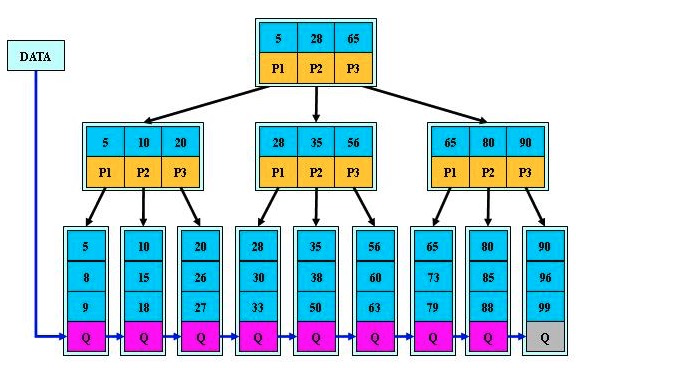

### 5.2  B+树的特点：
> B+树通过仅在树的叶子结点中存储数据指针而消除了上述缺陷。  
> 因此，B+树的叶结点的结构与 B树的内部结点的结构完全不同。  
> 在这里应该注意，由于数据指针仅存在于叶子结点中，因此叶子结点必须将所有键值及其对应的数据指针存储到磁盘文件块以便访问。  
> 此外，叶子结点被链接磁盘的某个位置，以提供对记录的有序访问。  
> 因此，叶子结点形成第一级索引，而内部结点形成多层索引的其他层。  
> 叶子结点的某些关键字 key 也出现在内部结点中，充当控制搜索记录的媒介。

### 5.2 B+树的查找

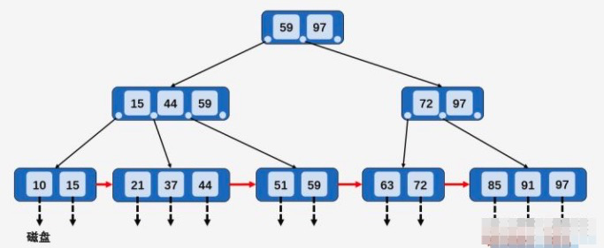
* B+树中所有数据均保存在叶子节点上

* 第一次磁盘 I/O ：访问根结点 [59、97] ，发现 59 小于等于 [59、97] 中的 59 ，则访问根结点的第一个孩子结点。

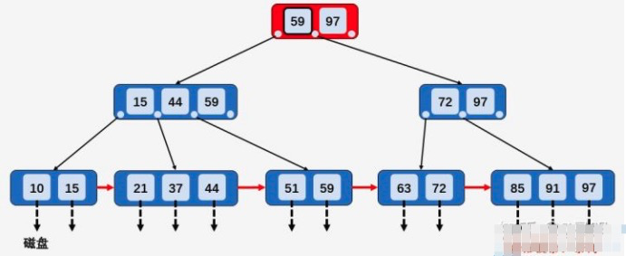

* 第二次磁盘 I/O : 访问结点 [15、44、59] ，发现 59 大于 44 且小于等于 59 ，则访问当前结点的第三个孩子结点 [51、59]

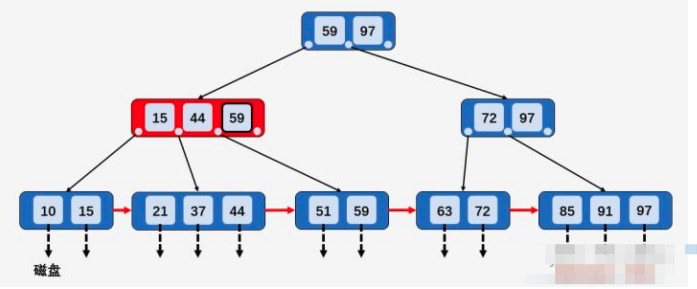

* 第三次磁盘 I/O ：访问叶子结点 [51、59] ，顺序遍历结点内部，找到要查找的元素 59

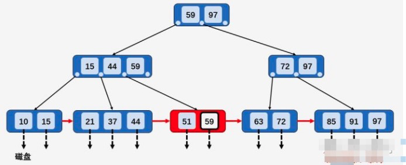

### 5.3 比较 B树和B+树的查找过程
查询[21,63]之间的数据

#### 5.3.1 B树的查询过程

* B树的数据结构

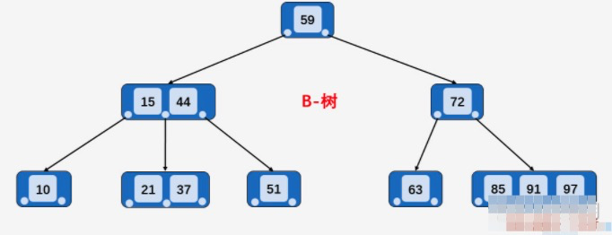

* 第一步：访问 B-树的根结点 [59] ，发现 21 比 59 小，则访问根结点的第一个孩子 [15、44]

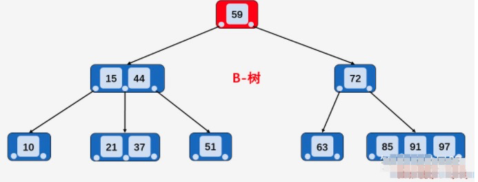

* 第二步：访问结点 [15、44] ，发现 21 大于 15 且小于 44 ，则访问当前结点的第二个孩子结点 [21、37]

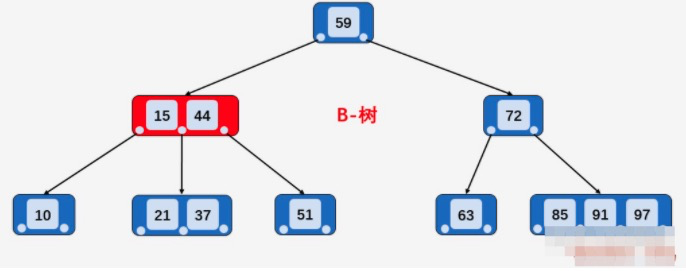

* 第三步：访问结点 [21、37] , 找到区间的左端点 21 ，然后从该关键字 21 开始，进行中序遍历，依次为关键字 37 、44、51、59，直到遍历到区间的右端点 63 为止， 不考虑中序遍历过程的压栈和入栈操作，光磁盘 I/O 次数就多了 2次，即访问结点 72 和结点 63
* 注意这里要进行多次中序遍历，而B+树是不需要的

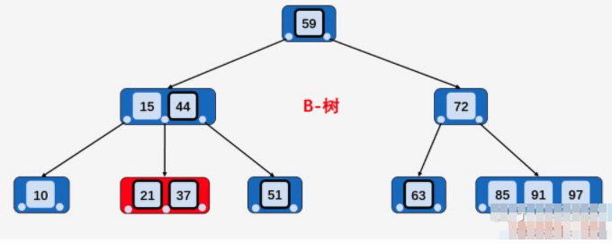

#### 5.3.2 B+树的查询过程

* B+树的数据结构

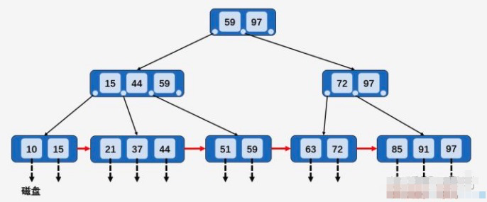

* 第一步：访问根结点 [59、97] , 发现区间的左端点 21 小于 59， 则访问第一个左孩子 [15、44、59]

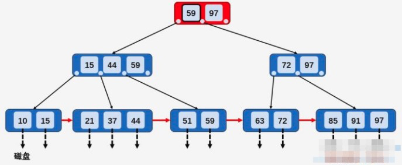

* 第二步：访问结点 [15、44、59] ，发现 21 大于 15 且小于 44 ，则访问第二个孩子结点 [21、37，44]

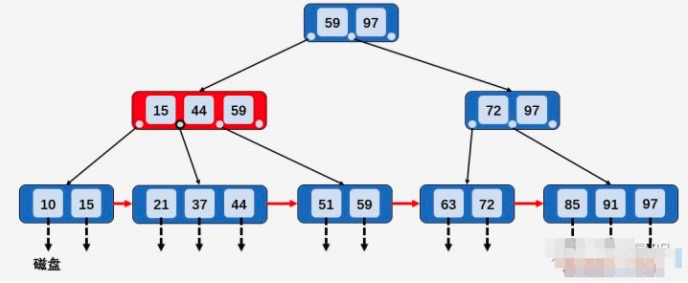

* 第三步：访问结点 [21、37，44] ，找到了左端点 21 ，此时 B+树的优越性就出来了，不再需要中序遍历，而是相当于单链表的遍历，直接从左端点 21 开始一直遍历到左端点 63 即可，没有任何额外的磁盘 I/O 操作

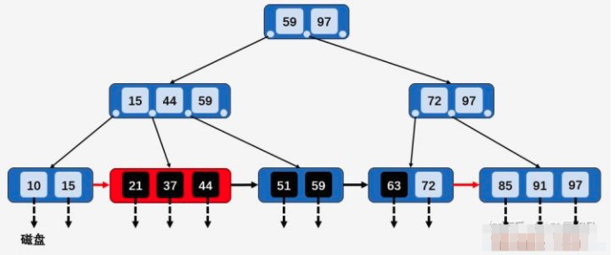

### 5.4 B+树的插入操作
在B+树中插入关键字时，需要注意以下几点：

* 插入的操作全部都在叶子结点上进行，且不能破坏关键字自小而大的顺序；
* 由于 B+树中各结点中存储的关键字的个数有明确的范围，做插入操作可能会出现结点中关键字个数超过阶数的情况，此时需要将该结点进行 “分裂”；

我们依旧以之前介绍查找操作时使用的图对插入操作进行说明，需要注意的是，B+树的阶数 M = 3 ，且 ⌈M/2⌉ = 2（取上限） 、⌊M/2⌋ = 1（取下限） ：
注意 这里的阶数 并不是层数的概念，而是每个节点保存几个健值树
如下图所示
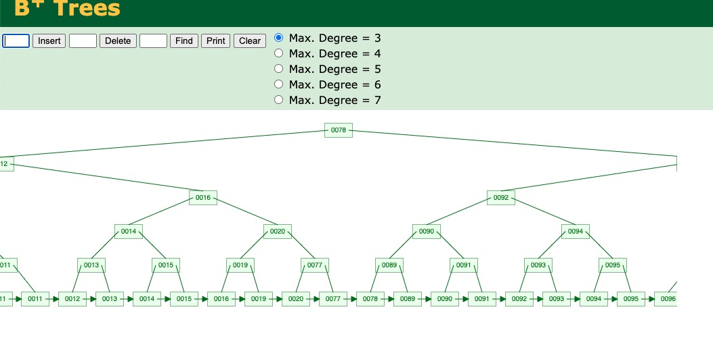

* B+树的数据存储结构


#### 5.4.1： 若被插入关键字所在的结点，其含有关键字数目小于阶数 M

* 直接插入

> 比如插入关键字 12 ，插入关键字所在的结点的 [10，15] 包含两个关键字，小于 M ，则直接插入关键字 12

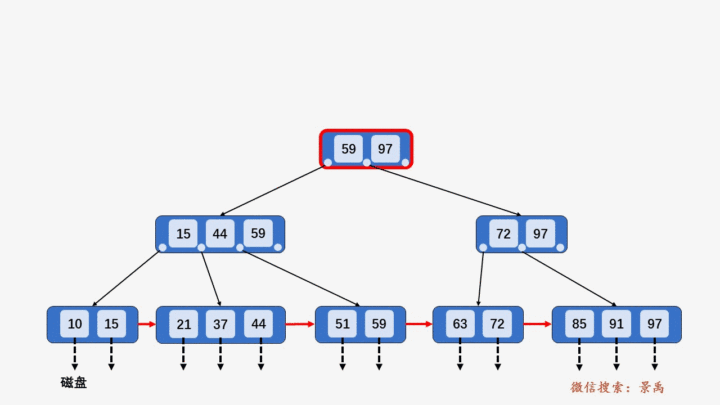

#### 5.4.2：若被插入关键字所在的结点，其含有关键字数目等于阶数 M
* 则需要将该结点分裂为两个结点，一个结点包含 ⌊M/2⌋ ，另一个结点包含 ⌈M/2⌉
* 同时，将⌈M/2⌉的关键字上移至其双亲结点。
* 假设其双亲结点中包含的关键字个数小于 M，则插入操作完成

> 插入关键字 95 ，插入关键字所在结点 [85、91、97] 包含 3 个关键字，等于阶数 M ，  
> 则将 [85、91、97] 分裂为两个结点 [85、91] 和结点 [97] ,  
> 关键字 95 插入到结点 [95、97] 中，并将关键字 91 上移至其双亲结点中，  
> 发现其双亲结点 [72、97] 中包含的关键字的个数 2 小于阶数 M ，插入操作完成。


#### 5.4.3：在第 2 情况中，如果上移操作导致其双亲结点中关键字个数大于 M

* 则应继续分裂其双亲结点

> 插入关键字 40 ，按照第 2 种情况将结点分裂，并将关键字 37 上移到父结点，  
> 发现父结点 [15、37、44、59] 包含的关键字的个数大于 M ，  
> 所以将结点 [15、37、44、59] 分裂为两个结点 [15、37] 和结点 [44、59] ，  
> 并将关键字 37 上移到父结点中 [37、59、97] .  
> 父结点包含关键字个数没有超过 M ，插入结束


#### 5.4.4：若插入的关键字比当前结点中的最大值还大，破坏了B+树中从根结点到当前结点的所有索引值
* 此时需要及时修正后，再做其他操作
* 某些B+树的定义中 该条是不存在的

> 插入关键字 100，由于其值比最大值 97 还大，插入之后，  
> 从根结点到该结点经过的所有结点中的所有值都要由 97 改为 100。  
> 改完之后再做分裂操作

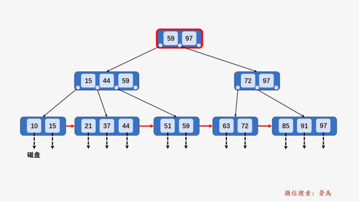

### 5.5 B+树的删除
#### 5.5.1 找到存储有该关键字所在的结点时，由于该结点中关键字个数大于⌈M/2⌉，做删除操作不会破坏 B+树
* 则可以直接删除

> 删除关键字 91，包含关键字 91 的结点 [85、91、97] 中关键字的个数 3 大于 ⌈M/2⌉ = 2 ，  
> 做删除操作不会破坏 B+树的特性，直接删除


#### 5.5.2 当删除某结点中最大或者最小的关键字

* 就会涉及到更改其双亲结点一直到根结点中所有索引值的更改。

> 以删除整颗 B+树中最大的关键字 97 为例，查找并删除关键字 97 ，  
> 然后向上回溯，将所有关键字 97 替换为次最大的关键字 91

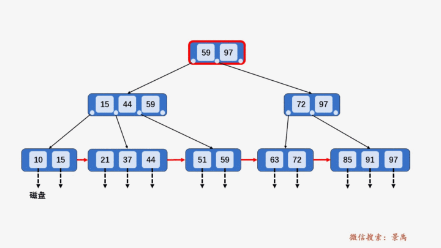

#### 5.5.3 当删除该关键字，导致当前结点中关键字个数小于 ⌈M/2⌉

* 若其兄弟结点中含有多余的关键字，可以从兄弟结点中借关键字完成删除操作

> 当删除某个关键字之后，结点中关键字个数小于 ⌈M/2⌉ ，则不符合 B+树的特性，则需要按照 3 he 4 两种情况分别处理。  
> 以删除关键字 51 为例，由于其兄弟结点 [21、37、44] 中含有 3 个关键字，  
> 所以可以选择借一个关键字 44，同时将双亲结点中的索引值 44 修改 37 ，删除过程如下图所示：

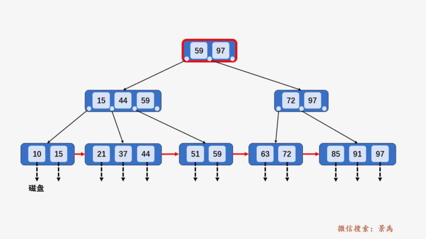

#### 5.5.4 第 3 种情况中，如果其兄弟结点没有多余的关键字，则需要同其兄弟结点进行合并
> 为了说明这种情况，我们在第 3 种情况最终得到的 B+树之上进行删除操作。第 3 种情况删除关键字 51 之后得到如下所示 B+树

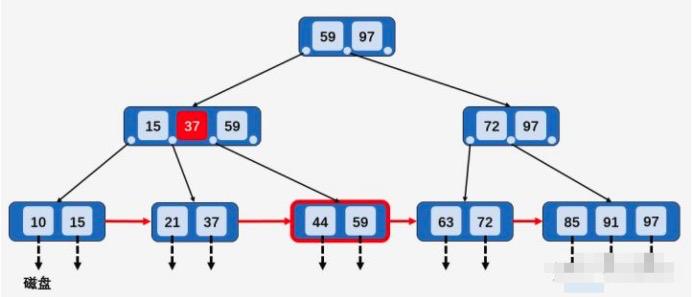

> 我们以删除上面这个 B+树中的关键字 59 说明第 4 种情况，首先查找到关键 59 所在结点 [44、59] ，  
> 发现该结点的兄弟结点 [21、37] 包含的关键字的个数 2 等于 ⌈M/2⌉， 所以删除关键字 59 ，  
> 并将结点 [21、37] 和 [44] 进行合并 [21、37、44] ，  
> 然后向上回溯，将所有关键字 59 替换为次最大的关键字 44

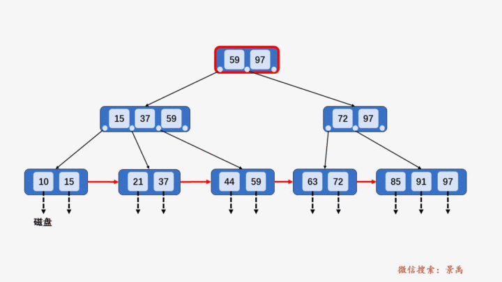

#### 5.5.5 当进行合并时，可能会产生因合并使其双亲结点破坏 B+树的结构，需要依照以上规律处理其双亲结点
> 删除关键字 63，当删除关键字后，该结点中只剩关键字 72，且其兄弟结点 [85、91] 中只有 2 个关键字，  
> 所以将 [72] 和 [85、91] 进行合并，向上回溯，删除结点 [72、91] 当中的关键字 72 ，  
> 此时结点中只有关键 91 ，不满足 B+树中结点关键字个数要求，但其兄弟结点 [15、44、59] 中包含的 3 个关键字，  
> 所以从其兄弟结点当中借一个关键字 59 , 再对其兄弟结点的父结点中的关键字进行调整，将关键字 59 替换为 44

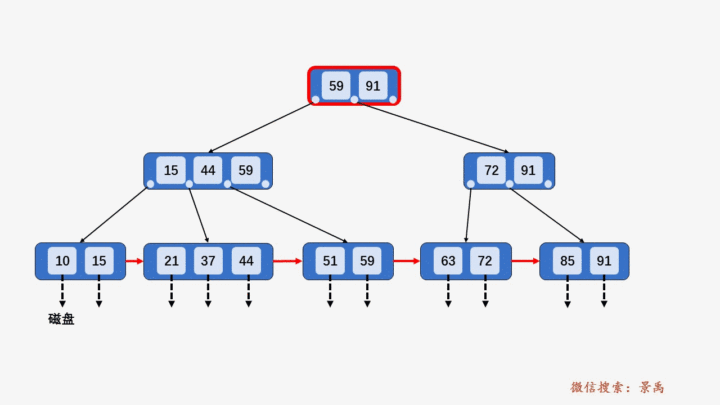

### 5.6 什么时候会破坏索引的结构
* 当添加的目标节点 所包含的个数 > M/2
* 当删除的目标节点 所包含的格式 < M/2
会破坏索引的结构


## 6 Mysql索引相关的注意事项
### 6.1 mysql的索引的高度通常是1-3，而degree是多少要个页的大小已经index的大小有关？
* 一般情况下，3到4层就足以满足支撑千万级别的查询
* lineitem表的数据行数为600多万，B+树高度为3，customer表数据行数只有15万，B+树高度也为3。可以看出尽管数据量差异较大，这两个表树的高度都是3，换句话说这两个表通过索引查询效率并没有太大差异，因为都只需要做3次IO。那么如果有一张表行数是一千万，那么他的B+树高度依旧是3，查询效率仍然不会相差太大。region表只有5行数据，当然他的B+树高度为1。

### 6.2 创建索引的字段长了好，还是短了好？
* 短了好，原因是在高度不变的情况下，可以存储更多的数据量

### 6.3 创建表的时候 是用代理主键还是自然主键
* 代理主键：业务无关的主键，如id
* 自然主键：和业务有关的主键，如uuid
* 能支持代理主键就尽量设置代理主键

### 6.4 主键设置好了之后，要不要自增？
* 满足业务的情况下尽可能设置自增，不会增加索引的维护成本

### 6.5 在分布式应用场景中，自增ID还适用吗？
* 不适用，需要使用雪花算法，snowflake
* 雪花算法、UUID、ID的三者对比
参考一下文章： https://www.cnblogs.com/barrywxx/p/7723122.html

### 6.6 常用的几个术语
* 聚集索引、非聚集索引(普通索引)、
* 回表查询
* 覆盖索引
* 索引下堆
* 向左匹配

### 6.6.1 聚簇索引、非聚簇索引
* 聚簇索引：找到了索引就找到了需要的数据，那么这个索引就是聚簇索引
* 非聚簇索引：索引的存储和数据的存储是分离的，也就是说找到了索引但没找到数据

特点
* 聚簇索引（clustered index）：包括： 主键索引，但聚簇索引并非都是主键索引
* 非聚簇索引（secondary index）：回表
* 聚集索引就是：判断标准就是 数据跟索引是否是否聚集存储的

### 6.6.2 回表查询
* 聚簇索引树上：查询时 仅通过聚簇索引就可以找到数据。
* 非聚集索引查询树上：找到的节点上的字段不能全部命中，需要先拿到ID，再去聚集索引查询，要查2遍，这就叫回表查询。
* 不是所有非聚合索引查询都会回表，切记切记。

### 6.6.3 索引覆盖(命中索引）
* 只需要在一棵索引树上就能获取SQL所需的所有列数据，无需回表，速度更快。
* explain的输出结果Extra字段为Using index时，能够触发索引覆盖。

> 命不中，还有一种情况是 索引中了，但是要产生回表，也无法 Using Index,  
> 所以可以考虑把 字段也加到 index中。
> 但是这样一来，不同的业务就无法区分，要加的index就越来越多了。

### 6.6.4 如何创建有效的索引

* 如果需要索引很长的字符串，此时需要考虑前缀索引
索引选择性：不重复索引值 / 记录总数 的比值，1 效率最高，但是 同样代价也是最高
* 如何选择前缀

* 使用多列索引
尽量不要在多列上创建单列索引，这样还不如用 union

* 选择合适的索引列顺序
选择性最高的索引放在最前列

* 覆盖索引
explain的时候 看到 Using index 就是覆盖索引

* 使用索引扫描来做排序

* 怎样保证使用索引顺序扫描
索引和orderby的顺序一致、排序方向一致、

* 压缩索引
MyISAM中用到

* 减少重复、冗余以及未使用的索引

* 减少索引和数据碎片
optimize table 可以整理碎片

### 6.6.5 索引下堆
explain 时 出现 Using index condition 表示索引下推

## 7 MySql事务

### 7.1 事务的传播特性
|No|名称|解释|
| ----- | ------- | -------- |
|1|PROPAGATION_REQUIRED|如果当前没有事务，就创建一个新事务，如果当前存在事务，就加入该事务，该设置是最常用的设置。|
|2|PROPAGATION_NESTED|如果当前存在事务，则在嵌套事务内执行。如果当前没有事务，则执行与PROPAGATION_REQUIRED类似的操作|
|3|PROPAGATION_SUPPORTS|支持当前事务，如果当前存在事务，就加入该事务，如果当前不存在事务，就以非事务执行。|
|4|PROPAGATION_MANDATORY|支持当前事务，如果当前存在事务，就加入该事务，如果当前不存在事务，就抛出异常。|
|5|PROPAGATION_REQUIRES_NEW|支持当前事务，创建新事务，无论当前存不存在事务，都创建新事务。|
|6|PROPAGATION_NOT_SUPPORTED|以非事务方式执行操作，如果当前存在事务，就把当前事务挂起。|
|7|PROPAGATION_NEVER|以非事务方式执行，如果当前存在事务，则抛出异常。|

### 7.2 事务的隔离级别

#### 7.2.1 事务的基本要素ACID
* 原子性: Atomicity: 事务开始后所有操作，要吗全部做完，要吗全部不做。出现错误，要回滚。
* 一致性: Consistency: 事务开始前和后，数据库约束没有被破坏。比如 A转账给B，不能 A扣了钱，B却没收到。
* 隔离性: Isolation: 同一时间，只允许 一个事务请求同一数据，不同的事务之间彼此没有任何干扰。比如 A正从卡里取钱，A取钱的时候，B不能向这张卡转账。
* 持久性: Durability: 事务完成后，事务对数据库所有的更新将被保存到数据库，不能回滚。

#### 7.2.2 事务的并发问题
* 脏读：
* 不可重复读：
* 幻读：

#### 7.2.3 事务隔离级别
所谓事务级别就是多个事务之间修改数据之后，未提交之前 数据对其他事务的可见性。

事务隔离级别只在当前数据库有效。


|No|英文|名称|脏读|不可重复读|幻读|
|----|----|----|----|----|----|
|1|read uncommitted|读取未提交内容|√|√|√|
|2|read committed|读取提交内容|X|√|√|
|3|repeatable read|可重读|X|X|√|
|4|serializable|可串行化|X|X|X|

mysql 默认级别是 READ-COMMITTED
``` mysql
-- 查看当前事物级别：
SELECT @@transaction_isolation;
show variables like '%transaction_isolation%';

-- 设置read uncommitted级别：
SET SESSION TRANSACTION ISOLATION LEVEL READ UNCOMMITTED;
-- 设置read committed级别：
SET SESSION TRANSACTION ISOLATION LEVEL READ COMMITTED;
-- 设置repeatable read级别：
SET SESSION TRANSACTION ISOLATION LEVEL REPEATABLE READ;
-- 设置serializable级别：
SET SESSION TRANSACTION ISOLATION LEVEL SERIALIZABLE;


SET GLOBAL TRANSACTION ISOLATION LEVEL READ UNCOMMITTED;
SET GLOBAL TRANSACTION ISOLATION LEVEL READ COMMITTED;
SET GLOBAL TRANSACTION ISOLATION LEVEL REPEATABLE READ;
SET GLOBAL TRANSACTION ISOLATION LEVEL SERIALIZABLE;
```
注，SESSION设置好了之后，仅对当前连接生效，再次连接不会有作用。  
GLOBAL设置好了之后，当前不能生效，只有从新建立连接后才能生效。

<!--http://c.biancheng.net/view/7265.html-->
```mysql
mysql> create database test;
Query OK, 1 row affected (0.00 sec)

mysql> use test;
Database changed

mysql> CREATE TABLE testnum(num INT(4));
Query OK, 0 rows affected, 1 warning (0.01 sec)

mysql> INSERT INTO test.testnum (num) VALUES(1),(2),(3),(4),(5);
Query OK, 5 rows affected (0.01 sec)
Records: 5  Duplicates: 0  Warnings: 0

```
##### 7.2.3.1 读未提交 Read Uncommited / RU
A事务已执行，但未提交；B事务查询到A事务更新后的数据；A事务回滚。 B出来的就是脏数据

下面演示脏读

窗口1
```
mysql> SET GLOBAL TRANSACTION ISOLATION LEVEL READ UNCOMMITTED;
Query OK, 0 rows affected (0.00 sec)
```

重新开启窗口1
```
mysql> show variables like '%transaction_isolation%';
+-----------------------+------------------+
| Variable_name         | Value            |
+-----------------------+------------------+
| transaction_isolation | READ-UNCOMMITTED |
+-----------------------+------------------+
1 row in set (0.01 sec)

mysql> begin;
Query OK, 0 rows affected (0.00 sec)

mysql> select * from testnum;
+------+
| num  |
+------+
|    1 |
|    2 |
|    3 |
|    4 |
|    5 |
+------+
5 rows in set (0.00 sec)

mysql> UPDATE test.testnum SET num=num*2 WHERE num=2;
Query OK, 1 row affected (0.00 sec)
Rows matched: 1  Changed: 1  Warnings: 0

```

窗口2
```
mysql> SELECT * FROM testnum;
+------+
| num  |
+------+
|    1 |
|    4 |
|    3 |
|    4 |
|    5 |
+------+
5 rows in set (0.01 sec)
```

窗口1
```
mysql> ROLLBACK;
Query OK, 0 rows affected (0.00 sec)
```

窗口2
```
mysql> SELECT * FROM testnum;
+------+
| num  |
+------+
|    1 |
|    2 |
|    3 |
|    4 |
|    5 |
+------+
5 rows in set (0.00 sec)
```
##### 7.2.3.2 读提交 Read Committed / RC 的不可重复读
A和B同时执行，A在事务中修改了数据，并且提交， B未结束之前再次读取数据 和 之前读到的不一致。

这是大多数数据库系统的默认事务隔离级别（例如 Oracle、SQL Server），但不是 MySQL 默认的。

以下演示提交隔离级别后产生的不可重复读的问题

窗口1
```mysql
mysql> SET GLOBAL TRANSACTION ISOLATION LEVEL READ COMMITTED;
Query OK, 0 rows affected (0.00 sec)
```
重新开启窗口1
```mysql
mysql> SELECT @@transaction_isolation;
+-------------------------+
| @@transaction_isolation |
+-------------------------+
| READ-COMMITTED        |
+-------------------------+
1 row in set (0.00 sec)

mysql> BEGIN;
Query OK, 0 rows affected (0.00 sec)

mysql> UPDATE test.testnum SET num=num*2 WHERE num=2;
Query OK, 1 row affected (0.00 sec)
Rows matched: 1  Changed: 1  Warnings: 0

mysql> SELECT * from test.testnum;
+------+
| num  |
+------+
|    1 |
|    4 |
|    3 |
|    4 |
|    5 |
+------+
5 rows in set (0.00 sec)

```

窗口2
```mysql
mysql> begin;
Query OK, 0 rows affected (0.00 sec)
mysql> SELECT * from test.testnum;
+------+
| num  |
+------+
|    1 |
|    2 |
|    3 |
|    4 |
|    5 |
+------+
5 rows in set (0.00 sec)
```

窗口1
```mysql
mysql> commit;
Query OK, 0 rows affected (0.00 sec)
mysql> SELECT * from test.testnum;
+------+
| num  |
+------+
|    1 |
|    4 |
|    3 |
|    4 |
|    5 |
+------+
5 rows in set (0.00 sec)
```

窗口2
```mysql
mysql> SELECT * from test.testnum;
+------+
| num  |
+------+
|    1 |
|    4 |
|    3 |
|    4 |
|    5 |
+------+
5 rows in set (0.00 sec)

```

##### 7.2.3.3 可重复读 Repeatable Read / RR

A和B同时执行，A在事务中修改了数据，并且提交， B直到执行结束 多次查询数据 不会有变化。

例 3 演示了在可重复读隔离级别中产生的幻读问题。

窗口1
```mysql
mysql> SET GLOBAL TRANSACTION ISOLATION LEVEL REPEATABLE READ;
Query OK, 0 rows affected (0.00 sec)
```
重新开启窗口1
```mysql
mysql> SELECT @@transaction_isolation;
+-------------------------+
| @@transaction_isolation |
+-------------------------+
| REPEATABLE-READ        |
+-------------------------+
1 row in set (0.00 sec)

mysql> BEGIN;
Query OK, 0 rows affected (0.00 sec)

mysql> UPDATE test.testnum SET num=12 WHERE num=3;
Query OK, 1 row affected (0.00 sec)
Rows matched: 1  Changed: 1  Warnings: 0

mysql> SELECT * from test.testnum;
+------+
| num  |
+------+
|    1 |
|    4 |
|    3 |
|    4 |
|    5 |
+------+
5 rows in set (0.00 sec)

```

窗口2
```mysql
mysql> begin;
Query OK, 0 rows affected (0.00 sec)
mysql> SELECT * from test.testnum;
+------+
| num  |
+------+
|    1 |
|    4 |
|    3 |
|    4 |
|    5 |
+------+
5 rows in set (0.00 sec)
```

窗口1
```mysql
mysql> commit;
Query OK, 0 rows affected (0.00 sec)
mysql> SELECT * from test.testnum;
+------+
| num  |
+------+
|    1 |
|    4 |
|   12 |
|    4 |
|    5 |
+------+
5 rows in set (0.00 sec)
```

窗口2
```mysql
mysql> SELECT * from test.testnum;
+------+
| num  |
+------+
|    1 |
|    4 |
|    3 |
|    4 |
|    5 |
+------+
5 rows in set (0.00 sec)

```

##### 7.2.3.4 可串行化 Serializable
略，一般不用，效率太低

* 另，还有一篇更详尽的说明：https://juejin.im/post/6844904162094759949
* https://www.bilibili.com/video/BV1bD4y1m7RU?p=5
