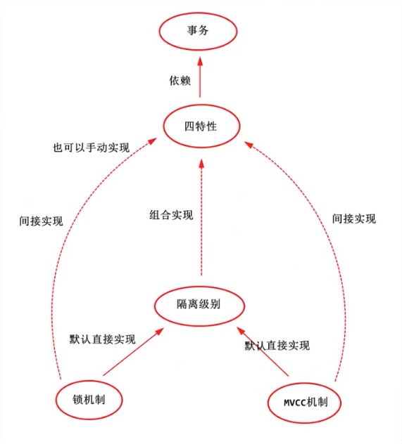

# 数据库的隔离级别

## 1 事务
事务只是一个改变，是一些操作的集合；用专业的术语讲，他是一个程序的执行单元；
事务本身实际并不包含这4个特性，我们通过某些手段，尽可能让这个执行单元满足这四个特性，
那么，我们可以称它为一个事务，或者说是一个正确的事务，完美的事务。

## 2 四个特性
* 原子性
> 事务的一个操作，要吗全部成功，要吗全部失败
* 一致性
> 事务在执行前和执行后，都要保证一致
* 隔离性
> 事务在执行过程中，互相不干扰
* 持久性
> 数据的修改是永久的

## 3 隔离级别

### 3.1 并发情况下事务引发的问题
一般请况下，多个单元操作并发执行，会出现这么几个问题
* 脏读：A事务还未提交，B事务就读到了A事务的结果。（破坏了隔离性）
* 不可重复读：A事务在本事务中，对自己未操作过的数据，进行了多次读取，结果出现了不一致或记录不存在的情况。（破坏了一致性， update 和delete）
* 幻读：A事务在本事务中，对自己未操作过的数据，进行多次读取，第一次读取时，记录不存在，第二次读取时，记录出现了。（破坏了一致性，insert）

### 3.2 (制定标准)
为何权衡【隔离】和【并发】的矛盾，ISO定义了四个事务的隔离级别，每个级别的隔离程度不同，允许出现的副作用也不同。

* 1 读未提交：最低一级别，只能保证持久性
* 2 读已提交：语句自己别的
* 3 可重复读：事无级别
* 4 串行化/序列化：最高级别，事务与事务完全串行化执行，毫无并发可研

```
查看数据库默认隔离级别
mysql> select @@tx_isolation
```
| 事务隔离级别 |术语|  脏读|不可重复读 | 幻读 |
| :-------- |:--|:--------| :--|:-- |
|读未提交|READ-COMMITTED|会|会|会|
|读已提交|READ-UNCOMMITTED|-|会|会|
|可重复读|REPATABLE-READ|-|-|会|
|串行化|SERIALIABLE|-|-|-|

### 3.3 （InnoDB)
* 锁机制：阻止其他事务对数据进行操作，各个隔离级别主要体现在读取数据时加的锁和释放机制。
  * RU: 事务读取的时候，不加锁
  * RC: 事务读取的时候加行级共享锁（读到才加锁），一旦读完，立即释放（并不是事务结束).
  * RR: 事务读取时加行级共享锁，知道事务结束才会释放。
  * SE: 事务读取时加表级共享锁，知道事务结束时，才会释放。
* MVCC机制：生成一个数据快照，并用这个快照提供一定级别的一致性的读取，也作为多个版本数据控制。
  * 实际就是 [CAS版本控制]和[读写分离]的思想
  * 主要作用与RC和RR实现
## 总结图 


# 三、InnoDB的锁机制原理解析

# 四、临键锁&间歇锁&记录锁详解
# 五、隔离界别与锁之间的关系