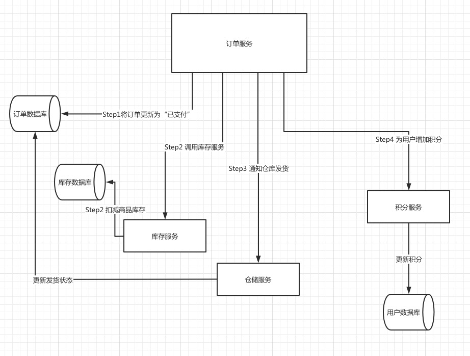
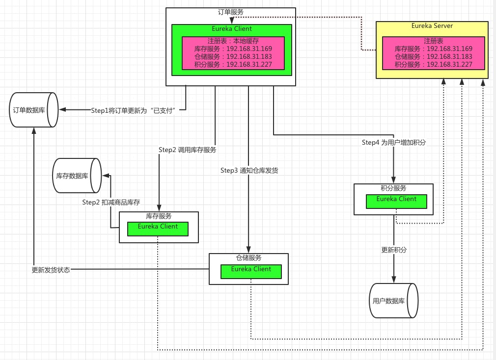
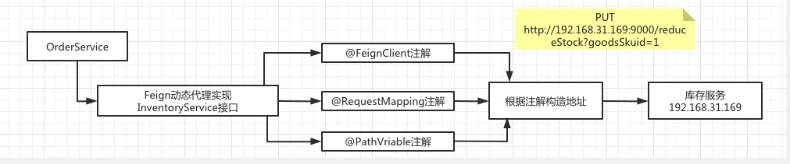
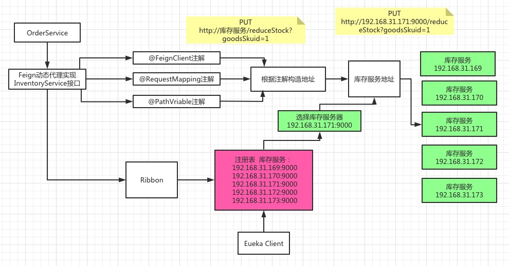
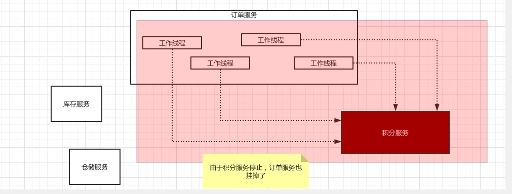
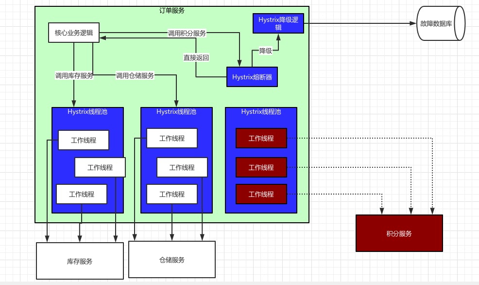

# Spring Cloud 的组件介绍

* 要正常显示图片的话，请修改DNS：114.114.114.114 或 8.8.8.8
* 要正常显示plantuml图 需要安装插件 https://chrome.google.com/webstore/detail/pegmatite/jegkfbnfbfnohncpcfcimepibmhlkldo

<!--https://blog.csdn.net/With_Her/article/details/97165385-->
Spring Cloud 提供几个组件：Eureka、Ribbon、Feign、Hystrix、Zuul

## 1 假设一个业务场景

电商网站， 支付订单流程如下：
* 创建订单，订单状态变为"已支付"
* 扣减相应的库存
* 通知仓储中心，进行发货
* 给用户这次购物增加积分

业务流程如下



## 2 Eureka 的应用

订单服务要调用其他服务怎么调用？
使用Euraka注册中心，专门负责服务注册和发现

每个服务都有一个 Eureka Client 去 Eureka Server找目标服务的地址

结构如图所示


## 3 Feign 的应用

订单服务调用其他服务的话，要写一大堆代码，如下所示
```java
CloseablehttpClient httpclient = HttpClients.createDetault();
HttpOst httpPost = new HttpPost("http://192.168.31.169:9000/");

List<NameValuePair> params = new ArrayList<NameValuePaire>();
params.add(new BasicNameValuePair("scope", "project"));
params.add(new BasicNameValuePair("q", "java"));

UrlEncodeFormEntity formEntity = new UrlEncodeFormEntity(params);
httpPost.setEntity(formEntity);
httpPost.setHeader(
   "user-Agent",
   "Mozilla/5.0 (Windows NT 6.3; Win64; x64)"     
);

CloseableHttpResponse response = null;
response = httpclient.execute(httpPost);
if(response.getStatusLine().getStatusCode() == 200){
    String context = EntityUtils.toString(response.getEntity(), "UTF-8");
    System.out.println(content);
}
if(response != null){
    response.close();
}
httpclient.close();
```
类似这样的代码

然而 Feign 给出了优雅的解决方案。

```java
@FeignClient("inventory-service")
public class InventoryService{
    @RequestMapping(value = "reduceStock/{goodsSkuId}", method = HttpMethod.PUT)
    @ResponseBody
    public ResultCode reduceStock(@PathVriable("goodsSkuId") Long goodsSkuId);
}
@Service
public class OrderService{
    @Autowired
    private InventoryService inventoryService;
    
    public ResultCode payOrder(){
        orderDao.updateStatus(id, OrderStatus.PAYED);
        inventoryService.reduceStock(goodsSkuId);
    }
}
```


可以通过注解定义 FeignClient接口，剩下的 建立连接、构造请求、发起请求、获取相应、解析相应 等等 都交给Feign干就可以了。

Feign 的实现原理
* 通过 @FeignClient注解，创建动态代理
* 调用哪个接口，就会调用Feign创建动态代理，放到 Spring的 FactoryBean中
* Feign的动态大力会根据接口上的 @RequestMapping等注解，来构造出要请求的服务地址
* 最后，发起请求，解析相应

具体流程如下：


具体请参考 https://github.com/thefirstwind/tech-doc/blob/master/11_spring/SpringCloud_02_Feign.md


## 4 Ribbon 的应用

另外为了提高负载能力，库存服务配置在5台机器上，
* 192.168.31.169:9000
* 192.168.31.170:9000
* 192.168.31.171:9000
* 192.168.31.172:9000
* 192.168.31.173:9000

可以使用Ribbon做负载均衡，轮训请求这5台机器



## 5 Hystrix的应用

如图所示



由于积分服务故障，造成 订单服务长期无法响应。但是 积分服务，不应该 影响 订单服务的可用性。

所以 Hystrix提供了 隔离、熔断 以及 降级的服务。

> 积分服务挂了你就熔断，好歹你干点儿什么啊！别啥都不干就直接返回啊？  
> 没问题，咱们就来个降级：每次调用积分服务，你就在数据库里记录一条消息，  
> 说给某某用户增加了多少积分，因为积分服务挂了，导致没增加成功！这样等积分服务恢复了，  
> 你可以根据这些记录手工加一下积分。这个过程，就是所谓的降级。  
> 接下来用一张图，梳理一下Hystrix隔离、熔断和降级的全流程：




## 6 Zuul的应用
网关服务，对外起到 降级、限流、认证授权、安全等服务。
在最上层。