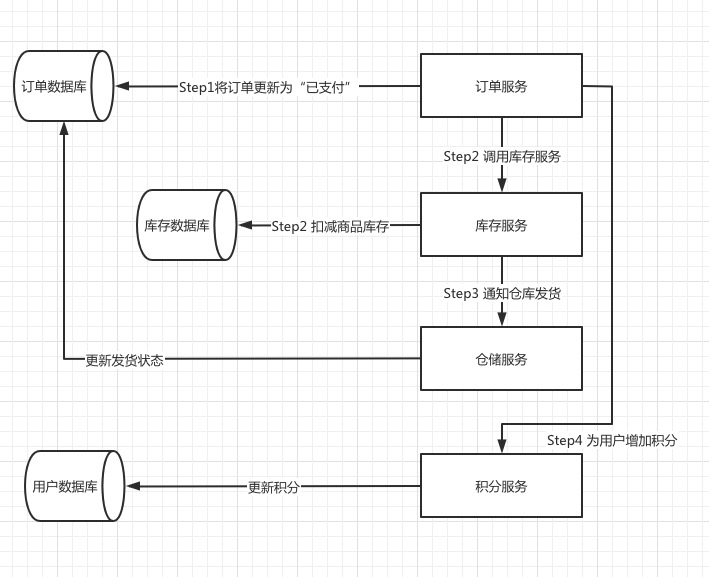

# Spring Cloud 的组件介绍

<!--https://blog.csdn.net/With_Her/article/details/97165385-->
Spring Cloud 提供几个组件：Eureka、Ribbon、Feign、Hystrix、Zuul

## 1 假设一个业务场景

电商网站， 支付订单流程如下：
* 创建订单，订单状态变为"已支付"
* 扣减相应的库存
* 通知仓储中心，进行发货
* 给用户这次购物增加积分

业务流程如下

##