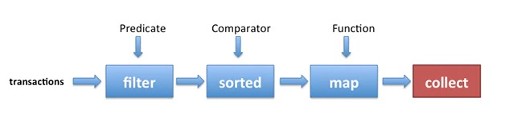

# Java lambda

[github](https://github.com/thefirstwind/tech-doc/blob/master/12_java_core/src/main/java/com/thefirstwind/Case001_lambda.java)

##  Lambda表达式
* 函数式接口
  * Function
  * Predicate
  * Consumer
  * Supplier
* Stream
* Optional
* Filter
* Map-Reduce
* 新的Date API

## 1 函数式接口

### 1.1 匿名函数()的使用
```java
  @Test
  public void case001LambdaFunction(){
    //第一种
    Runnable runnable = new Runnable() {
      public void run() {
        System.out.println("不使用Lambda表达式");
      }
    };
    runnable.run();
    System.out.println("=======================");
    //第二种
    // Runnable runnable1 = () -> System.out.println("使用Lambda表达式1");

    Runnable runnable1 = () -> {
      System.out.println("使用Lambda表达式1");
      System.out.println("使用Lambda表达式2");
    };
    runnable1.run();

  }
```

### 1.2 有参无返回函数的使用
```java
  public void case002LambdaFunction(){
    //第一种：没有使用lambda表达式
    Consumer<String> consumer = new Consumer<String>() {
      @Override
      public void accept(String s) {
        System.out.println(s);
      }
    };
    consumer.accept("没有使用lambda:有参数，但是没有返回值");
    //第二种：使用lambda表达式
    Consumer<String> consumer1 = (String s)->{
      //此时只有一行输出代码，因此可以省去外部的{}
      System.out.println(s);
    };
    consumer1.accept("使用lambda:有参数，但是没有返回值");

  }
```

### 1.3 有参无返回函数的使用
```java
  public void case003LambdaFunction(){

    //第二种：使用lambda表达式
    Consumer<String> consumer = (s)->{
      //此时只有一行输出代码，因此可以省去外部的{}
      System.out.println(s);
    };
    consumer.accept("使用lambda:有参数，但是没有返回值");

  }
```

### 1.4 有多个参数，有返回值
```java
  public void case004LambdaFunction(){
    //第一种：没有使用lambda表达式
    Comparator<Integer> comparator = new Comparator<Integer>() {
      @Override
      public int compare(Integer o1, Integer o2) {
        System.out.println("o1:"+o1);
        return o1.compareTo(o2);
      }
    };
    System.out.println(comparator.compare(1,2));
    System.out.println("======================");
    //第二种：使用lambda表达式
    Comparator<Integer> comparator2 = (o1,o2)->{
      System.out.println("o1:"+o1);
      return o1.compareTo(o2);
    };
    System.out.println(comparator2.compare(1,2));

  }
```

### 1.5 自定义函数式接口

#### 特点
* 含有@FunctionalInterface注解

* 只有一个抽象方法

#### 函数式接口有什么用

* 函数式接口能够接受匿名内部类的实例化对象，换句话说，我们可以使用匿名内部类来实例化函数式接口的对象，
* 而Lambda表达式能够代替内部类实现代码的进一步简化。


* 并且java为我们提供了四个比较重要的函数式接口：
  * 消费型接口：Consumer< T> void accept(T t)有参数，无返回值的抽象方法；
  * 供给型接口：Supplier < T> T get() 无参有返回值的抽象方法；
  * 断定型接口： Predicate< T> boolean test(T t):有参，但是返回值类型是固定的boolean
  * 函数型接口： Function< T，R> R apply(T t)有参有返回值的抽象方法；

自定义一个我们自己的函数式接口
```java
  @FunctionalInterface
  public interface MyInterface{
    void test();
  }

  @Test
  public void case005LambdaFunction() {
    MyInterface myInterface = () -> System.out.println("hello test");
    myInterface.test();
  }

```

### 1.6 Function功能型函数式接口的应用
```java
  @Test
  public void case007LambdaFunction(){

    Function<Object, Object> fun = (s) -> {
      Integer in = (Integer)s;
      System.out.println("in:" + in);
      return in + 20;
    };
    Function<Object, Object> fun2 = (s) -> {
      Integer in = (Integer)s;
      System.out.println("in:" + in);
      return String.valueOf(in);
    };
    fun.apply(1);

    //value作为function1的参数，返回一个结果，该结果作为function2的参数，返回一个最终结果
    fun.andThen(fun2).apply(1);
    
    Function<String, Integer> fun3 = s -> Integer.parseInt(s) +20;
    Function<Integer, String> fun4 = s -> "in_:" + String.valueOf(s);

    System.out.println("in_:" + fun3.apply("1"));
    System.out.println(fun3.andThen(fun4).apply("1"));

  }

```
### 1.7 Consumer消费型函数式接口的应用
```java
 @Test
  public void case008LambdaConsumer(){

    Consumer<Object> fun = (s) -> {
      Integer in = (Integer)s;
      System.out.println("in:" + in);
    };
    fun.accept(1);

    Consumer<String> fun2 = s -> System.out.print("in_:" + s);
    fun2.accept("1");

  }
```
### 1.8 Predicate断言型函数式接口的应用
```java
  @Test
  public void case009LambdaPredicate(){

    Predicate<Integer> fun = (s) -> {
      return (s == 3);
    };
    fun.test(1);

  }

```
### 1.9 Supplier供给型函数式接口的应用
```java
  @Test
  public void case010LambdaSupplier(){

    Supplier<String> fun = () -> {
      return "hello supplier";
    };
    System.out.println(fun.get());

  }

```

## 2 方法引用
```java
  @Test
  public void case011LambdaMethodReference(){

    Supplier<HashMap<String,Object>> mapFun = HashMap::new;
  }

  @Test
  public void case012LambdaMethodReference(){
    List<String> list = Arrays.asList("1", "22", "333");
    list.forEach(s -> System.out.println(s));
    list.forEach(System.out::println);
  }
```

## 3 Stream接口

请重点理解下图
* filter 使用 Predicate断言函数式接口
* sorted 使用 Comparator函数式接口
* map 使用 Function函数式接口




来一段代码理解理解

```java
  @Test
  public void case013LambdaStream(){
    List<String> list = Arrays.asList("1", "22", "333");
    List<Integer> list2 = list.stream()
            .filter((s)-> s.length() >= 2)
            .sorted()
            .map((s) -> Integer.parseInt(s) + 1)
            .collect(Collectors.toList());

    System.out.println(list2);
  }

```

### 3.1 Collection to Stream
```java
  @Test
  public void case014LambdaStream(){
    List<String> list = Arrays.asList("1", "2", "3");
    Stream<String> stream = list.stream();

    Stream<String> stream2 = Stream.of("1", "2", "3");
  }
```

### 3.2 Array to Stream
```java
  @Test
  public void case015LambdaStream(){
    String[] array = new String[]{"1","2","3"};
    Stream<String> stream1 = Arrays.stream(array);
    Stream<String> stream2 = Stream.of(array);
  }
```

### 3.3 Map to Stream
```java
  @Test
  public void case016LambdaStream(){
    Map<Integer, String> map = new HashMap<Integer, String>();
     map.put(1, "value1");
     map.put(2, "value2");
     map.put(3, "value3");
     Stream<Map.Entry<Integer,String>> stream = map.entrySet().stream();
  }
```

### 3.4 terminal operation 常用方法
* forEach ： 迭代Stream
* toArray ： 转为数组
* max ： 取最大值
* min ： 取最小值
* sum ： 求和
* count ： Stream 中元素数量
* average ： 求平均数
* findFirst ： 返回第一个元素
* findAny ： 返回流中的某一个元素
* allMatch ： 是否所有元素都满足条件
* anyMatch ： 是否存在元素满足条件
* noneMatch ： 是否没有元素满足条件
* reduce ： 执行聚合操作，上面的 sum、min、max 方法一般是基于 reduce 来实现的
* collect ： 执行相对 reduce 更加复杂的聚合操作，上面的 average 方法一般是基于 collect 来实现的

https://xxgblog.com/2020/04/17/java-8-stream/


Groupingby操作

FilterMap操作

Optional操作可以防止NullPointException

给出一个详细的例子


Java8常见操作