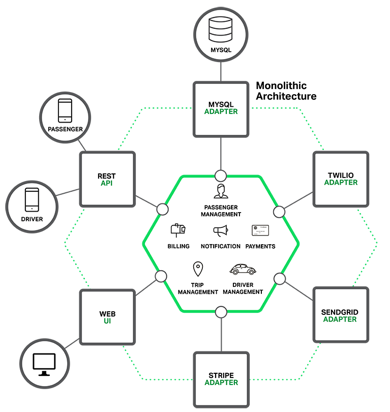

# 微服务之构建容错&自动降级的系统

## 微服务是什么
MicroService主要是针对以前的Monolithic（单体）服务来说的，类似优步打车（Uber）这样的应用，如果使用Monolithic来架构，可能是这样的



> 注：
STRIPE是支付服务
SENDGRID是邮件推送服务
TWILIO是语音、消息的云服务

大部分的项目都是由Monolithic起步的。刚开始最合适不过了，开发简单直接（直接在一个IDE里面就可以调试）、部署方便（搞个war包扔到tomcat里面就能跑）。
但是随着时间的增长，单体应用的缺陷暴露出来了。

* 首先是代码量大大增加
> 从几千行到几十万行，接手的程序员已经无法搞清楚里面模块交互逻辑和依赖关系了。大家都在小心翼翼的加代码，避免触碰以前的旧代码。至于单元测试，这种怪兽级别的应用，能不能拆分出来单元啊？
* 不可避免的超长启动时间
> 3分钟以内的都算是快的。启动后，程序员抽支烟再回来的不在少数。大量的时间在等待，使得程序员越来越不愿意测试自己的功能，写完了之后直接扔给测试就完事了。测试轮次一次又一次，时间不可避免的浪费。
* 部署扩展困难
> 各个模块对服务器的性能要求不同，有的占用CPU高，有的需要大量的IO，有的需要更多的内存。部署在一个服务器内相互影响，扩容的话，无法针对性的扩展。
* 单个的bug会损坏整个服务
> 可能一个模块的内存泄露，会使得整个服务都crash down。
* 对于一些新技术尝试有限制
> 比如想换个新框架试试，但是要换就全部得换，风险太大。

## 服务化的改造
解决方案就是服务化，进行下图的Y轴方向的功能拆解。


最终可能的情况类似下图


## MicroService不是银弹

* 服务之间的通讯机制RPC开销大
* 需要考虑分布式情况下的服务失效恢复等等问题
* 数据库分布带来的分布式事务困扰，还有分布式数据结果Join的问题
* 如何管理这么多服务之间的依赖关系，出了问题如何定位？
* 部署服务变得复杂。包括配置、部署、扩容、监控，都是需要专门的工具链支持。

## 微服务和SOA

虽然微服务很火，但是仅仅把微服务和Monolithic服务做对比，然后搞个大新闻把Monolithic批判一番，我认为是很不公平的。
一般稍具规模企业都在前几年完成了SOA的演化，那么微服务和SOA的区别？SOA在十年前就提出了服务化的概念，那微服务到底是新的理论突破，还是新瓶装旧酒换了一个概念出来忽悠？
总结了微服务应该具备的特点：

* 小, 且专注于做⼀件事情
* 独立的进程
* 松耦合、独立部署
* 轻量级的通信机制
* 有边界：
服务间边界清晰、灵活选择语言和技术（这个是有争议的）
* 松耦合：
服务无状态、容错性、故障隔离、自动恢复、弹性伸缩、服务间独立部署，发布、升级、降级互不影响
* 面向服务架构(SOA) ：
服务化、服务分层

我个人理解SOA和MicroService理论是同源，但是实施方案上面有轻量和重量解决方案的区别，类似当年EJB和Spring之争。
基于ESB、SOAP、WSDL等重型解决方案，演化出来SOA。
利用Dubbo、zookeeper、http/rest、consul、Eureka这些框架的轻量解决方案，也就是现在流行的MicroService。

## 微服务之后，前端（Web、App）怎么开发？
以电商APP为例，需要购物车、物流服务、库存服务、推荐服务、订单服务、评价服务、商品类目服务….


如果我们让APP分别去调用这些服务会带来什么后果？

* 后端代码必须改造，因为APP调不了Dubbo协议（二进制的比较复杂），我们得给每个服务都架设一个HTTP代理，也无法利用MicroService的服务发现机制（暴露Zookeeper到公网，非常不安全），必须通过额外的nginx做负载均衡
* 客户端的代码极其冗余，因为业务数据是需要融合的，很多页面需要发送多次请求才能返回给用户一个完成的View，再加上UI 的Callback hell，特别酸爽
* 将内部的逻辑放到了客户端，一旦服务有拆分、融合之类的操作，APP也必须升级

## 适配移动化的BFF架构
在微服务和APP之间建立一个沟通的桥梁，一个网关（Gateway），我们称之为Backend for Frontier，一个专为前端准备的后端（绕口令中）


BFF职责是路由、聚合、协议转换。
每个请求BFF都可能会调用后面多个微服务的Dubbo接口，将结果聚合后返回给前台。BFF需要给前端更粗颗粒的接口，避免APP的多次调用降低效率。比如/products/{productId}这样的接口会将商品标题、规格、图片、详情页面、评价一股脑的返回给前台。

## 优缺点
优点：提供了一站式的接口，隐藏内部逻辑，对前端开发友好
缺点：对高可用的架构来说，这个单点的职责较重。

## 微服务后，中心应该如何开发？
以商品中心为例：一个大的商品中心服务可以被拆为类目、商品、价格、库存四个微服务。这样每个服务的职责专注，接口单一。每个服务可以有自己的存储，甚至可以用不同的存储，比如商品适合Elasticsearch的搜索引擎，库存就适合Redis这样的内存数据库。这样系统的性能提升。
问题又出现了，服务拆开，本来一个接口能返回的数据，必须通过分别调用不同服务的接口来完成。更糟糕的是，不同的服务使用不同的存储引擎，以前一个sql join能解决的事情，变得非常的复杂。
如何解决？

* 得益于现在技术的提升，我们可以在BFF侧使用zip、join这类的函数式写法替代原来的多层循环来更高效聚合数据。
* 可以使用最新的思路在客户端缓存数据，相当于在app、js侧做了一个数据拷贝的子集（mongodb？），通过diff之类的算法和后端不断同步数据。（类似firebase，野狗的思路）
* 使用类似物化视图的概念，在业务侧生成他需要的视图数据。加快查询速度。

以上方案视情况采用

## Backend for Frontier和SOA配合的烦恼
一旦涉及到调用多个后台SOA的接口，SOA接口之间有一定关联关系，需要将结果组合，这组调用的危险性就很大。
以我们常见的商品列表的接口举例，该接口不仅仅是调用了商品中心商品信息接口，还调用了定价服务的用户级别价格接口，然后组合（zip）成为一个商品完整信息返回。
在某些情况下价格服务失效，或者是返回时长波动，那么整个商品列表就一直会阻塞，直到超时也不会返回结果，用户在前台看到的是一个空白的转圈的页面。 用户只会认为整个系统都挂了，他可不管你里面发生了什么。
微服务架构成规模后，任何一个我们认为的微不足道的服务的故障，都会导致整个业务的不可用。而在SOA模式下面数千个服务，可能有一定的几率某几个服务是失效的，这种minor的失效导致整个系统不可用的失败，是SOA的一大硬伤。


### 在后端服务失效这种情况下，我们希望API网关能做到

* 快速响应用户的请求
* 给用户一些详尽的错误提示，安抚客户
* 如果有可能，降级到某个缓存或者备用服务上
* 快速的跟踪到错误位置
* 防止失效扩散到整个集群
* 如果服务正常了，前端API网关能够自动恢复


## Hystrix 是什么？

### Hystrix是Netflix开发的一个库，能够实现

* 调用外部API能够设置超时时间(默认1000ms)
* 限制外部系统的并发调用(默认10个)
* Circuit Breaker可以在一定错误率后不再调用API（默认50%）
* Circuit Breaker启动后，每隔五秒可以再次尝试调用API
* 可以监控实时的调用情况，Hystrix甚至提供了一个可视化的监控面板

### Hystrix适用场景
Hystrix用在BFF侧，包装外部系统API的调用是最合适的。当然不仅仅是外部系统API调用，即使是内部进程内的调用，也可以用Hystrix的Semaphore模式进行并发限制和监控
Hystrix提供了贴心的Fallback（回落、降级，怎么称呼好呢？）功能，在我们设置的条件满足后，就会转到Fallback方法上，替代原来的接口的返回。
有两个场景，不适合Hystrix的Fallback：

* 如果接口是write操作
– 这里的write包括append，update、delete等等操作，这些操作会改变外部系统状态，使用Hystrix是不合适的。因为Hystrix只是在客户端做了限制和监控，Hystrix判定的超时，和外部系统判定的标准并不同步，这就会导致数据不一致。
* 批量操作或者是离线操作
– 如果是导出一个订单列表或者统计一个报表之类的操作，就不要Fallback了，让他异步执行吧，没有必要降级。

### CircuitBreaker模式
Martin Flower 曾经总结了一个CircuitBreaker的模式，就是在服务故障的情况下，迅速做出反应，不让故障扩散


在图中看到，在可能出现超时的调用中，保护性的调用启动了两个线程，一个线程去实际调用，一个线程监控，如果超过设定的阈值，监控线程会返回一个默认值或者直接抛出异常给客户端，就不等那个真正的远调用线程的返回了
当然这种对超时的控制，一般的RPC都会有（比如Dubbo做了mock的功能）。但是CircuitBreaker的高效之处在于过了一段时间后，可以检测接口的状况，如果接口正常了，自动恢复。
在这里Martin Flower设计了一个“half open”半开的状态


从图上可以看到，在客户端调用次数到了一定的阈值的时候，CircuitBreaker进入了Open状态，在Open状态启动定时器，到了时间会转入Half Open，再次尝试一下接口调用，如果正常了，就恢复。如果还是错误，那就回到Open状态，继续等着吧。

## 如何集成到我们的SpringBoot的框架

很简单，就是几个Jar包的引入和annotation的使用
请参考例子
http://git.dev.qianmi.com/commons/micro-service-frontend-sample.git

``` java
@Service
public class PricingApi implements PricingProvider {
    @Reference(timeout = 15000, check = false)
    PricingProvider pricingProvider;

    /**
     * 默认在500毫秒内就需要返回结果，否则回落到default的值中
     *
     * @param itemids
     * @return
     */
    @Override
    @HystrixCommand(fallbackMethod = "defaultPrice", commandProperties = {
            @HystrixProperty(name = "execution.isolation.thread.timeoutInMilliseconds", value = "500"),
            @HystrixProperty(name = "circuitBreaker.requestVolumeThreshold", value = "10")})
    public List<ItemPrice> getPrice(String... itemids) {
        return pricingProvider.getPrice(itemids);
    }

    /**如果回落到此方法，使用-1代替价格返回**/
    public List<ItemPrice> defaultPrice(String... itemids) {
        List<ItemPrice> prices = new ArrayList<>();
        for (String itemId : itemids) {
            ItemPrice itemPrice = new ItemPrice(itemId, -1.0);
            prices.add(itemPrice);
        }
        return prices;
    }
}
```

只需要通过注解的方式将Dubbo的远程调用包住即可
如果没用Spring boot框架，可以参考这篇文章
https://ahus1.github.io/hystrix-examples/manual.html

## 最佳实践

### 几个重要的参数说明
* execution.isolation.thread.timeoutInMilliseconds
这个用于设置超时时间，默认是1000ms

* execution.isolation.strategy
这里有两个选择，一个是thread 一个semaphore，thread会启动线程池，默认为10个，主要用于控制外部系统的API调用。semaphore是控制内部的API调用，本机调用（顺便说一下其实Hystrix不仅仅用于RPC场景）


* circuitBreaker.requestVolumeThreshold
这个参数决定了，有规定时间内（一般是10s），有多少个错误请求，会触发circuit breaker open。默认20个

* circuitBreaker.sleepWindowInMilliseconds
该参数决定了，在circuit break 进入到open状态后，多少时间会再次尝试进入

### 如何设置线程池的大小


打个比方，经过统计，一个远程接口的返回时间

> Median: 40ms
99th: 200ms
99.5th: 300ms

* 线程池的计算公式
requests per second at peak when healthy × 99th percentile latency in seconds + some breathing room
99%的请求都会在200ms内返回，一个高峰期并发30个每秒
那么thread pool size = 30 rps * 0.2 seconds = 6 + breathing room(冗余量) =10 threads
99%的请求都会在200ms之内返回，考虑到在失败时，设置一次retry，那么大概就是240ms左右，这样的话设置执行线程的超时时间为300ms。
如果设置得当，一般来说，线程池的Active Thread只会有1-2个，大部分的40ms内的请求会很快的处理掉。

* Thread pool设置

``` java
@HystrixCommand(commandProperties = {
        @HystrixProperty(name = "execution.isolation.thread.timeoutInMilliseconds", value = "500")
    },
            threadPoolProperties = {
                    @HystrixProperty(name = "coreSize", value = "30"),
                    @HystrixProperty(name = "maxQueueSize", value = "101"),
                    @HystrixProperty(name = "keepAliveTimeMinutes", value = "2"),
                    @HystrixProperty(name = "queueSizeRejectionThreshold", value = "15"),
                    @HystrixProperty(name = "metrics.rollingStats.numBuckets", value = "12"),
                    @HystrixProperty(name = "metrics.rollingStats.timeInMilliseconds", value = "1440")
    })
public User getUserById(String id) {
    return userResource.getUserById(id);
}
```

