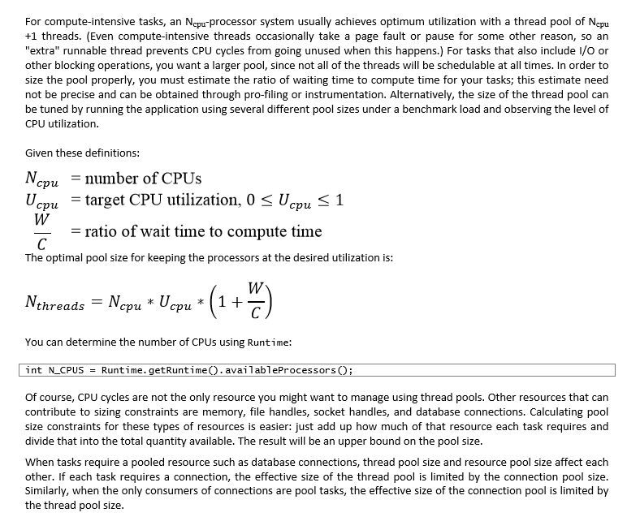
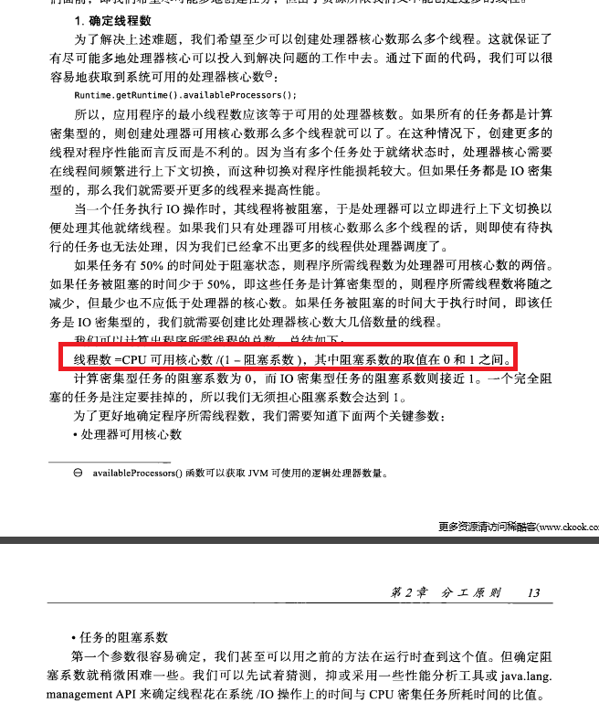
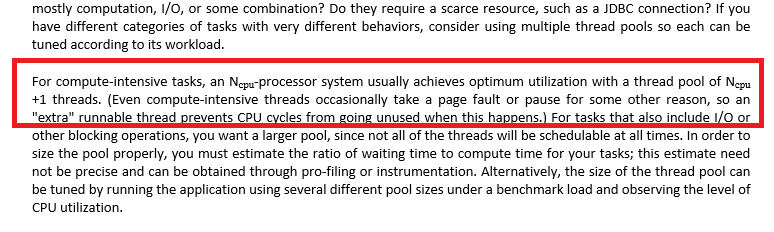

# 如何科学的设置线程池

> 参考 https://www.douban.com/note/695620965/

在经理过这些年对小伙伴的设计评审，得知小伙伴们都是凭经验、凭直觉来设置线程池的线程数的，然后根据线上的情况调整数量多少，最后找到一个最合适的值，这是通过经验的，有时候管用，有时候不管用，有时候虽然管用但是牺牲了很大的代价才找到最佳的设置数量。

其实，线程池的设置是有据可依的，可以根据理论计算来设置的。

首先，我们看一下理想的情况，也就是所有要处理的任务都是计算任务，这时，线程数应该等于CPU核数，让每个CPU运行一个线程，不需要线程切换，效率是最高的，当然这是理想情况。

这种情况下，如果我们要达到某个数量的QPS，我们使用如下的计算公式。

设置的线程数 = 目标QPS/(1/任务实际处理时间)
举例说明，假设目标QPS=100，任务实际处理时间0.2s，100 * 0.2 = 20个线程，这里的20个线程必须对应物理的20个CPU核心，否则将不能达到预估的QPS指标。

但实际上我们的线上服务除了做内存计算，更多的是访问数据库、缓存和外部服务，大部分的时间都是在等待IO任务。

如果IO任务较多，我们使用阿姆达尔定律来计算。

设置的线程数 = cpu核数 * (1 + io/computing)
举例说明，假设4核CPU，每个任务中的IO任务占总任务的80%，4 * (1 + 4) = 20个线程，这里的20个线程对应的是4核心的CPU。

线程中除了线程数的设置，线程队列大小的设置也很重要，这也是可以通过理论计算得出，规则为按照目标响应时间计算队列大小。

队列大小 = 线程数 * (目标相应时间/任务实际处理时间)
举例说明，假设目标相应时间为0.4s，计算阻塞队列的长度为20 * (0.4 / 0.2) = 40。

另外，在设置线程池数量的时候，我们有如下的最佳实践。

线程池的使用要考虑线程最大数量和最小数最小数量。
对于单部的服务，线程的最大数量应该等于线程的最小数量，而混布的服务，适当的拉开最大最小数量的差距，能够整体调整CPU内核的利用率。
线程队列大小一定要设置有界队列，否则压力过大就会拖垮整个服务。
必要时才使用线程池，须进行设计性能评估和压测。
须考虑线程池的失败策略，失败后的补偿。
后台批处理服务须与线上面向用户的服务进行分离。

____________

# 根据CPU核心数确定线程池并发线程数

> 参考 https://www.cnblogs.com/dennyzhangdd/p/6909771.html

## 一、抛出问题

关于如何计算并发线程数，一般分两派，来自两本书，且都是好书，到底哪个是对的？问题追踪后，整理如下：

### 第一派：《Java Concurrency in Practice》即《java并发编程实践》，如下图：

如上图，在《Java Concurrency in Practice》一书中，给出了估算线程池大小的公式：

Nthreads=Ncpu*Ucpu*(1+w/c)，其中

Ncpu=CPU核心数

Ucpu=cpu使用率，0~1

W/C=等待时间与计算时间的比率

### 第二派：《Programming Concurrency on the JVM Mastering》即《Java 虚拟机并发编程》

线程数=Ncpu/（1-阻塞系数）

## 二、分析

对于派系一，假设cpu100%运转，即撇开CPU使用率这个因素，线程数=Ncpu*(1+w/c)。

现在假设将派系二的公式等于派系一公式，即Ncpu/（1-阻塞系数）=Ncpu*(1+w/c),===》阻塞系数=w/(w+c)，即阻塞系数=阻塞时间/（阻塞时间+计算时间），这个结论在派系二后续中得到应征，如下图：

由此可见，派系一和派系二其实是一个公式......这样我就放心了......

## 三、实际应用

那么实际使用中并发线程数如何设置呢？分析如下（我们以派系一公式为例）：

__Nthreads=Ncpu*(1+w/c))__

IO密集型：一般情况下，如果存在IO，那么肯定w/c>1（阻塞耗时一般都是计算耗时的很多倍）,但是需要考虑系统内存有限（每开启一个线程都需要内存空间），这里需要上服务器测试具体多少个线程数适合（CPU占比、线程数、总耗时、内存消耗）。如果不想去测试，保守点取1即，Nthreads=Ncpu*(1+1)=2Ncpu。这样设置一般都OK。

__计算密集型__：假设没有等待w=0，则W/C=0. Nthreads=Ncpu。

### 至此结论就是：

__IO密集型=2Ncpu（可以测试后自己控制大小，2Ncpu一般没问题）（常出现于线程中：数据库数据交互、文件上传下载、网络数据传输等等）__

__计算密集型=Ncpu（常出现于线程中：复杂算法）__

__java中：Ncpu=Runtime.getRuntime().availableProcessors()__

当然派系一种《Java Concurrency in Practice》还有一种说法，

即对于计算密集型的任务，在拥有N个处理器的系统上，当线程池的大小为N+1时，通常能实现最优的效率。(即使当计算密集型的线程偶尔由于缺失故障或者其他原因而暂停时，这个额外的线程也能确保CPU的时钟周期不会被浪费。)

__即，计算密集型=Ncpu+1，但是这种做法导致的多一个cpu上下文切换是否值得，这里不考虑。读者可自己考量。__
