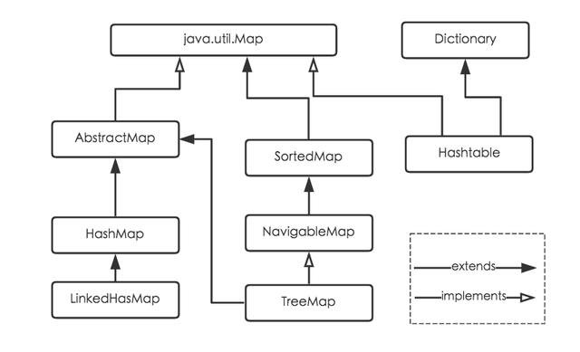
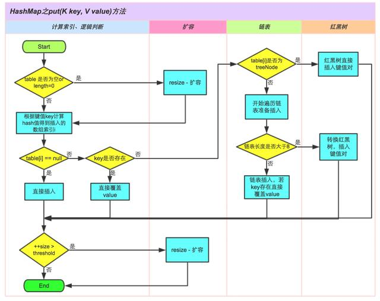
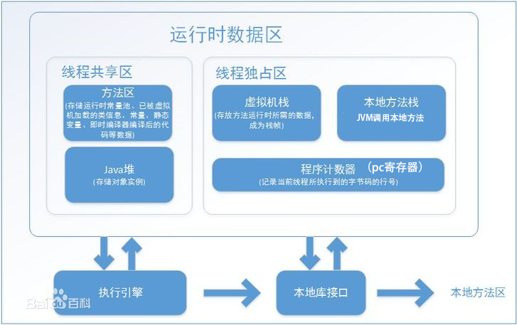

# 面试题汇总

## 1 线程安全和线程不安全

* 线程安全：就是当多线程访问时，采用了加锁的机制；即当一个线程访问该类的某个数据时，会对这个数据进行保护，其他线程不能对其访问，直到该线程读取完之后，其他线程才可以使用。防止出现数据不一致或者数据被污染的情况。
* 线程不安全：就是不提供数据访问时的数据保护，多个线程能够同时操作某个数据，从而出现数据不一致或者数据污染的情况。
* 对于线程不安全的问题，一般会使用synchronized关键字加锁同步控制。
* 线程安全 工作原理： jvm中有一个main memory对象，每一个线程也有自己的working memory，一个线程对于一个变量variable进行操作的时候， 都需要在自己的working memory里创建一个copy,操作完之后再写入main memory。
  * 当多个线程操作同一个变量variable，就可能出现不可预知的结果。
  * 而用synchronized的关键是建立一个监控monitor，这个monitor可以是要修改的变量，也可以是其他自己认为合适的对象(方法)，然后通过给这个monitor加锁来实现线程安全，每个线程在获得这个锁之后，要执行完加载load到working memory 到 use && 指派assign 到 存储store 再到 main memory的过程。才会释放它得到的锁。这样就实现了所谓的线程安全。

## 2 java.util 包下集合

* 线程安全(Thread-safe)的集合对象：
  * Vector 线程安全：
  * HashTable 线程安全：
  * StringBuffer 线程安全：
* 非线程安全的集合对象：
  * ArrayList ：
  * LinkedList：
  * HashMap：
  * HashSet：
  * TreeMap：
  * TreeSet：
  * StringBulider：

### 2.1 【常见问题】ArryList和LinkedList的区别

在处理一列数据项时，Java提供了两个类ArrayList和LinkedList，ArrayList的内部实现是基于内部数组Object[]，所以从概念上说它更像数组；然而LinkedList的内部实现是基于一组连接的记录，所以，它更像一个链表结构；所以它们在性能上有很大的差别。
由上可知，在ArrayList的前面或者中间插入数据的时候，必须将其后的所有数据相应的后移，这样要花费较多的时间；所以，当操作是在一列数据的后面添加数据而不是在前面或者中间，并需要随机地访问其中的元素时，使用ArrayList性能比较好。
然而访问链表中的某个元素的时候，就必须从链表的一端开始，沿着连接的方向一个一个元素的去查找，直到找到所需的元素为止，所以，当对一列数据的前面或者中间执行添加或者删除操作时，并且按照顺序访问其中的元素时，要使用LinkedList。

### 2.2 【常见问题】StringBuffer和StringBulider

StringBuilder与StringBuffer都继承自AbstractStringBuilder类，在AbstractStringBuilder中也是使用字符数组保存字符串。

* 1 在执行速度方面的比较：StringBuilder > StringBuffer ；
* 2 StringBuffer与StringBuilder，他们是字符串变量，是可改变的对象，每当我们用它们对字符串做操作时，实际上是在一个对象上操作的，不像String一样创建一些对象进行操作，所以速度就快了；
* 3 StringBuilder：线程非安全的；
* 4 StringBuffer：线程安全的；

### 2.3 【常见问题】对于String、StringBuffer和StringBulider三者使用的总结

* 1 如果要操作少量的数据用 = String
* 2 单线程操作字符串缓冲区 下操作大量数据 = StringBuilder
* 3 多线程操作字符串缓冲区 下操作大量数据 = StringBuffer

### 2.4 【常见问题】HashTable、HashMap、HashSet

* HashMap：
  * 采用数组方式存储key-value构成的Entry对象，无容量限制；
  * 基于key hash查找Entry对象存放到数组的位置，对于hash冲突采用链表的方式去解决；
  * 在插入元素时，可能会扩大数组的容量，在扩大容量时须要重新计算hash，并复制对象到新的数组中；
  * 是非线程安全的；
  * 遍历使用的是Iterator迭代器；
* HashTable：
  * 是线程安全的；
  * 无论是key还是value都不允许有null值的存在；在HashTable中调用Put方法时，如果key为null，直接抛出NullPointerException异常；
  * 遍历使用的是Enumeration列举；
* HashSet：
  * 基于HashMap实现，无容量限制；
  * 是非线程安全的；
  * 不保证数据的有序；

### 2.5 【常见问题】 Map

https://youzhixueyuan.com/the-underlying-structure-and-principle-of-hashmap.html

类继承关系如下图所示:


### 2.5.1 各个实现类的特点做一些说明

> (1) HashMap：它根据键的hashCode值存储数据，大多数情况下可以直接定位到它的值，因而具有很快的访问速度，但遍历顺序却是不确定的。
>
> HashMap最多只允许一条记录的键为null，允许多条记录的值为null。HashMap非线程安全，即任一时刻可以有多个线程同时写HashMap，可能会导致数据的不一致。如果需要满足线程安全，可以用 Collections的synchronizedMap方法使HashMap具有线程安全的能力，或者使用ConcurrentHashMap。
>
> (2) Hashtable：Hashtable是遗留类，很多映射的常用功能与HashMap类似，不同的是它承自Dictionary类，并且是线程安全的，任一时间只有一个线程能写Hashtable，并发性不如ConcurrentHashMap，因为ConcurrentHashMap引入了分段锁。Hashtable不建议在新代码中使用，不需要线程安全的场合可以用HashMap替换，需要线程安全的场合可以用ConcurrentHashMap替换。
>
> (3) LinkedHashMap：LinkedHashMap是HashMap的一个子类，保存了记录的插入顺序，在用Iterator遍历LinkedHashMap时，先得到的记录肯定是先插入的，也可以在构造时带参数，按照访问次序排序。
>
> (4) TreeMap：TreeMap实现SortedMap接口，能够把它保存的记录根据键排序，默认是按键值的升序排序，也可以指定排序的比较器，当用Iterator遍历TreeMap时，得到的记录是排过序的。如果使用排序的映射，建议使用TreeMap。在使用TreeMap时，key必须实现Comparable接口或者在构造TreeMap传入自定义的Comparator，否则会在运行时抛出java.lang.ClassCastException类型的异常。

### 2.5.2 【常见问题】根据key获取哈希桶数组索引位置

Hash算法本质上就是三步：取key的hashCode值、高位运算、取模运算。

### 2.5.3 【常见问题】put方法的详细执行




### 2.5.4 【常见问题】扩容过程
https://blog.csdn.net/pange1991/article/details/82347284

* HashMap扩容是 2的倍数
* ArrayList扩容是 1.5倍
* 链表长度为 8 的时候转红黑树

### 2.5.5 为什么是红黑树，而不是其他别的树
https://blog.csdn.net/21aspnet/article/details/88939297

* hashmap 什么时候会触发扩容？
  负载0.75 的标准达到的时候
* jdk1.8 之前并发操作 hashmap 时为什么会有死循环的问题？
  https://www.jianshu.com/p/619a8efcf589

扩展阅读： HashMap的21 连击
https://zhuanlan.zhihu.com/p/147209395


## 2.6 LinkedHashMap

了解基本原理、哪两种有序、如何用它实现 LRU

HashMap 有一个不足之处就是在迭代元素时与插入顺序不一致。而大多数人都喜欢按顺序做某些事情，所以，LinkedHashMap 就是针对这一点对 HashMap 进行扩展，主要新增了「两种迭代方式」：

* 按插入顺序 - 保证迭代元素的顺序与插入顺序一致
* 按访问顺序 - 一种特殊的迭代顺序，从最近最少访问到最多访问的元素访问顺序，非常适合构建 LRU 缓存

https://juejin.cn/post/6844903941814091789

### 2.6.1 按插入顺序迭代

那 LinkedHashMap 怎么解决的？它维护了一个贯穿所有元素的双向链表，遍历时，迭代器直接对双向链表进行迭代，从而保证了与插入顺序一致，关键成员属性和节点信息定义如下：

```java
// 双向链表头节点，也是最久没有访问的元素
transient LinkedHashMap.Entry<K,V> head;
// 双向链表尾节点，也是最近刚刚访问的元素
transient LinkedHashMap.Entry<K,V> tail;
// 迭代方式，true-按访问顺序迭代，false-按插入顺序迭代，默认 false
final boolean accessOrder;
// 添加了构建双向链表的前驱和后继指针
static class Entry<K,V> extends HashMap.Node<K,V> {
  Entry<K,V> before, after;
  Entry(int hash, K key, V value, Node<K,V> next) {
    super(hash, key, value, next);
  }
}
```

HashMap 在元素插入、删除和访问时定义并调用了一些 Hook 方法，这些方法使得 LinkedHashMap 内部保持有序的机制相对独立，降低了普通模式和树模式转换的复杂度。
此外，红黑树节点继承的是 LinkedHashMap 的 Entry，固然可能多了两个指针，但在实现时有助于避免操作指针出现混淆错误。
LinkedHashMap 在元素插入时，覆盖的回调方法主要有 newNode, replacementNode, replacementTreeNode, newTreeNode，主要就是保持双向链表，核心是下面两个方法：

```java
// 插入到双向链表的尾部
private void linkNodeLast(LinkedHashMap.Entry<K,V> p) {
  LinkedHashMap.Entry<K,V> last = tail; // 临时记住尾节点
  tail = p; // 将尾指针指向新节点
  if (last == null)
    head = p; // 第一个插入的节点
  else { // 关联前后节点
    p.before = last;
    last.after = p;
  }
}

// 连接两个节点之间的前后指针
private void transferLinks(LinkedHashMap.Entry<K,V> src,
                           LinkedHashMap.Entry<K,V> dst) {
  LinkedHashMap.Entry<K,V> b = dst.before = src.before;
  LinkedHashMap.Entry<K,V> a = dst.after = src.after;
  if (b == null)
    head = dst;
  else
    b.after = dst;
  if (a == null)
    tail = dst;
  else
    a.before = dst;
}
```

### 2.6.2 按访问顺序迭代

为了让元素按访问顺序排列，HashMap 定义了以下 Hook 方法，供 LinkedHashMap 实现：

```java
void afterNodeAccess(Node<K,V> p) { }
void afterNodeInsertion(boolean evict) { }
void afterNodeRemoval(Node<K,V> p) { }
```

afterNodeAccess 的原理是：访问的元素如果不是尾节点，那么就把它与尾节点交换，所以随着元素的访问，访问次数越多的元素越靠后
afterNodeRemoval 这个没有特殊操作，正常的断开链条
afterNodeInsertion 的原理是：元素插入后，可能会删除最旧的、访问次数最少的元素，也就是头节点

重点看下插入之后的实现：

```java
void afterNodeInsertion(boolean evict) { // possibly remove eldest
  LinkedHashMap.Entry<K,V> first;
  if (evict && (first = head) != null && removeEldestEntry(first)) {
    K key = first.key;
    removeNode(hash(key), key, null, false, true);
  }
}
```

是否会删除头节点，是由 removeEldestEntry 方法决定的，默认返回 false。在覆盖这个方法时，不能简单的返回 true，因为这样可能会导致一个空的 LinkedHashMap，通常的做法是在插入指定数量的元素后再删除，具体见下面 LRU 缓存的实现。


### 2.6.3 实现一个 LRU 缓存

借助 LinkedHashMap 可以很方便的实现一个 LRU 缓存数据结构，只需设置 accessOrder 为 true，并覆盖 removeEldestEntry 方法即可，代码如下：

```java
final int MAX_CACHE_SIZE = 100;
LinkedHashMap<Object, Object> lru = new LinkedHashMap<Object, Object>(MAX_CACHE_SIZE, 0.75f, true) {
    private static final long serialVersionUID = 1L;
    protected boolean removeEldestEntry(Map.Entry<Object, Object> eldest) {
      return size() > MAX_CACHE_SIZE;
    }
};
```

```java
public class LRU<K,V> extends LinkedHashMap<K, V> implements Map<K, V>{

    private static final long serialVersionUID = 1L;

    public LRU(int initialCapacity,
             float loadFactor,
                        boolean accessOrder) {
        super(initialCapacity, loadFactor, accessOrder);
    }

    /** 
     * @description 重写LinkedHashMap中的removeEldestEntry方法，当LRU中元素多余6个时，
     *              删除最不经常使用的元素
     * @param eldest
     * @return
     * @see java.util.LinkedHashMap#removeEldestEntry(java.util.Map.Entry)
     */  
    @Override
    protected boolean removeEldestEntry(java.util.Map.Entry<K, V> eldest) {
        if(size() > 6){
            return true;
        }
        return false;
    }

    public static void main(String[] args) {
        LRU<Character, Integer> lru = new LRU<Character, Integer>(
                16, 0.75f, true);

        String s = "abcdefghijkl";
        for (int i = 0; i < s.length(); i++) {
            lru.put(s.charAt(i), i);
        }
        System.out.println("LRU中key为h的Entry的值为： " + lru.get('h'));
        System.out.println("LRU的大小 ：" + lru.size());
        System.out.println("LRU ：" + lru);
    }
}
```

## 2.7 TreeMap

* 如何用 TreeMap 实现一致性 hash？
* 了解数据结构、了解其 key 对象为什么必须要实现 Compare 接口、如何用它实现一致性哈希

https://www.cnblogs.com/markcd/p/8476237.html

## 3 Java内存模型

* 高速缓存
  * 使读写速度尽可能快
  * 在多处理器系统中，每个处理器都有自己的高速缓存，而他们又共享统一主存
  * 缓存中数据不一致问题
  * 有一些协议
* 指令重排序
  * 处理器对输入的代码进行乱序执行优化，处理器在计算之后将乱序执行的结果重组，保证乱序执行的结果和顺序执行的结果是一致的

### 3.1 Java内存模型JMM

* 主内存（main memory）
* 工作内存（working memory）
  * 屏蔽硬件和操作系统的内存访问差异，是Java程序在任何平台下都达到一致性的访问效果
  * 定义变量从内存中取出以及储存到内存的细节
  * 变量指的是共享变量（包括实例字段、静态字段、构成数组的元素，不包括局部变量与方法参数这些线程私有的变量）
  * 所有的共享变量都存储在主内存中
  * 每条线程都拥有自己的工作内存
  * 线程的工作内存中保存了当前线程使用到的共享变量的主内存副本拷贝
  * 线程不能直接操作主内存
  * 一个线程也不能访问另一个线程的工作内存

### 3.2 主内存和线程工作内存的交互操作

* lock unlock（作用于主内存）
* read write（主内存）
* load store（工作内存）
* use assign（工作内存）

上述操作都是原子性的

* 1 read之后必须load，store之后必须write（不允许一个变量从主存读取了，但是工作内存不接受；或者一个变量从工作内存发起了回写，但是主存不接受）
* 2 不能丢弃assign（不允许一个线程在其工作内存中修改了变量的值，但是又没有同步回主存；也不允许一个线程没有assign变量，但是又想同步回主存）
* 3 不允许在工作内存中新建变量（工作内存中use和assign的变量必须是从主从中read并load到的）
* 4 同一时刻，只允许一条线程对一个变量进行lock，但是，允许一个线程执行多次lock。每一个lock都必须有与之对应的unlock
* 5 在unlock之前，必须把变量同步回主存

### 3.3 volatile关键字

JVM提供的轻量级同步策略

* 1 可见性
  * 保证主存中的共享变量对所有线程都是可见的，即当一个线程改变了变量的值，其它线程立即可知
  * 在各个线程的工作内存中，volatile变量可能存在不一致的情况，但是，由于每次使用之前执行引擎都要刷新volatile变量的值，因此看不到不一致的情况
  * 不能保证原子性（i++）

* 2 禁止指令重排序
  内存屏障，在指令重排序时，不能把内存屏障后面的指令重排序到内存屏障之前

* 3 性能：读操作跟普通变量差不多，写操作慢一些

注意

* 1 每次使用（use）volatile变量的时候，都必须先从主内存中load最新的值，用于保证当前线程看见其它线程对共享变量所做的修改
* 2 每次修改（assign）volatile变量之后，都必须立即将修改同步回主内存（store），用于保证其它线程能看见当前线程对共享变量所做的修改
* 3 禁止指令重排序，代码的执行顺序和程序中定义的顺序是一致的

### 3.4 long&double变量

long和double变量的非原子性协议

允许虚拟机将没有被volatile修饰的64位数据类型的读写操作分为两次32位的操作进行

即64位数据类型不用保证read、load、store、write操作的原子性

### 3.5 总结

* 1 原子性
  * read load use assign store write 操作都是原子性的
  * long double类型的特殊规定
* 2 可见性
  * 一个线程对共享变量的修改，其它线程立即可知
  * volatile保证可见性：修改数据之后，立即同步回主存；使用数据之前，从主存中刷新最新值
  * synchronized保证可见性：对一个变量unlock之前，必须同步回主存
  * final保证可见性：final字段在构造器中一旦初始化完成，构造器没有把this引用传递出去，其它线程中就可看见final变量的值
* 3 有序性
  * 在本线程内观察，所有操作都是有序的；但是，在线程外观察，所有操作都是无序的
  * 线程内表现为串行的语义
  * 指令重排序
  * 工作内存和主内存的同步延迟
  * volatile保证有序性：禁止指令重排序（内存屏障）
  * synchronized保证有序性：同一时刻只允许一条线程获得对象锁
* 4 内存可见性问题
  * 指令都是在CPU中执行的，指令在执行过程中进行数据 的读取和写入
  * 程序执行过程中的临时数据是存放在主存中的
  * 线程在使用主存中的共享数据时，会复制一份到高速缓存中，对共享数据操作完之后，再将数据写入告诉缓存
  * 多个线程对共享数据的操作是在线程自己的缓存中进行的，线程之间彼此不可见

扩展阅读: https://blog.csdn.net/guyuealian/article/details/52525724

## 4 java.util.concurrent 包下的集合

https://www.cnblogs.com/coolgame/p/8746750.html
https://blog.csdn.net/windsunmoon/article/details/36903901

### 4.1 Atomic原子数据

 java.util.concurrent.atomic中的类可以分成4组：

标量类（Scalar）：AtomicBoolean，AtomicInteger，AtomicLong，AtomicReference

数组类：AtomicIntegerArray，AtomicLongArray，AtomicReferenceArray

更新器类：AtomicLongFieldUpdater，AtomicIntegerFieldUpdater，AtomicReferenceFieldUpdater

复合变量类：AtomicMarkableReference，AtomicStampedReference

AtomicBoolean，AtomicInteger，AtomicLong，AtomicReference
他们的实现都是依靠 真正的值为volatile 类型，通过Unsafe 包中的原子操作实现。最基础就是CAS，他是一切的基础。如下 。其中offset是 在内存中 value相对于基地址的偏移量。

getAndSet( )方法，利用compareAndSet循环自旋实现。

### 4.2 Lcoks 锁

#### 4.2.1 Lock 和Synchronized

synchronized 锁在退出块时自动释放。而Lock 需要手动释放，且Lock更加灵活。Syschronizd 是 java 语言层面的，是系统关键字；Lock则是java 1.5以来提供的一个类。

Synchronized 具有以下缺陷，它无法中断一个正在等候获得锁的线程；也无法通过投票得到锁，如果不想等下去，也就没法得到锁；同步还要求锁的释放只能在与获得锁所在的堆栈帧相同的堆栈帧中进行。

而Lock（如ReentrantLock ）除了与Synchronized 具有相同的语义外，还支持锁投票、定时锁等候和可中断锁等候(就是说在等待锁的过程中，可以被中断)的一些特性。

#### 4.2.2 LockSupport 和java内置锁

#### 4.2.3 AbstractQueuedSynchronizer

AQS框架是 java.utils.concurrent包的核心。是构建同步、锁、信号量和自定义锁的基础。也是构建高级工具的基础。

简单说来，AbstractQueuedSynchronizer会把所有的请求线程构成一个CLH队列，当一个线程执行完毕（lock.unlock()）时会激活自己的后继节点，但正在执行的线程并不在队列中，而那些等待执行的线程全部处于阻塞状态，经过调查线程的显式阻塞是通过调用LockSupport.park()完成，而LockSupport.park()则调用 sun.misc.Unsafe.park()本地方法，再进一步，HotSpot在Linux中中通过调用pthread_mutex_lock函数把 线程交给系统内核进行阻塞。

扩展阅读: https://blog.csdn.net/windsunmoon/article/details/36903901

### 4.3 接口 Future
扩展阅读: https://blog.csdn.net/windsunmoon/article/details/36903901


### 4.4 其他常用的java.utils.concurrent下的接口

#### 4.4.1 Condition

* 场景
  * 两个线程数数，同时启动两个线程，线程A数1、2、3，然后线程B数4、5、6，最后线程A数7、8、9，程序结束，这涉及到线程之间的通信。
* 创建方式
  * 通过Lock创建，Lock.newCondition()；
* 常用方法
  * await()：阻塞，直到相同的Condition调用了signal方法。
  * signal()：通知。
* 总结
  * Condition必须与Lock一起使用（wait()、notify()必须与synchronized一起使用，否则运行会报错java.lang.IllegalMonitorStateException），相比于wait与notify更加的灵活，可以设置各种情形，如上例中的到达3和到达6两个条件。

#### 4.4.2 CountDownLatch

* 创建方式
  * 直接创建，new CountDownLatch(int num);
* 常用方法
  * await()：阻塞，直到countDown方法被执行了num次。
  * countDown()：减
* 总结
  * 适用于一个线程等待其他线程的情景。

#### 4.4.3 CyclicBarrier

* 创建方式
  * 直接创建，new CyclicBarrier(int num);
* 常用方法
  * await()：阻塞，直到阻塞的线程数量达到num个。
* 总结
  * 想想一下百米跑，所有运动员都就位之后才会发令起跑，线程调用await意味着说，我准备好了。

#### 4.4.4 Semaphore

* 场景
  * 上厕所的例子，厕所位置有限，想用得排队了。实现使用的就是信号量，可以看出信号量可以用来做限流。
* 创建方式
  * 直接创建，new Semaphore(int num);
* 常用方法
  * availablePermits()：看现在可用的信号量。
  * acquire()：尝试获取一个位置，如果获取不到则阻塞。
  * release()：释放位置。
  * acquireUninterruptibly(int num)：尝试获取num个许可，如果没有足够的许可则阻塞，一直阻塞到有足够的许可释放出来。调用这个方法的线程具有优先获取许可的权利。如果调用线程被interrupted,该线程并不会被打断，它会继续阻塞等待许可。
* 总结
  * 抢位置

#### 4.4.5 ReentrantLock

* 创建方式
  * new ReentrantLock(); 此种创建方式会创建出一个非公平锁。
  * new ReentrantLock(true); 此种方式会创建出一个公平锁。
* 非公平锁
  * 当锁处于无线程占有的状态，此时其他线程和在队列中等待的线程都可以抢占该锁。
* 公平锁
  * 当锁处于无线程占有的状态，在其他线程抢占该锁的时候，都需要先进入队列中等待。
* tryLock()方法
  * 尝试去获取锁，如果没有获取到直接返回，不等待。

扩展阅读： https://blog.csdn.net/jiangjiajian2008/article/details/52226189

#### 4.4.6 ReentrantReadWriteLock

* 创建方式
  * new ReentrantReadWriteLock();
* 常用方法
  * readLock().lock();写锁
  * writeLock().lock();读锁
  * readLock().unlock();解锁
  * writeLock().unlock();解锁
* 总结
  * 如果目前是读锁，其他读锁也可以进请求，写锁不能进。
  * 如果目前是写锁，那么其他所有的锁都不可以进。
  * 适用于读多写少的情况，如果是写多读少用ReentrantLock。

#### 4.4.7 Callable接口

* Callable接口支持返回执行结果，此时需要调用FutureTask.get()方法实现，此方法会阻塞主线程直到获取结果；当不调用此方法时，主线程不会阻塞！
* 与Runnable对比
  * Callable可以有返回值，Runnable没有
  * Callable接口的call()方法允许抛出异常；而Runnable接口的run()方法的异常只能在内部消化，不能继续上抛；

#### 4.4.8 线程池

* 有数量限制的线程池

> ExecutorService service=Executors.newFixedThreadPool(4);

* 没有数量限制的线程池

> ExecutorService service=Executors.newCachedThreadPool();

* 单线程池

> ExecutorService service=Executors.newSingleThreadExecutor();


扩展阅读: https://www.jianshu.com/p/67076450de38

## 5 Java 类加载和实例化过程

https://blog.csdn.net/cw1254332663/article/details/103222542

* JVM模型


* 类加载
  * 过程
  它的生命周期包括了：加载、验证、准备、解析、初始化、使用、卸载。其中验证、准备、解析被称为链接

  

  * 加载
    * 将class文件字节码内容加载到内存中。
    * 并将这些静态数据转换成方法区中的运行时数据结构。
    * 在堆中生成一个代表这个类的java.lang.Class对象。

  * 链接
    * 验证：确保加载的类信息符合JVM规范，没有安全方面的问题。验证阶段主要包括四个检验过程：文件格式验证、元数据验证、字节码验证和符号引用验证。
    * 准备：正式为类变量(static修饰的变量)分配内存并设置类变量初始值的阶段，这些内存都将在方法区中进行分配。
    * 解析：虚拟机常量池的符号引用替换为字节引用过程。

  * 初始化
    * 调用类构造器‘()’。类构造器<clinit>()方法是由编译器自动收集类中的所有类变量的赋值动作和静态代码块static{}中的语句合并产生的，其中编译器收集的顺序是由语句在源文件中出现的顺序所决定。如果一个类中没有静态代码块，也没有对类变量的赋值操作，那么编译器可以不为这个类生产类构造器<clinit>()。
    * 【注意】该方法仅能由Java编译器生成并由JVM调用，程序开发者无法自定义一个同名的方法，更无法直接在Java程序中调用该方法。
    * 触发条件：
      * 遇到new、getstatic、putstatic或invokestatic这四条字节码指令时，如果类没有进行初始化，则需要先触发初始化。生成了这四条指令的场景：new关键字实例化对象、读取或设置一个类的静态字段（被final修饰的变量在编译阶段就已经把结果放入常量池）的时候，以及调用类的静态方法的时候。
      * 使用java.lang.reflect包的方法对类进行反射调用的时候。
      * 当初始化一个类的时候，如果发现其父类还没有进行过初始化、则需要先触发其父类的初始化。
      * jvm启动时，用户指定一个执行的主类，虚拟机会先初始化这个类。

* 类实例化
  * 过程
    * 1 new一个对象时，在堆内存中开辟一块空间。
    * 2 给开辟的空间分配一个地址。
    * 3 把对象的所有非静态成员加载到所开辟的空间下。
    * 4 所有的非静态成员加载完毕之后，对所有非静态成员变量进行默认初始化。
    * 5 所有非静态成员变量默认初始化完成之后，调用构造函数。
    * 6 在构造函数入栈执行时，分为两步：
      * 1 执行构造函数中的隐式三步
      * 2 执行构造函数中书写的代码。
    * 7 在整个构造函数执行完并出栈之后，把分配空间的地址赋给引用对象。
  * 隐式三步
    * 1 执行super语句
    * 2 显示初始化（对开辟空间下的所有非静态成员变量进行赋值）
    * 3 执行构造代码块
  * 调用顺序
  父类的类构造器<clinit>() -> 子类的类构造器<clinit>() -> 父类的成员变量和实例代码块 -> 父类的构造函数 -> 子类的成员变量和实例代码块 -> 子类的构造函数。

https://blog.csdn.net/cw1254332663/article/details/103222542
* 类加载器
  * 启动类加载器
  * 扩展类加载器
  * 系统类加载器
* 双亲委派模式
  * 原理
  * 优势

扩展阅读 类的加载过程
https://juejin.cn/post/6844903961372147720

https://zhuanlan.zhihu.com/p/133747766

## 6 Spring

### 6.1 spring bean 的生命周期

```plantuml

agent at01 as "[实例化bean] 启动ApplicationContext容器，使用BeanFactory初始化Bean"
agent at02 as "[设置对象属性] Spring根据BeanDefinition进行依赖注入，通过BeanWrapper完成依赖注入"
agent at03 as "[检查Aware相关接口并设置相关依赖]"
agent at04 as "[BeanPostProcessor前置处理]"
agent at05 as "[检查是否是InitializingBean以确定是否调用afterPropertiesSet方法]"
agent at06 as "[检查是否配置有自定义的init-method]"
agent at07 as "[BeanPostProcessorc后置处理]"
agent at08 as "[注册必要的Destruction相关回调接口]"
agent at09 as "[使用中]"
agent at10 as "[是否实现DisposableBean接口]"
agent at11 as "[是否配置有自定义的destroy方法]"

at01 --> at02
at02 --> at03
at03 --> at04
at04 --> at05
at05 --> at06
at06 --> at07
at07 --> at08
at08 --> at09
at09 --> at10
at10 --> at11
```

### 6.2 spring 如何解决循环依赖问题

如下A和B的循环依赖，在spring中是如何解决的

```java
@Component
public class A {
  private B b;
  public void setB(B b) {
    this.b = b;
  }
}
@Component
public class B {
  private A a;
  public void setA(A a) {
    this.a = a;
  }
}
```


* 循环依赖问题、spring cloud（如项目中有用过）、AOP 的实现、spring 事务传播
常见问题
•		java 动态代理和 cglib 动态代理的区别（经常结合 spring 一起问所以就放这里了）
•	spring 中 bean 的生命周期是怎样的？
•	属性注入和构造器注入哪种会有循环依赖的问题？
 
## Dubbo（或其他 Rpc 框架）
了解一个常用 RPC 框架如 Dubbo 的实现：服务发现、路由、异步调用、限流降级、失败重试
常见问题
•	Dubbo 如何做负载均衡？
•	Dubbo 如何做限流降级？
•	Dubbo 如何优雅的下线服务？
•	Dubbo 如何实现异步调用的？

## RocketMq（或其他消息中间件）
•		了解一个常用消息中间件如 RocketMq 的实现：如何保证高可用和高吞吐、消息顺序、重复消费、事务消息、延迟消息、死信队列
常见问题
•	RocketMq 如何保证高可用的？
•	RocketMq 如何保证高吞吐的？
•	RocketMq 的消息是有序的吗？
•	RocketMq 的消息局部顺序是如何保证的?
•	RocketMq 事务消息的实现机制？
•	RocketMq 会有重复消费的问题吗？如何解决？
•	RocketMq 支持什么级别的延迟消息？如何实现的？
•	RocketMq 是推模型还是拉模型？
•	Consumer 的负载均衡是怎么样的？
•	Redis（或其他缓存系统）
•		redis 工作模型、redis 持久化、redis 过期淘汰机制、redis 分布式集群的常见形式、分布式锁、缓存击穿、缓存雪崩、缓存一致性问题
•	常见问题
•	redis 性能为什么高?
•	单线程的 redis 如何利用多核 cpu 机器？
•	redis 的缓存淘汰策略？
•	redis 如何持久化数据？
•	redis 有哪几种数据结构？
•	redis 集群有哪几种形式？
•	有海量 key 和 value 都比较小的数据，在 redis 中如何存储才更省内存？
•	如何保证 redis 和 DB 中的数据一致性？
•	如何解决缓存穿透和缓存雪崩？
•	如何用 redis 实现分布式锁？
•
## Mysql
•		事务隔离级别、锁、索引的数据结构、聚簇索引和非聚簇索引、最左匹配原则、查询优化（explain 等命令）
•	推荐文章：
•	http://hedengcheng.com/?p=771
•	https://tech.meituan.com/2014/06/30/mysql-index.html
 
•	http://hbasefly.com/2017/08/19/mysql-transaction/
•	常见问题
•	Mysql(innondb 下同) 有哪几种事务隔离级别？
•	不同事务隔离级别分别会加哪些锁？
•	mysql 的行锁、表锁、间隙锁、意向锁分别是做什么的？
•	说说什么是最左匹配？
•	如何优化慢查询？
•	mysql 索引为什么用的是 b+ tree 而不是 b tree、红黑树
•	分库分表如何选择分表键
•	分库分表的情况下，查询时一般是如何做排序的？

## zk
•		zk 大致原理（可以了解下原理相近的 Raft 算法）、zk 实现分布式锁、zk 做集群 master 选举
•	常见问题
•	如何用 zk 实现分布式锁，与 redis 分布式锁有和优缺点
•
